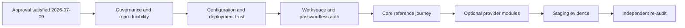

# Approved Dependency-Ordered Repair Backlog

Status: **approved by the project owner on 2026-07-09 for GitHub Issue conversion and issue-scoped execution.** Approval itself completes no repair and does not establish readiness.

Each row is intended to become one deployable behavioral outcome and usually one PR. A row may touch schema, server, UI, tests, and docs when those layers are necessary to prove the outcome. Dependency upgrades remain isolated from behavioral repairs unless the behavior cannot be implemented safely on the pinned version.

Issue normalization split three cross-cutting audit rows into independent outcomes: R-008A/R-008B, R-023A/R-023B, and R-029S/R-029J. The approved program therefore creates 38 GitHub Issues while preserving traceability to the original 35-row audit proposal.

## Wave 1 — governance, tooling, and vulnerable pins

| Repair ID | Outcome | Depends on | Acceptance and evidence |
| --- | --- | --- | --- |
| R-001 | Make `master` the canonical protected branch without losing history | Audit approval satisfied 2026-07-09 | Local/remote default renamed; GitHub default updated; required reviews/checks configured; clone/PR documentation verified. Rollback path recorded. |
| R-002 | Pin one supported Node/pnpm bootstrap contract | R-001 deferred by owner; proceed from current `main` | Node 24 line declared in repo/CI/Docker; exact pnpm available through documented bootstrap; fresh clean install passes on macOS and CI. Do not rename the branch or change protection in this Issue. |
| R-003 | Add fast PR CI and full merge workflow | R-002 | PR: format/lint/Stylelint/typecheck/targeted tests/migration consistency. Merge: all tests/build/Docker/integration/browser. Required check names and intended protection are documented; repository enforcement remains deferred to R-001 because it requires admin access. |
| R-004 | Add dependency, secret, and provenance gates | R-003 | Maintained scanners run in CI; baseline suppressions are reviewed/expiring; canary secret test proves failure; dependency reports are retained as artifacts; all declared application/dev dependencies use exact versions and CI rejects ranges. |
| R-005N | Patch Nuxt/Vue/router advisories | R-004 | Nuxt high advisories are removed without unrelated framework migration; full verify, built-server runtime-config/security probes, browser smoke, and rollback evidence pass. |
| R-005A | Patch Better Auth and validate its Drizzle adapter package | R-005N | Better Auth high advisory is removed; generated schema/API/import diff is reviewed; auth smoke and full verify pass; workspace/passwordless behavior remains a later non-goal. |

## Wave 2 — configuration and deployment trust

| Repair ID | Outcome | Depends on | Acceptance and evidence |
| --- | --- | --- | --- |
| R-006 | Introduce one validated server runtime environment contract | R-005N, R-005A | Built server honors documented runtime-only variables; private config is not baked into client/build; missing core config prevents listen; explicit module flags drive validation. Regression reproducer for CFG-001 passes. |
| R-007 | Implement optional-module state semantics | R-006 | Each module has disabled, incomplete-enabled, and ready states; disabled is healthy/no calls; incomplete-enabled fails startup/readiness; doctor/readiness derive from the module manifest. |
| R-008A | Remove production cryptographic fallbacks and harden Better Auth proxy/origin policy | R-006 | Production boot rejects missing/default secrets; local/test values are explicit; Better Auth trusted-origin, proxy-IP, cookie, and rate-limit behavior has route tests behind representative Cloudflare/Coolify headers. |
| R-008B | Enforce cross-origin and CSRF protection on app-owned commands | R-008A | One documented Origin/Fetch-Metadata or CSRF-token policy protects every cookie-authenticated app command; hostile-origin tests cover workspace, project, file, billing, and lifecycle families without weakening webhook/bearer boundaries. |
| R-009 | Split public liveness from protected/internal readiness | R-006, R-007 | Liveness is minimal; readiness redacts topology; required dependency failure returns 503; Docker/Coolify health interprets failure correctly. |
| R-010 | Harden the Docker build/runtime and provide migration/maintenance execution | R-002, R-004, R-006, R-009 | Strict `.dockerignore`; non-root runtime; migrations and backup/restore executable using documented image/job; `/app/data` persistence verified; canary context secret absent. |
| R-011 | Separate read-only deployment smoke from isolated mutating integration tests | R-003, R-006, R-009 | Production-mode smoke makes zero DB/provider writes; mutating suite creates a fresh temp DB/workspace/provider fixture and cleans up; both run in appropriate gates. |

## Wave 3 — workspace and passwordless identity

| Repair ID | Outcome | Depends on | Acceptance and evidence |
| --- | --- | --- | --- |
| R-012 | Decide Better Auth Organization versus app-owned workspace layer | R-005A, R-006 | Short spike compares schema ownership, personal workspace, roles, URL versus session selection, cross-tab behavior, invitations, upgrade risk, and Better Auth coupling; one option is selected and recorded. No hybrid duplicate model. |
| R-013 | Add workspace and membership schema with safe migration | R-012 | `workspace`/membership/roles/FKs/composite uniqueness created; existing fixtures migrate deterministically; foreign-key/delete/rollback tests pass. |
| R-014 | Add email boundary and passwordless magic-link flow | R-008B, R-013 | Provider-neutral sender plus local capture transport; Better Auth explicitly configures `storeToken: "hashed"` and `expiresIn: 300`; selected storage proves atomic single use; neutral responses and rate tests pass; password UI/API is disabled; incomplete email config fails when auth needs it. Hosted delivery certification is recorded in R-033. |
| R-015 | Add configurable social login and safe account linking | R-007, R-014 | Providers are disabled independently; incomplete enabled provider fails; verified-email or explicit link policy and minimum scopes are tested; unneeded OAuth tokens are not retained, while retained tokens are encrypted with rotation and excluded from logs/ordinary exports; unlink/delete/revocation cleanup passes. Google sandbox certification is recorded in R-033. |
| R-016 | Provision personal workspace and resolve current workspace | R-013, R-014 | New and returning users idempotently obtain/resolve a personal workspace and owner membership; multi-membership switching behavior is tested; onboarding remains optional. |
| R-017 | Replace hypothetical roles with persisted workspace capabilities | R-013, R-016 | Request helper resolves membership/capabilities; owner/admin/member matrix is explicit; no fabricated session role tests; staff privilege remains separate. |
| R-018 | Implement account/workspace export and deletion/transfer lifecycle | R-016, R-017 | Core identity/workspace/project export and deletion behavior is explicit; sole-owner transfer/delete rules pass; an extensible lifecycle registry and retryable cleanup-job contract are tested with fake provider adapters. Each later module registers its own data and cleanup. |

## Wave 4 — complete reference journey

| Repair ID | Outcome | Depends on | Acceptance and evidence |
| --- | --- | --- | --- |
| R-019 | Secure workspace-scoped project CRUD | R-013, R-017 | No ownership field in DTO; list/create/read/update/delete include workspace predicates and transactional invariants; anonymous and cross-workspace tests pass. Search projection moves to R-029S. |
| R-020 | Build public/auth/app/account/workspace route shell | R-014, R-016, R-017 | `/`, `/login`, `/signup`, `/app`, `/account`, workspace settings, legal templates, 401/403/404/error routes work with safe redirects and page titles. Optional social login does not block the core shell. |
| R-021 | Install Reka and implement app-owned account/workspace menu | R-016, R-020 | Reka is pinned; native primary nav remains semantic; dropdown passes keyboard arrows, Enter/Space, Escape, outside click, focus return, and screen-reader naming tests. |
| R-022 | Build the private project UI vertical slice | R-019, R-020, R-021, R-023A | List/create/detail/edit/delete demonstrate loading, empty, error/retry, success, forbidden, and not-found states; browser journey passes in desktop/mobile target browsers. |
| R-023A | Establish the canonical CSS, accessibility, and browser foundation | R-020, R-021 | Reset/tokens/base/layout/component layers with no accidental unlayered SFC rules; repeated form/state primitives consolidated; skip link/main focus/current nav; 44px target and contrast gates; no Tailwind/PrimeVue/Nuxt UI/shadcn. |
| R-023B | Roll out provider-aware Content Security Policy | R-006, R-020 | Nonce/hash-compatible CSP progresses from report-only to enforcement; automated checks reject regressions; later browser-facing provider modules add only their minimum directives without weakening unrelated policy. |

## Wave 5 — optional modules as vertical slices

| Repair ID | Outcome | Depends on | Acceptance and evidence |
| --- | --- | --- | --- |
| R-024 | Stripe workspace billing module | R-007, R-017, R-018, R-020, R-023A, R-023B | Official SDK, server plan key, workspace permission/customer, durable checkout-attempt record with one stable retry key, success/cancel/management UI, transactional/order-aware webhook, entitlements, minimized retention, and lifecycle registration pass with deterministic mocks. Stripe sandbox certification is recorded in R-033. |
| R-025 | Files/local/R2 module | R-007, R-017, R-018, R-020, R-023A, R-023B | Explicit driver; persistent local adapter; workspace metadata/keys and lifecycle registration; server- or provider-verified declared integrity for direct uploads; short-lived R2 presigned PUT/GET/HEAD with reuse/domain caveats, CORS and pagination; deterministic failure tests pass. R2 sandbox certification is recorded in R-033. |
| R-026 | AI conversation module | R-007, R-017, R-018, R-020, R-023A, R-023B | Current AI Gateway REST/auth contract with explicit `cf-aig-gateway-id`; authenticated workspace, server model allowlist, quotas/timeouts; full app-held conversation/request-response history and lifecycle registration; clear/export/delete; provider payload logging disabled by default; Sentry/log tests exclude prompts. Gateway certification is recorded in R-033. |
| R-027 | Turnstile defense module | R-007, R-014, R-023B | All Turnstile-bearing DTOs share the official 2,048-character maximum; official test keys; hostname/action/single-use/timeout validation; a stable Siteverify `idempotency_key` is reused only after an ambiguous timeout; disabled/enabled-failure and timeout-retry tests pass. Real widget/edge certification is recorded in R-033. |
| R-028 | Sentry observability module | R-007, R-010, R-023B | Correct server import/start; client maps are hidden, uploaded, then deleted; no `/_nuxt/*.map` is publicly served; build-only upload secret; global event/breadcrumb/transaction scrubbing; protected test controls; deterministic build/SDK tests pass. Real events/maps/alerts are recorded in R-033. |
| R-029S | Workspace-authorized search with transactional projection | R-018, R-019 | Search uses relational workspace/source authorization, project/index writes are transactional or reconciled, request-time schema DDL is removed, old schema fails readiness, lifecycle deletion is registered, and cross-workspace tests pass. |
| R-029J | Reliable leased background jobs | R-006, R-007, R-010, R-013, R-017, R-018 | Atomic job claim, leases, stale recovery, worker-token completion, enqueue idempotency, bounded payload/errors, cleanup-job integration, and multi-worker/crash tests pass. |
| R-030 | Feature-gated PWA shell | R-023A, R-023B | Explicit build/module flag; no API/offline mutations; icons/theme/update UX; built-browser install/offline/update tests pass. Target iOS/Android certification is recorded in R-033. |

## Wave 6 — operations and staging proof

| Repair ID | Outcome | Depends on | Acceptance and evidence |
| --- | --- | --- | --- |
| R-031 | Automate SQLite backup, off-host retention, and local restore proof | R-010, R-025 | RPO/RTO and retention are declared; encrypted/off-host adapter/schedule is implemented; an isolated local restore proves migrations, integrity, core user/workspace/project/file consistency, and measured recovery time. Full deployed/enabled-module restore certification is recorded in R-033. |
| R-032 | Deploy persistent `baseline-staging` from exact `master` commit | R-024, R-025, R-026, R-027, R-028, R-029S, R-029J, R-030, R-031 | Isolated Stripe sandbox, Cloudflare resources, Sentry project, email delivery, DB, and an AI Gateway-capable Cloudflare token/gateway with sufficient Unified Billing credits; provider keys exist only if BYOK is deliberately selected. Deployed ref is recorded; no staging code fork. |
| R-033 | Execute provider/mobile staging evidence matrix | R-032 | Checkout/failure/cancel/duplicate/order, R2, Turnstile, AI history/logging, email, Sentry server/client events/maps/alerts, backup/restore, and target mobile browser cases all have non-secret evidence. |
| R-034 | Independently re-audit fork readiness | R-033 | Requirements matrix rerun; no blocker/high findings; residual lower risks explicit; readiness decision reviewed by an agent/person who did not author each repair. |

## GitHub Issue map

Created 2026-07-09 in [`Josephdhng/swl-step-by-step`](https://github.com/Josephdhng/swl-step-by-step/issues). Issue numbers follow dependency readiness rather than repair-ID order.

| Repair ID | GitHub Issue | Milestone |
| --- | --- | --- |
| R-001 | [#1](https://github.com/Josephdhng/swl-step-by-step/issues/1) | Foundation and vulnerable pins |
| R-002 | [#2](https://github.com/Josephdhng/swl-step-by-step/issues/2) | Foundation and vulnerable pins |
| R-003 | [#3](https://github.com/Josephdhng/swl-step-by-step/issues/3) | Foundation and vulnerable pins |
| R-004 | [#4](https://github.com/Josephdhng/swl-step-by-step/issues/4) | Foundation and vulnerable pins |
| R-005N | [#5](https://github.com/Josephdhng/swl-step-by-step/issues/5) | Foundation and vulnerable pins |
| R-005A | [#6](https://github.com/Josephdhng/swl-step-by-step/issues/6) | Foundation and vulnerable pins |
| R-006 | [#7](https://github.com/Josephdhng/swl-step-by-step/issues/7) | Runtime and deployment trust |
| R-007 | [#8](https://github.com/Josephdhng/swl-step-by-step/issues/8) | Runtime and deployment trust |
| R-008A | [#9](https://github.com/Josephdhng/swl-step-by-step/issues/9) | Runtime and deployment trust |
| R-008B | [#11](https://github.com/Josephdhng/swl-step-by-step/issues/11) | Runtime and deployment trust |
| R-009 | [#12](https://github.com/Josephdhng/swl-step-by-step/issues/12) | Runtime and deployment trust |
| R-010 | [#14](https://github.com/Josephdhng/swl-step-by-step/issues/14) | Runtime and deployment trust |
| R-011 | [#15](https://github.com/Josephdhng/swl-step-by-step/issues/15) | Runtime and deployment trust |
| R-012 | [#10](https://github.com/Josephdhng/swl-step-by-step/issues/10) | Workspace and passwordless identity |
| R-013 | [#13](https://github.com/Josephdhng/swl-step-by-step/issues/13) | Workspace and passwordless identity |
| R-014 | [#16](https://github.com/Josephdhng/swl-step-by-step/issues/16) | Workspace and passwordless identity |
| R-015 | [#17](https://github.com/Josephdhng/swl-step-by-step/issues/17) | Workspace and passwordless identity |
| R-016 | [#18](https://github.com/Josephdhng/swl-step-by-step/issues/18) | Workspace and passwordless identity |
| R-017 | [#19](https://github.com/Josephdhng/swl-step-by-step/issues/19) | Workspace and passwordless identity |
| R-018 | [#20](https://github.com/Josephdhng/swl-step-by-step/issues/20) | Workspace and passwordless identity |
| R-019 | [#21](https://github.com/Josephdhng/swl-step-by-step/issues/21) | Reference journey |
| R-020 | [#22](https://github.com/Josephdhng/swl-step-by-step/issues/22) | Reference journey |
| R-021 | [#23](https://github.com/Josephdhng/swl-step-by-step/issues/23) | Reference journey |
| R-022 | [#30](https://github.com/Josephdhng/swl-step-by-step/issues/30) | Reference journey |
| R-023A | [#27](https://github.com/Josephdhng/swl-step-by-step/issues/27) | Reference journey |
| R-023B | [#24](https://github.com/Josephdhng/swl-step-by-step/issues/24) | Reference journey |
| R-024 | [#31](https://github.com/Josephdhng/swl-step-by-step/issues/31) | Optional modules |
| R-025 | [#32](https://github.com/Josephdhng/swl-step-by-step/issues/32) | Optional modules |
| R-026 | [#33](https://github.com/Josephdhng/swl-step-by-step/issues/33) | Optional modules |
| R-027 | [#28](https://github.com/Josephdhng/swl-step-by-step/issues/28) | Optional modules |
| R-028 | [#29](https://github.com/Josephdhng/swl-step-by-step/issues/29) | Optional modules |
| R-029S | [#25](https://github.com/Josephdhng/swl-step-by-step/issues/25) | Optional modules |
| R-029J | [#26](https://github.com/Josephdhng/swl-step-by-step/issues/26) | Optional modules |
| R-030 | [#34](https://github.com/Josephdhng/swl-step-by-step/issues/34) | Optional modules |
| R-031 | [#35](https://github.com/Josephdhng/swl-step-by-step/issues/35) | Staging certification |
| R-032 | [#36](https://github.com/Josephdhng/swl-step-by-step/issues/36) | Staging certification |
| R-033 | [#37](https://github.com/Josephdhng/swl-step-by-step/issues/37) | Staging certification |
| R-034 | [#38](https://github.com/Josephdhng/swl-step-by-step/issues/38) | Staging certification |

## Issue body contract

Every created GitHub Issue should contain:

1. finding and impact;
2. intended behavior and relevant canonical requirement IDs;
3. dependencies and explicit non-goals;
4. affected layers and likely files without pre-committing to an unsafe implementation;
5. acceptance criteria including negative/security cases;
6. targeted unit, route, integration, browser, Docker, and staging evidence as applicable;
7. schema migration, data compatibility, rollback, and provider cleanup considerations;
8. documentation that becomes stale if the Issue lands.

Dex then decomposes the approved Issue-sized ticket into 3–7 agent-sized subtasks. Dex IDs stay internal. Branches start from protected `master` and use `branch/<issue>-<slug>` unless the owner chooses a different naming convention.

## Merge discipline

- One Issue usually maps to one PR.
- Do not merge a test that preserves known unsafe behavior simply to keep green status.
- Do not combine broad dependency modernization with workspace, provider, or UI behavior.
- A PR is incomplete when only its targeted test passes; it also needs the applicable full gate.
- Provider implementation Issues may close on their specified deterministic local/contract evidence when real accounts do not yet exist; R-033 owns the consolidated sandbox/device certification required for fork readiness.
- Documentation must state observed evidence, not “code complete” based on file presence.
