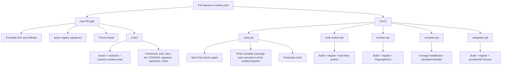

# CI and verification simplification audit

**Status:** Phase 1 audit and approved deletion tranches through CI-S02C3/PR #102 are merged. The owner rejected the numerical CI-R08 V1 token, approved CI-R08 V2 on 2026-07-12, and authorized its six narrow implementation PRs. CI-R08A through CI-R08E merged as PRs #105 through #109 with green post-merge `master` checks. CI-R08F implementation is complete: the remaining process runner is consolidated from 33 packaged rejection cases to two representatives while retaining the named build, telemetry, health, origin, deployment, and cleanup boundaries; live publication and merge evidence is tracked on #77.

**Audited commit:** `3f705edac3d66ff5bea1db6098f39342baa8b57d`

**Audit date:** 2026-07-11

## Executive verdict

The verification system protects important security, recovery, deployment, and runtime guarantees, but its evidence mechanism is substantially more complex than the application it checks. Simplification is justified and should be deletion-led, not a rewrite.

The repository contains 17,867 handwritten lines in 43 verification scripts. The 28 implementation scripts alone contain 13,306 lines, compared with 6,924 lines in the application's 110 production TypeScript files. Eleven verification files exceed 500 lines. The contract and its mutation tests account for 4,058 lines and inspect implementation text across the application, tests, runners, and documentation.

The valuable core is behavioral:

- real temporary-SQLite fresh/repeat initialization, initialized-database upgrade rollback/retry, backup, and restore tests;
- built Nitro startup and fail-closed runtime-configuration behavior;
- authorization, privacy, invitation, and workspace tests;
- browser accessibility and responsive behavior;
- isolated mutating API/provider fixtures;
- container context, non-root, persistence, readiness, and liveness evidence;
- exact dependency, lock-integrity, vulnerability-exception, secret, and registry-signature policy.

The highest-burden layer is meta-evidence: exact source fragments, test titles, function names, command strings, file inventories, test counts, and mutation tests that prove those strings remain present before the real behavior runs.

The recommended outcome is:

1. retain the behavioral and structured policy guarantees;
2. replace generic workflow analysis with pinned maintained tools;
3. remove literal application/test implementation contracts after mapping every approved guarantee to one primary behavior test;
4. make native Vitest thresholds the primary coverage gate;
5. simplify Doctor and browser orchestration in separate bounded pull requests and delete documentation-link CI after the owner explicitly retired that development-only guarantee;
6. keep the direct OSV-Scanner, Gitleaks, pnpm-signature, migration, deployment, and container behavioral boundaries unless a later replacement proves full parity;
7. require separate design approval before restructuring the 2,503-line built-runtime runner.

No script, test, workflow, dependency, lockfile, configuration, product code, or provider code changed during this audit.

## Historical execution sequence

At the audited commit, the audit found an authorization defect outside CI: project listing and creation were unauthenticated, and creation accepted a caller-supplied `ownerId`. The original approved execution order was:

1. review and approve, reject, or narrow this audit roadmap;
2. reconcile #19/#64 completion evidence, update [#20](https://github.com/smallwiselabs/swl-step-by-step/issues/20) to depend on #21, and create the approval-blocked lifecycle child issues;
3. implement [#21](https://github.com/smallwiselabs/swl-step-by-step/issues/21) before an open-ended CI program;
4. implement only proposals whose exact approval tokens and order were recorded by the owner;
5. implement the approved #20 child issues;
6. close milestone 3 only after #20 and its children have complete evidence.

This section records the decision at audit time rather than current GitHub state. #21 and its later #84 ownership correction have since merged; live issues and implementation records are authoritative for remaining work. Deferred [#1](https://github.com/smallwiselabs/swl-step-by-step/issues/1) remains out of scope.

## Evidence package

- [Inventory, call graph, runtime, churn, and external state](./inventory.md)
- [Raw evidence snapshot and selected collection commands](./evidence-snapshot.md)
- [Proposed-guarantee and primary-evidence ledger](./guarantee-ledger.md)
- [Source/config assertion ledger](./source-assertion-ledger.md)
- [Maintained-tool candidate matrix](./candidate-matrix.md)
- [CI-S01 implementation and differential evidence](./implementation-ci-s01.md)
- [CI-S02A1 authentication source-mirror implementation and differential evidence](./implementation-ci-s02a1.md)
- [CI-S02A2 module-state/hostile-origin mirror implementation and differential evidence](./implementation-ci-s02a2.md)
- [CI-S02B runtime/integration source-mirror implementation and differential evidence](./implementation-ci-s02b.md)
- [CI-S02C1 browser source-mirror implementation and differential evidence](./implementation-ci-s02c1.md)
- [CI-S02C2 container source-mirror implementation and differential evidence](./implementation-ci-s02c2.md)
- [CI-S02C3 migration/recovery source-mirror implementation and differential evidence](./implementation-ci-s02c3.md)
- [CI-S03 native-coverage implementation and differential evidence](./implementation-ci-s03.md)
- [CI-S04 Doctor and duplicate-entrypoint implementation and differential evidence](./implementation-ci-s04.md)
- [CI-R08 built-runtime scenario decomposition and implementation decision](./research-ci-r08.md)
- [CI-R08A evaluated Nuxt-config implementation evidence](./implementation-ci-r08a.md)
- [CI-R08B passwordless and SSR ownership implementation evidence](./implementation-ci-r08b.md)
- [CI-R08C HTTP-authority implementation evidence](./implementation-ci-r08c.md)
- [CI-R08D worker-entry implementation evidence](./implementation-ci-r08d.md)
- [CI-R08E ordinary-duplication deletion evidence](./implementation-ci-r08e.md)
- [CI-R08F process-only consolidation evidence](./implementation-ci-r08f.md)

## Key measurements

| Measure                                                          |        Baseline |
| ---------------------------------------------------------------- | --------------: |
| Verification implementation files                                |              28 |
| Verification implementation physical/nonblank LOC                | 13,306 / 12,093 |
| Verification test files                                          |              15 |
| Verification test physical/nonblank LOC                          |   4,561 / 4,159 |
| Total custom verification physical/nonblank LOC                  | 17,867 / 16,252 |
| Application production TypeScript physical/nonblank LOC          |   6,924 / 6,093 |
| Verification/application implementation ratio                    |           1.92× |
| Verification including tests/application implementation ratio    |           2.58× |
| Verification files at or above 500 physical lines                |              11 |
| CI contract plus mutation-test LOC                               |           4,058 |
| Required contract fragments in list-based assertions             |             913 |
| Contract mutation replacements                                   |             230 |
| Later non-merge commits touching the contract                    |        14 of 15 |
| Later non-merge commits touching coverage/debt files             |        12 of 15 |
| Median Fast + Full runner use per successful `master` event pair |     661 seconds |
| p95 Fast + Full runner use                                       |   711.6 seconds |
| Median Full workflow wall time                                   |     184 seconds |
| Observed workflow runs in the available history                  |             126 |
| Rerun attempts                                                   |               0 |

The run history covers only 2026-07-10 through 2026-07-11. It contains two deterministic failures—formatting and a Gitleaks finding—and 17 cancelled runs. There is no rerun-based flake evidence, but the observation window is too short to claim a durable flake rate.

## Audited baseline call graph

At the audited baseline, one ready-pull-request event pair performed six dependency installations, five production builds, four complete application-suite executions across Fast and Full verify, and repeated meta-validation of the same source graph. CI-S03/#72 removes two coverage mutation runs and the interrupted partial run; later implementation records supersede this baseline without rewriting it.

## Classification summary

| Capability                      | Audited LOC | Classification           | Audit decision                                                                                                                                                                                                                                                                                                                                                                                                                                                                                                                                                                                                                                                                                                                                      |
| ------------------------------- | ----------: | ------------------------ | --------------------------------------------------------------------------------------------------------------------------------------------------------------------------------------------------------------------------------------------------------------------------------------------------------------------------------------------------------------------------------------------------------------------------------------------------------------------------------------------------------------------------------------------------------------------------------------------------------------------------------------------------------------------------------------------------------------------------------------------------- |
| CI contract and mutation tests  |       4,058 | Approved tranches merged | #88, #89, #70, #90, #91, and #92 removed the approved application/runtime/browser/container/maintenance/migration mirrors without replacement source assertions.                                                                                                                                                                                                                                                                                                                                                                                                                                                                                                                                                                                    |
| Built-runtime smoke             |       2,503 | V2 implemented           | CI-R08/#77 replaces hard LOC acceptance with primary-owner, standard-layer, differential-fault, same-PR deletion, lifecycle, diagnostics, and measured-complexity requirements. CI-R08A removes three duplicate config children; CI-R08B removes the 19-case auth matrix; CI-R08C moves webhook authority to focused real H3 while retaining one encoded packaged project canary and the isolated canonical webhook journey; CI-R08D moves worker-entry behavior to focused tests; CI-R08E removes the second valid server and ordinary duplicates; CI-R08F reduces the final runner from 900/840 to 694/638 physical/nonblank lines and 37 to 6 child roots while retaining two representative packaged starts.                                    |
| Supply chain                    |       1,910 | Keep/simplify late       | Keep direct pinned OSV/Gitleaks CLIs, preinstall parser, expiring exceptions, count parity, canary, and pnpm signatures. Reject weaker current Actions.                                                                                                                                                                                                                                                                                                                                                                                                                                                                                                                                                                                             |
| Integration/deployment smoke    |       1,898 | Keep behavior            | Remove meta-source assertions; retain disposable-state, provider-double, no-write, and redaction behavior.                                                                                                                                                                                                                                                                                                                                                                                                                                                                                                                                                                                                                                          |
| Container/migration/maintenance |       1,676 | Keep behavior            | Retain real Docker/SQLite behavior; remove only duplicate source-string checks.                                                                                                                                                                                                                                                                                                                                                                                                                                                                                                                                                                                                                                                                     |
| Coverage                        |       1,349 | Replace/simplify         | CI-S03/#72 uses native Vitest ceilings/inclusion, retains only a strict reporter and source-root symlink preflight, and retires exact inventories, per-file debt, and artifacts.                                                                                                                                                                                                                                                                                                                                                                                                                                                                                                                                                                    |
| Documentation links             |       1,226 | Retire/remove            | The owner retired `DOC-01` in full; CI-S05/#74 deletes the checker, tests, callers, and source mirrors without Lychee or another replacement.                                                                                                                                                                                                                                                                                                                                                                                                                                                                                                                                                                                                       |
| Browser orchestration           |       1,162 | Behavior retained        | #90 keeps Playwright/Axe journeys and a dynamic fail-closed reporter while removing their source mirrors. CI-R08E PR #109 retains browser runtime/public/private rendering and private capture-output behavior while deleting duplicate browser build-output/database and liveness checks. Its exact intentional-navigation manifest-cancellation classification follows pinned Nuxt/Playwright behavior and keeps every other request failure fatal. CI-S06/#75 now delegates ordinary packaged-server startup, `/api/live` waiting, occupied-port rejection, and POSIX shutdown to pinned Playwright `webServer`; the launcher retains build/migration, disposable state, bounded private-output/artifact observation, and whole-sandbox cleanup. |
| Doctor/toolchain/format/runner  |       1,051 | Implemented by CI-S04    | Doctor is now a 45-line effective Git-ignore check; exact toolchain/formatter owners remain, the AWS boundary uses ESLint, and duplicate auth/contract/toolchain work is removed.                                                                                                                                                                                                                                                                                                                                                                                                                                                                                                                                                                   |
| Framework-security fixture      |         482 | Keep                     | It proves pinned framework behavior against a disposable real fixture. Remove only meta-source checks.                                                                                                                                                                                                                                                                                                                                                                                                                                                                                                                                                                                                                                              |
| CSS/PWA regex checks            |         303 | Defer replacement        | Preserve until #27/#34 provide behavioral evidence or the owner explicitly retires the current weak guarantee.                                                                                                                                                                                                                                                                                                                                                                                                                                                                                                                                                                                                                                      |
| Production readiness/evidence   |         249 | Keep manual              | Not on the automatic CI critical path; reassess with staging work.                                                                                                                                                                                                                                                                                                                                                                                                                                                                                                                                                                                                                                                                                  |

## Guarantee rule

Only approved, documented guarantees are protected. Existing bookkeeping or implementation assertions do not become guarantees merely because a checker currently enforces them.

Every replacement pull request must:

- identify the guarantee IDs it changes;
- identify one primary behavioral test, maintained validator, or narrow structured policy check for each guarantee;
- run the old and proposed mechanisms against the same passing fixture and at least one representative failing fixture for every guarantee and materially distinct failure mode affected before removing the old mechanism;
- preserve the public `Fast PR gate` and `Full pre-merge gate` check contexts;
- record base/head physical and nonblank LOC, runner minutes, critical path, and wrapper/configuration LOC;
- record added dependencies, licenses, privileges, network/data disclosure, installation provenance, and rollback;
- leave unrelated application/provider work out of the pull request;
- add a newly discovered concern only when it blocks acceptance, invalidates evidence, or is a serious security/data-loss defect.

Structured repository policy—such as workflow permissions, immutable action pins, event coverage, stable check names, artifact scope, exact toolchain values, and exception expiry—is not equivalent to literal implementation-text inspection. Small parsed/data-driven validators may remain where maintained tools do not know repository intent.

## Approved roadmap

The owner approved CI-S02 through CI-S05 and the bounded CI-R07/CI-R08 research on 2026-07-11, then approved the six-PR CI-R08 V2 implementation on 2026-07-12. CI-S06 received its separate design approval on 2026-07-14 and is implemented by the bounded #75 pull request; merge remains separately approval-gated. Other post-research implementations still require their recorded second approval.

| Order | Proposal                                                    | Outcome                                                                                                                                                                                     | Estimated net effect                                                                                                               | Approval boundary                                                                                                                         |
| ----: | ----------------------------------------------------------- | ------------------------------------------------------------------------------------------------------------------------------------------------------------------------------------------- | ---------------------------------------------------------------------------------------------------------------------------------- | ----------------------------------------------------------------------------------------------------------------------------------------- |
|     0 | R-019 / #21                                                 | Close the known project authorization and organization-migration gap                                                                                                                        | Product/security change; measured in its own PR                                                                                    | Must precede an open-ended CI program                                                                                                     |
|    0A | R-019C / #84                                                | Correct the approved family-plan boundary by restoring user-owned private projects without weakening #21 authorization                                                                      | Product/data-migration correction; measured in its own PR                                                                          | Must precede the revised #20 lifecycle children                                                                                           |
|     1 | CI-S01: maintained workflow analysis                        | Add exact actionlint/ShellCheck and zizmor validation; retain only narrow structured repository policy                                                                                      | Replace hundreds of generic workflow assertions with an expected 30–110 lines of config/bootstrap plus a small policy validator    | Approve exact tool pins, GPL tool execution, online/offline zizmor mode, and bootstrap provenance                                         |
|    2A | CI-S02A: application authorization contract removal         | #88 removes direct application auth mirrors; #89 removes module-state/origin mirrors and dead module file/test inventories. No direct invitation/Organization mirror existed.               | Deletion-led; each child records its final reduction and primary behavioral evidence                                               | No new source checker; every authorization/security guarantee retains a distinct failure fixture                                          |
|    2B | CI-S02B: runtime and integration contract removal           | #70 removes built-runtime, readiness, worker, deployment, and isolated-integration source/test-title assertions while retaining executable runners; no raw framework mirror remained        | Deletion-led; exact reduction recorded in the implementation document                                                              | Implemented without a runner rewrite; `INT-01D` actual-runner signal interruption is explicitly retired by owner decision                 |
|    2C | CI-S02C: browser, container, and migration contract removal | #90 removes browser mirrors; #91 removes container mirrors; #92 removes maintenance/migration implementation and test-title mirrors while retaining real SQLite migration/recovery behavior | Deletion-led; each narrow PR records its own reduction                                                                             | Preserve reporter completion, context-canary, persistence/health, and recovery failure modes                                              |
|     3 | CI-S03: native coverage gate                                | Make native Vitest thresholds/inclusion primary; remove exact inventories, per-file debt, coverage artifacts, and redundant full-suite failure runs                                         | 1,353→88 coverage script/test LOC, plus the 161-line debt ledger; GitHub runtime measured in the implementation PR                 | Approved: a 23-line source policy owns pinned ignore hints and source-root symlinks; artifacts and actual-runner interruption are retired |
|     4 | CI-S04: Doctor and duplicate entrypoints                    | Retain effective private-artifact, exact-toolchain, formatter, workflow-entrypoint, and provider-import boundaries; delete inventories and duplicate execution                              | 609 custom-script/test lines removed; 31 ESLint config lines added; dedicated auth duplicate removed                               | Implemented by #73 with no application/runtime/provider change                                                                            |
|     5 | CI-S05: documentation-link retirement                       | Delete the 1,226-line parser/tests, callers, and source mirrors without replacement                                                                                                         | Direct reduction above 1,226 LOC and approximately 0.97 seconds per Fast/Full verification job                                     | `DOC-01` and all ordinary/edge link guarantees explicitly retired by the owner                                                            |
|     6 | CI-S06: browser `webServer` parity                          | Pinned Playwright owns ordinary browser launch/readiness/shutdown; the launcher retains named app-owned build, migration, disposable-state, secrecy, and cleanup gaps                       | Runner plus config: 529→557 physical lines; direct lifecycle removed, with a narrow paired-file raw-byte privacy boundary retained | Design approved 2026-07-14; merge remains separately approval-gated                                                                       |
|     7 | CI-R07: supply-chain wrapper research gate                  | Produce a bounded design that keeps direct OSV/Gitleaks/pnpm capabilities while isolating duplicated parsing/download/report code                                                           | Research only; no implementation estimate until parity is mapped                                                                   | Later/high-risk; requires a second implementation approval                                                                                |
|     8 | CI-R08: built-runtime scenario implementation               | Use Vitest for config/auth/H3/worker-entry contracts, one existing Playwright lifecycle for two viewport executions, and Node only for named packaged/process failures                      | Six narrow PRs; one primary owner, same-PR deletion, unchanged isolated runner absent amendment, measured outcomes                 | V1 rejected; V2 approved 2026-07-12; CI-R08A/#105 through CI-R08E/#109 merged; CI-R08F implemented with live publication evidence on #77  |
|     9 | Revised R-018 / #20 children                                | Constrain member-only family access and implement immediate account deletion with minimized detached billing retention                                                                      | Product lifecycle work                                                                                                             | After #84; export, transfer, and the lifecycle registry are canceled                                                                      |

The CI-S/CI-R work above is recorded as approved, deferred, or research-gated GitHub issues with no milestone:

| Proposal | GitHub issue                                                       |
| -------- | ------------------------------------------------------------------ |
| CI-S01   | [#68](https://github.com/smallwiselabs/swl-step-by-step/issues/68) |
| CI-S02A  | [#69](https://github.com/smallwiselabs/swl-step-by-step/issues/69) |
| CI-S02A1 | [#88](https://github.com/smallwiselabs/swl-step-by-step/issues/88) |
| CI-S02A2 | [#89](https://github.com/smallwiselabs/swl-step-by-step/issues/89) |
| CI-S02B  | [#70](https://github.com/smallwiselabs/swl-step-by-step/issues/70) |
| CI-S02C  | [#71](https://github.com/smallwiselabs/swl-step-by-step/issues/71) |
| CI-S02C1 | [#90](https://github.com/smallwiselabs/swl-step-by-step/issues/90) |
| CI-S02C2 | [#91](https://github.com/smallwiselabs/swl-step-by-step/issues/91) |
| CI-S02C3 | [#92](https://github.com/smallwiselabs/swl-step-by-step/issues/92) |
| CI-S03   | [#72](https://github.com/smallwiselabs/swl-step-by-step/issues/72) |
| CI-S04   | [#73](https://github.com/smallwiselabs/swl-step-by-step/issues/73) |
| CI-S05   | [#74](https://github.com/smallwiselabs/swl-step-by-step/issues/74) |
| CI-S06   | [#75](https://github.com/smallwiselabs/swl-step-by-step/issues/75) |
| CI-R07   | [#76](https://github.com/smallwiselabs/swl-step-by-step/issues/76) |
| CI-R08   | [#77](https://github.com/smallwiselabs/swl-step-by-step/issues/77) |

Existing #21 was not duplicated. The owner decision is recorded on audit PR #67 and in the live issues; #69 and #71 now have narrow implementation children #88 through #92.

### Current approval records and pending tokens

Approval by a short proposal label alone is insufficient. The owner should use the corresponding token or state an explicit variation.

| Proposal      | Approval token                     | Recorded or pending option                                                                                                                                                                                                                                                                                                                                                                                                                                                                                                                                                     |
| ------------- | ---------------------------------- | ------------------------------------------------------------------------------------------------------------------------------------------------------------------------------------------------------------------------------------------------------------------------------------------------------------------------------------------------------------------------------------------------------------------------------------------------------------------------------------------------------------------------------------------------------------------------------ |
| CI-S01        | `APPROVE-CI-S01-OFFLINE`           | Verified actionlint 1.7.12 and ShellCheck 0.11.0 binaries; verified zizmor 1.26.1 binary in required offline fail-closed mode; no SARIF/Advanced Security dependency; aggregate bootstrap/config additions capped at 110 lines; retain parsed repository-specific policy.                                                                                                                                                                                                                                                                                                      |
| CI-S02A       | `APPROVE-CI-S02A-AUTH`             | Deletion manifest maps every removed auth/workspace/module/origin assertion to a guarantee ID, primary test, and distinct failure fixture; no runtime runner or structured policy changes.                                                                                                                                                                                                                                                                                                                                                                                     |
| CI-S02B       | `APPROVE-CI-S02B-RUNTIME`          | Deletion manifest covers runtime/readiness/worker/deployment/integration mirrors and confirms no raw framework mirror remains; retain focused readiness behavior, every executable runner, and unique Nitro/no-write/redaction scenarios. The owner's later explicit decision retires `INT-01D` instead of requiring an actual-runner signal fixture; ordinary cleanup implementation and generic coordinator tests remain. No orchestration rewrite.                                                                                                                          |
| CI-S02C       | `APPROVE-CI-S02C-SYSTEM`           | Deletion manifest covers browser/container/migration mirrors; retain Playwright reporter completion, actual Docker canaries/health/persistence, and real SQLite recovery behavior.                                                                                                                                                                                                                                                                                                                                                                                             |
| CI-S03        | `APPROVE-CI-S03-NATIVE`            | Native Vitest include and reviewed global negative ceilings are primary; retire exact inventories, per-file debt tuples, wrapper/mutation runs, and the coverage artifact; keep `autoUpdate` off; retain focused failures for skipped/todo/expected-failure/non-passed/missing results, recognized ignore comments, and production-root symlinks. Replacement implementation plus tests stays below 100 aggregate lines.                                                                                                                                                       |
| CI-S04        | `APPROVE-CI-S04-DOCTOR`            | Retain exact toolchain/import/repository-shape checks; delete exhaustive inventories/content patterns and duplicate focused-auth/toolchain/contract executions; do not alter application behavior.                                                                                                                                                                                                                                                                                                                                                                             |
| CI-S05        | `APPROVED-CI-S05-RETIRE`           | Retire `DOC-01` completely; delete the custom checker/tests, callers, and source mirrors; add no Lychee, dependency, wrapper, replacement checker, or parity fixture.                                                                                                                                                                                                                                                                                                                                                                                                          |
| CI-S06        | Approved on #75, 2026-07-14        | Playwright `webServer` owns ordinary launch/readiness/occupied-port/shutdown behavior; `reuseExistingServer: false`; the launcher retains named build/migration/disposable-state/secrecy gaps; reporter behavior is unchanged. Merge remains separately gated.                                                                                                                                                                                                                                                                                                                 |
| CI-R07        | `APPROVE-CI-R07-RESEARCH`          | Research/design output only; no dependency, workflow, or script changes and no implementation issue until a second approval.                                                                                                                                                                                                                                                                                                                                                                                                                                                   |
| CI-R08        | `APPROVE-CI-R08-IMPLEMENTATION-V2` | Approved 2026-07-12. Six guarantee-led PRs; standard-layer ownership; one logical Playwright login journey in both existing projects with failure-path output redaction; focused real-H3 webhook authority; one focused real TSX worker process plus dynamic-import mappings; unchanged isolated runner absent an approved amendment; retained migration/health/process canaries; no guarantee retirement; one semantic owner plus distinct canaries; same-PR deletion; measured outcomes; 500-plus lines as review checkpoint only. See the V2 packet for the complete token. |
| Empty tranche | `APPROVE-CI-TRANCHE-NONE`          | Defer all CI implementation after the audit; complete the product-planning handoff, then proceed from #21 to #20 without treating unapproved CI proposals as blockers.                                                                                                                                                                                                                                                                                                                                                                                                         |

## Product milestone handoff

The audit originally handed off organization-owned project authorization to #21. #21 merged and remains valid security history, but the later owner-approved personal/family-app clarification separates two authorities: Better Auth Organization supplies family-plan membership and future entitlements, while private records are user-owned by default.

The current handoff is:

- #84 supersedes only #21's resource-ownership choice. It maps marked organization projects to the unique `personal_owner_user_id`, rejects unmarked organizations, restores `/api/projects` user predicates, re-keys search, and proves same-plan cross-user isolation plus actual SQLite rollback/retry.
- #78 narrows the existing invitation surface to one provisioning owner and member-only invitations. It removes assignable admin/owner invitations and business-workspace member/role/transfer/delete operations.
- #79 is canceled. The baseline implements no account/workspace export and no lifecycle registry.
- #80 implements the only destructive public operation: immediate deletion of one's own account and owned family-plan group while preserving invitees' identities/private data and retaining only detached, purpose-limited billing history.
- Active external billing does not block account deletion or preserve application access.
- No child may introduce a generic ACL, workflow engine, second queue, source-text policy assertion, or a likely 500-plus-line handwritten infrastructure component without presenting maintained alternatives and obtaining separate approval. The number is a planning checkpoint, not a merge cap.

Milestone 3 closes only when #84, #78, #80, and umbrella #20 are closed with criterion-level evidence and current `master` is green.

## What should remain unchanged in the first tranche

- Better Auth and application authorization behavior tests.
- Real temporary-SQLite fresh/repeat initialization, initialized-database upgrade rollback/retry, integrity, and restore tests.
- Built-runtime invalid-configuration behavior with no listener observed before exit.
- Browser accessibility, keyboard, responsive, console, request, and invitation journeys.
- Isolated API/provider fixtures and no-write deployment smoke.
- Docker context canaries, non-root checks, persistence, backup/restore, readiness, and liveness behavior.
- Direct OSV-Scanner `2.4.0`, Gitleaks `8.30.1`, and pnpm `11.1.2` signature verification.
- Exact-version, lock-integrity, exception-expiry, package-count, canary, redaction, and artifact-scope guarantees.
- Public workflow check names.

## Rollback model

Each implementation proposal must be one independently revertible pull request. The parent commit is the behavioral baseline. The proposed replacement runs beside the old mechanism only inside its pull request; both are exercised against shared success/failure fixtures, then the old mechanism is removed before merge. A rollback is a single revert that restores the prior command and files without requiring a second migration PR.

Workflow changes must preserve check names and triggers. Dependency/tool changes must pin exact versions and installation artifacts. Generated output is excluded from the handwritten-infrastructure review signal only when a tracked deterministic generator exists and remains materially smaller than its output.

For the roughly 500-line planning checkpoint, a “solution” means all handwritten CI implementation, configuration, bootstrap, and CI-specific test additions serving one capability, even when split across files. The checkpoint exists to force an alternatives and complexity review before a large custom subsystem is built. It is not an acceptance threshold, and code must not be compressed, hidden in helpers, stripped of diagnostics, or rejected solely to satisfy it.

Owner review or approval is required before:

- a proposed new or materially rewritten handwritten CI capability is likely to reach roughly 500-plus lines;
- a draft is unexpectedly large relative to its approved design or introduces more custom concepts than the maintained alternative;
- a replacement becomes a rewrite;
- a guarantee is retired rather than replaced;
- the roadmap is reordered to delay #21.

## External-state limitations

The repository is private. GitHub Actions is enabled with default read permissions, all Actions are allowed, and repository-level full-SHA enforcement is off. There are no repository Actions secrets, variables, or environments. Dependabot alerts, secret scanning, and code scanning are unavailable or disabled.

Branch-protection and ruleset APIs return `403` under the current repository plan. This audit therefore does not claim that check contexts are externally required. It preserves their names for future enforcement and leaves #1 deferred.

## Implementation authorization

The owner supplied `APPROVE-CI-R08-IMPLEMENTATION-V2` on 2026-07-12. Phase 2 may proceed only through the six bounded CI-R08A–F pull requests and the stop conditions recorded in the V2 packet. CI-R07 implementation, guarantee retirement, product/provider work, schema/migration behavior changes, an isolated-runner addition, and another generic CI framework remain separately gated or out of scope.
