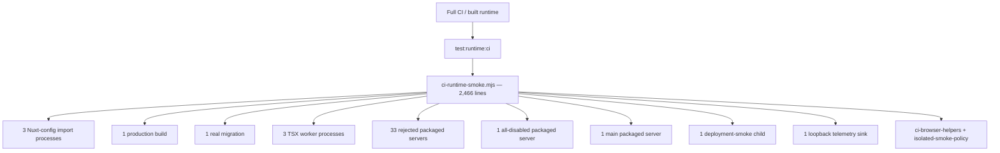

# CI-R08 built-runtime decomposition research

**Status:** V2 approved by the owner on 2026-07-12; six bounded implementation PRs authorized; V1 remains void; CI-R08A through CI-R08E merged as PRs #105 through #109; CI-R08F is implemented with live publication and merge evidence tracked on #77

**V2 research base:** `8a440484dcfae26f32caa277094bf70ab43beca4` (`origin/master` after PR #103)

**Issue:** [#77](https://github.com/smallwiselabs/swl-step-by-step/issues/77)

## Owner correction

The owner rejected `APPROVE-CI-R08-IMPLEMENTATION-V1`. It is void and cannot authorize implementation.

V1 incorrectly turned research estimates into merge ceilings. A line limit can reward compressed code, hidden helpers, weaker diagnostics, or moving scenarios between custom runners. Physical LOC remains useful as a maintenance signal and must be reported, but it is not an industry standard or the primary acceptance test.

The replacement decision is guarantee- and layer-led:

1. use the lowest standard test layer that can observe the failure;
2. give every guarantee one primary owner;
3. permit a packaged canary only when it catches a distinct build, bundle, registration, middleware-order, SSR, or process failure;
4. add no lifecycle merely to relocate assertions;
5. retain custom process code only for a named failure that maintained tooling cannot directly observe; and
6. judge the result by custom concepts removed, maintained tooling used, duplicate execution removed, diagnostics, reliability, runtime, and measured complexity.

The earlier estimates are historical research inputs, not authorization. Crossing an estimate triggers explanation and review, not compression or automatic rejection. A likely 500-plus-line new or materially rewritten infrastructure component remains an owner-review checkpoint under the repository policy; it is not a hard merge cap.

## V2 decision summary

Implement six narrow pull requests rather than the previous three:

1. evaluate the real Nuxt configuration in Vitest and delete the three config-import child processes;
2. move passwordless contracts to a focused Vitest/Drizzle/SQLite suite, add one logical login journey to the existing Playwright suite, preserve dynamic process-output secrecy narrowly, and delete the runtime auth matrix atomically;
3. put origin and webhook authority at real H3/Vitest boundaries, retain one exact runtime project canary plus the unchanged isolated canonical webhook journey, and delete the exhaustive runtime HTTP matrices;
4. move worker-entry evidence into a focused Vitest suite with one real TSX-process canary plus dynamic-import/real-SQLite handler cases, then delete the runtime copies;
5. delete ordinary module, runtime-config, browser-liveness/build, second-server, inventory, and bookkeeping duplication after their primary owners are fault-proven; and
6. consolidate the remaining process smoke around irreducible production-process failures, including the real migration setup and the packaged health transition.

No addition to `isolated-api-smoke.mjs`, `api-smoke.mjs`, or their policy layer is currently justified. Together those files already contain 1,196 implementation lines, and the current gaps have lower standard-layer or already-retained process owners. If implementation evidence disproves that conclusion, stop with a per-boundary comparison showing why Vitest, Playwright, Nuxt-supported E2E, and a retained process canary are worse and request an amendment. Do not silently move a scenario between custom runners.

Do not adopt Playwright `webServer` in #77. The existing Playwright lifecycle may receive fixture environment and the narrow dynamic-output observation needed by the real login, but its spawn/readiness/shutdown architecture remains #75. If the auth move requires changing that architecture, pause #77 and bring #75 forward for its separate decision.

Keep the existing `test:runtime:ci` command and `Full CI / built runtime` check name. Add no dependency, workflow job, source-text assertion, generic checker, test DSL, scenario engine, reporter, configuration parser, or process framework.

## Official and resolved-version basis

- Vitest `4.1.6` recommends testing observable contracts—inputs, configuration, outputs, errors, and side effects—and avoiding implementation-detail assertions. It also recommends keeping the real subject under test while replacing only slow or external dependencies: [pinned testing guidance](https://github.com/vitest-dev/vitest/blob/v4.1.6/docs/guide/learn/testing-in-practice.md).
- Nuxt `4.4.8` distinguishes ordinary Node tests, Nuxt-runtime tests, and end-to-end tests and says separating Nuxt runtime and end-to-end environments is important for stability. Its official test utilities can build and launch Nuxt, target an already running host, fetch SSR HTML, and use Playwright: [pinned Nuxt testing guidance](https://github.com/nuxt/nuxt/blob/v4.4.8/docs/1.getting-started/17.testing.md).
- `@nuxt/test-utils` `4.0.3` is official and can own conventional Nuxt E2E. It builds through `buildNuxt`, uses its own test output, starts the generated server with inherited output, exposes the managed `serverProcess`, and detects exit before readiness. It does not provide a first-class passing expected-failure/no-listener observation, complete assertion buffer, sink counts, exact shipped command, or repository state sentinels without app-owned hook/process logic: [pinned build implementation](https://github.com/nuxt/test-utils/blob/v4.0.3/src/e2e/nuxt.ts), [pinned server implementation](https://github.com/nuxt/test-utils/blob/v4.0.3/src/e2e/server.ts), [pinned context type](https://github.com/nuxt/test-utils/blob/v4.0.3/src/e2e/types.ts), and [package metadata](https://registry.npmjs.org/@nuxt/test-utils/4.0.3).
- Playwright `1.61.1` `webServer` can run an arbitrary command with an explicit environment, wait for HTTP or output, pipe output, enforce a timeout, and shut down the process group. The `webServer` configuration and tests expose neither its child handle nor a complete output buffer. Playwright's pinned implementation forwards launched-server chunks to reporter callbacks, but turning that stream into process secrecy, sink, artifact, and state assertions would require another custom reporter/wrapper rather than remove custom concepts: [pinned `webServer` documentation](https://github.com/microsoft/playwright/blob/v1.61.1/docs/src/test-webserver-js.md), [pinned implementation](https://github.com/microsoft/playwright/blob/v1.61.1/packages/playwright/src/plugins/webServerPlugin.ts#L112-L125), and [license](https://github.com/microsoft/playwright/blob/v1.61.1/LICENSE).
- Better Auth `1.6.23` mounts the public `auth.handler(toWebRequest(event))` boundary in a Nitro catch-all route. The application should test that handler, not private internals: [pinned Nuxt integration](https://github.com/better-auth/better-auth/blob/v1.6.23/docs/content/docs/integrations/nuxt.mdx).
- Better Auth documents that magic-link storage defaults to plain text, while this application selects hashing; token redemption is atomically single-use; and verification removes a legacy password and sessions specifically for a pre-existing account whose email was unconfirmed. Those are application configuration and supported-transition guarantees, not reasons to retest the plugin's internals: [pinned magic-link behavior](https://github.com/better-auth/better-auth/blob/v1.6.23/docs/content/docs/plugins/magic-link.mdx).
- Better Auth documents that `auth.api` bypasses client rate limiting and that the configured trusted client-address header differs from an untrusted comma-delimited forwarding chain. Rate-limit evidence must therefore cross the configured public handler: [pinned rate-limit behavior](https://github.com/better-auth/better-auth/blob/v1.6.23/docs/content/docs/concepts/rate-limit.mdx).
- The configured Better Auth instance uses the actual Drizzle SQLite adapter; focused tests can use the same production composition and a migrated temporary database: [pinned Drizzle adapter](https://github.com/better-auth/better-auth/blob/v1.6.23/docs/content/docs/adapters/drizzle.mdx).
- Nuxt documents that a built server does not automatically read `.env`, only matching `NUXT_` names override declared runtime config, and differently named defaults become build-time values. Evaluating the real configuration and retaining runtime/build canaries protect different failures: [pinned runtime configuration](https://github.com/nuxt/nuxt/blob/v4.4.8/docs/3.guide/6.going-further/10.runtime-config.md) and [pinned production `.env` behavior](https://github.com/nuxt/nuxt/blob/v4.4.8/docs/2.directory-structure/2.env.md).
- Nitro `2.13.4` identifies `.output/server/index.mjs` as the ready-to-run Node entry and auto-registers plugins at server startup. A small number of exact-built-process canaries remain justified: [pinned Node runtime](https://github.com/nitrojs/nitro/blob/v2.13.4/docs/2.deploy/10.runtimes/1.node.md) and [pinned plugin lifecycle](https://github.com/nitrojs/nitro/blob/v2.13.4/docs/1.docs/50.plugins.md).
- Node 24 supplies explicit child environments, child handles, piped output, signals, and lifecycle events. Its `close` event occurs after the child ended and stdio closed, which is the correct boundary for complete-output assertions: [Node child-process documentation](https://nodejs.org/download/release/latest-v24.x/docs/api/child_process.html).
- SQLite documents that `PRAGMA data_version` must be compared on the same observer connection and changes when another connection commits. The deployment no-write observer retains that exact boundary: [SQLite `PRAGMA data_version`](https://www.sqlite.org/pragma.html#pragma_data_version).

## V2 research-base caller and dependency graph



At the V2 research base, the caller was `.github/workflows/full-ci.yml` through the root `package.json` command and the runner launched 44 managed child processes. CI-R08A removes three config-import children; later implementation records supersede other counts without rewriting this baseline. All listeners and probes are loopback-only. External provider URLs are constructed as data, but the expected path makes no provider request.

The proposed primary owners already have these separate callers:

```text
package.json test
  -> apps/web/vitest.config.ts
  -> apps/web/tests/*.test.ts

Full CI / browser and accessibility
  -> test:browser:ci
  -> scripts/ci-browser-smoke.mjs
  -> playwright.config.mjs
  -> tests/browser/*.pw.mjs

Full CI / isolated integration
  -> test:integration:ci
  -> scripts/isolated-api-smoke.mjs
  -> scripts/api-smoke.mjs

Full CI / container health
  -> test:container-health:ci
  -> scripts/ci-container-health.mjs
```

### V2 research-base line decomposition

| Lines     |  Physical |  Nonblank | Responsibility                                                       |
| --------- | --------: | --------: | -------------------------------------------------------------------- |
| 1–120     |       120 |       117 | imports, paths, canaries, environments, shared state                 |
| 121–139   |        19 |        18 | pre-build rejection loop and poisoned production build               |
| 140–197   |        58 |        57 | migration and disabled/enabled worker journeys                       |
| 198–422   |       225 |       224 | runtime environment, 33 pre-listen cases, telemetry lifecycle        |
| 423–477   |        55 |        51 | all-disabled/main server orchestration and final diagnostics         |
| 478–719   |       242 |       220 | environment, database, worker, deployment, and artifact-scan helpers |
| 720–891   |       172 |       163 | pre-build/pre-listen/all-disabled/TCP helpers                        |
| 892–1040  |       149 |       138 | runtime precedence, SSR, liveness, and readiness                     |
| 1041–1126 |        86 |        82 | disabled-module route and Nitro error-header matrix                  |
| 1127–1187 |        61 |        58 | Stripe webhook HTTP matrix                                           |
| 1188–1268 |        81 |        75 | command-origin HTTP matrix                                           |
| 1269–1451 |       183 |       164 | runner-local timeout, process, cleanup, and output machinery         |
| 1452–2045 |       594 |       574 | 19 auth scenario bodies and control                                  |
| 2046–2401 |       356 |       316 | auth capture, SQLite, cookie, and HTTP helpers                       |
| 2402–2466 |        65 |        58 | telemetry, assertion, and port helpers                               |
| **Total** | **2,466** | **2,315** |                                                                      |

Auth accounts for 950 physical lines, or 38.5% of the runner. The runner also recreates process/output support despite importing shared lifecycle helpers.

## V2 research-base topology and burden

| Surface                             | Physical LOC | V2 research-base responsibility                                                                                                                           |
| ----------------------------------- | -----------: | --------------------------------------------------------------------------------------------------------------------------------------------------------- |
| `ci-runtime-smoke.mjs`              |        2,466 | 44 managed children; config, build, migration, workers, 33 rejected starts, two valid servers, deployment, origin, webhook, auth, and process observation |
| runtime auth block and helpers      |          950 | 19 auth scenarios plus capture, cookie, HTTP, and SQLite machinery                                                                                        |
| isolated integration implementation |        1,196 | 401-line launcher, 710-line API journey, and 85-line invocation policy                                                                                    |
| isolated launcher tests             |          140 | invocation and cleanup behavior                                                                                                                           |
| browser lifecycle implementation    |          846 | 365-line launcher, 321-line shared process helper, and 160-line reporter                                                                                  |
| Playwright config and main spec     |          434 | 48-line config and 386-line standard Playwright assertions                                                                                                |

The runtime command was observed at 40.35 seconds locally, 81 seconds for the hosted command, and 1m42s for its hosted job. Those measurements and all LOC above are baselines, not targets.

The browser suite already builds once, runs one real migration, starts the exact packaged server once, captures its output, and then executes the same logical tests in `desktop-chromium` and `mobile-chromium`. Its completion reporter requires identical logical test discovery and passing results in both projects. V2 therefore does **not** claim one login execution: it proposes one logical login journey executed twice, once per existing viewport, inside the same server lifecycle.

Billing is currently disabled in that fixture. The read-only authenticated `/billing` journey performs no checkout/provider operation; existing browser observation still rejects external browser requests, but this journey does not claim a server-wide Stripe no-contact proof. The exact disabled-module representative will be `/observability-client-test#token=disabled-token-must-not-be-sent`, which proves the disabled UI boundary prevents `/api/observability` calls and does not transmit the fragment token.

## Scenario disposition matrix

| ID     | V2 research-base `ci-runtime-smoke.mjs` group                                       | Exact post-V2 owner/caller                                                                                                                                                                                          | V2 disposition and distinct failure                                                                                                                                              |
| ------ | ----------------------------------------------------------------------------------- | ------------------------------------------------------------------------------------------------------------------------------------------------------------------------------------------------------------------- | -------------------------------------------------------------------------------------------------------------------------------------------------------------------------------- |
| R08-01 | three `NEXT_PUBLIC_AUTH_URL`/`NEXTAUTH_URL`/`VERCEL_URL` config-import children     | `apps/web/tests/nuxt-build-policy.test.ts` through root `test`/Vitest                                                                                                                                               | CI-R08A adds evaluated per-key cases and deletes the children; production process adds no evidence                                                                               |
| R08-02 | `assertExpectedEnvironment`/`assertEnvironmentBoundary` fixture-equality assertions | none                                                                                                                                                                                                                | E deletes fixture bookkeeping without replacement                                                                                                                                |
| R08-03 | poisoned build, complete output/artifact scans, build DB main/WAL/SHM absence       | process owner `ci-runtime-smoke.mjs`; Playwright keeps only distinct rendered runtime-vs-build behavior                                                                                                             | F retains process proof; E removes the duplicate browser build-output/build-DB assertions                                                                                        |
| R08-04 | real `pnpm db:migrate`                                                              | F process setup; correctness remains focused migration suites                                                                                                                                                       | retain only one disposable-server setup child; claim no recovery evidence                                                                                                        |
| R08-05 | jobs-disabled `server/worker.ts` child                                              | new `apps/web/tests/worker-entry.test.ts` through Vitest and Node `execFile`                                                                                                                                        | D runs the documented pinned-TSX command, proves stable clean exit/no DB touch, then deletes the runtime child                                                                   |
| R08-06 | `cache.cleanup` worker child                                                        | new `worker-entry.test.ts` with migrated temp SQLite                                                                                                                                                                | D queues a real expired-cache job and proves deletion, success, one attempt, and released lock before deleting the child                                                         |
| R08-07 | `files.cleanup-orphans` worker child                                                | new `worker-entry.test.ts`; existing account-deletion tests remain service/retry owners                                                                                                                             | D proves real entry mapping and job completion before deleting the child                                                                                                         |
| R08-08 | 33 pre-listen invalid starts and telemetry sink                                     | exhaustive config owners `server-foundation.test.ts`/`module-states.test.ts`; F retains two process cases                                                                                                           | collapse to missing database and Better Auth telemetry escape/no-contact; delete the other 31 starts                                                                             |
| R08-09 | second all-disabled packaged server and route matrix                                | focused module/origin tests plus existing Playwright disabled-observability page                                                                                                                                    | E deletes the second server and matrix                                                                                                                                           |
| R08-10 | packaged `/api/live` and retired `/api/health`                                      | semantic owner `health-boundaries.test.ts`; direct `.output` canary in F; Docker boundary in `ci-container-health.mjs`                                                                                              | retain packaged `204`/empty/no-store; delete historical `/api/health` and duplicate browser liveness assertion                                                                   |
| R08-11 | readiness missing/wrong/`200`/DB-loss `503` plus live-after-loss                    | semantic owner `health-boundaries.test.ts`; direct `.output` canary in F; Docker boundary in container health                                                                                                       | retain build-token `401`, runtime-token `200`, DB-loss `503`, and live `204`; delete redundant credential variants                                                               |
| R08-12 | homepage title/topbar/runtime/private-config matrix                                 | `tests/browser/foundation.pw.mjs` through `test:browser:ci`                                                                                                                                                         | E deletes runtime duplicate; Playwright owns initial-HTML and hydrated runtime-vs-build/public-vs-private rendering                                                              |
| R08-13 | disabled-module routes/collision/full error-header matrix                           | `module-states.test.ts`, `cross-origin-policy.test.ts`, existing Playwright `/observability-client-test`                                                                                                            | E deletes the matrix; R08-15 retains exact built error headers; no Files canary remains                                                                                          |
| R08-14 | canonical, hostile-metadata, encoded-metadata, and invalid-signature webhooks       | new `apps/web/tests/billing-webhook-http.test.ts`; primitive signature owner `server-foundation.test.ts`; policy owner `cross-origin-policy.test.ts`; canonical packaged projection owner unchanged `api-smoke.mjs` | C fills real-route hostile/invalid/no-write gap and deletes runtime matrix; R08-15 already proves encoded Nitro path/middleware behavior, so no second packaged webhook is added |
| R08-15 | command-origin matrix and project no-write                                          | exhaustive `cross-origin-policy.test.ts`; one exact-built encoded hostile `/api/projects` request in F                                                                                                              | retain packaged `403`, stable code, exact security headers, and no row; delete ordinary matrix                                                                                   |
| R08-16 | ten deployment-smoke checks through actual CLI                                      | request semantics `deployment-smoke.test.mjs`; actual CLI/state owner remains F                                                                                                                                     | retain one CLI execution with SQLite/object no-write comparison                                                                                                                  |
| R08-17 | repeated exhaustive DB-family inventories                                           | R08-03 build sentinel, R08-15 project no-write, R08-16 state observers                                                                                                                                              | E deletes bookkeeping inventories                                                                                                                                                |
| R08-18 | runner-local timeout/process/cookie/output/cleanup helpers                          | `ci-browser-helpers.mjs` plus tests for ordinary lifecycle; browser late-secret observer separately named                                                                                                           | E/F delete auth/cookie/local duplicates and reuse existing helpers; add no framework                                                                                             |

### Auth scenario matrix

|   # | V2 research-base built auth scenario                                                                   | Primary V2 disposition                                                                                |
| --: | ------------------------------------------------------------------------------------------------------ | ----------------------------------------------------------------------------------------------------- |
|   1 | anonymous session is empty                                                                             | focused configured-handler Vitest; delete runtime duplicate                                           |
|   2 | Google URL/scope/PKCE/state and absent token/link APIs                                                 | existing `social-auth.test.ts` and `server-foundation.test.ts`; delete runtime duplicate              |
|   3 | hostile issuance origin and proxy headers                                                              | focused configured-handler Vitest                                                                     |
|   4 | local and foreign return paths rejected before delivery                                                | focused passwordless plus existing invitation-return behavior                                         |
|   5 | hashed five-minute token and callback non-consumption                                                  | focused configured-handler/Drizzle/SQLite Vitest                                                      |
|   6 | concurrent one-token redemption and replay                                                             | focused Vitest owns atomic behavior; Playwright owns only ordinary packaged redemption                |
|   7 | known and unknown issuance are byte-neutral                                                            | focused Vitest owns privacy behavior                                                                  |
|   8 | expired token burns without a session                                                                  | focused Vitest                                                                                        |
|   9 | capture failure maps to generic HTTP `503`                                                             | focused handler owns mapping; existing email tests own capture filesystem behavior                    |
|  10 | password endpoints are absent and create no credential                                                 | one consolidated configured-handler surface/state case                                                |
|  11 | first verified link removes legacy credential and sessions                                             | focused Vitest for the supported pre-existing unconfirmed-account transition                          |
|  12 | hostile sign-out preserves authenticated session/cookie                                                | focused configured-handler origin/cookie case                                                         |
|  13 | sign-out, fresh link, cookie policy, and personal-workspace reuse                                      | focused provisioning and cookie cases; Playwright owns the real packaged session                      |
|  14 | authenticated `/auth` SSR forwards session cookie                                                      | Playwright in both configured projects; assert authenticated initial response HTML and hydrated state |
|  15 | authenticated `/billing` SSR reaches the private app API                                               | Playwright in both configured projects; assert authenticated initial response HTML and hydrated state |
|  16 | request rate limit trusts one single-valued CF client address                                          | focused production-handler Vitest with rate limiting enabled                                          |
|  17 | redemption limit runs before valid-token consumption                                                   | focused Vitest                                                                                        |
|  18 | comma-delimited CF values share the untrusted bucket                                                   | focused production-handler Vitest                                                                     |
|  19 | OIDC dynamic registration remains absent                                                               | configured-handler surface case                                                                       |
|   — | email, token, callback URL, and capture path absent from packaged-server and Playwright process output | narrow browser-launcher observers around the two viewport journeys                                    |

The browser launcher passes only the capture directory and per-project recipient convention to Playwright. Each project reads its private capture envelope directly and consumes the link without adding IPC. The token-bearing test disables retained trace, screenshot, and other token-bearing artifacts. The launcher pipes rather than inherits Playwright stdout/stderr and retains bounded full-lifetime server and Playwright-output buffers. In a `finally` after the Playwright child closes—on success or failure—it reads every available envelope, extracts all dynamic values, registers them with both observers, and performs retrospective scans before emitting any diagnostic or rethrowing. It then scans shutdown output prospectively with split-chunk overlap. Missing/unreadable envelopes after issuance or buffer overflow before registration fail closed without raw output. The existing short diagnostic tail is emitted only after value registration and redaction.

## Guarantee ownership ledger

| Guarantee                                                                                                                          | Primary owner after V2                                                                 | Distinct packaged/process evidence                                                                                                 | Final disposition                                                            |
| ---------------------------------------------------------------------------------------------------------------------------------- | -------------------------------------------------------------------------------------- | ---------------------------------------------------------------------------------------------------------------------------------- | ---------------------------------------------------------------------------- |
| each forbidden Better Auth build fallback rejects independently                                                                    | evaluated real-config Vitest                                                           | none                                                                                                                               | delete three config children                                                 |
| token persistence, expiry, replay, privacy, password surface, conditional legacy retirement, cookies/origin, and trusted-IP limits | production `createAuthentication` + public handler + real Drizzle/temp SQLite Vitest   | Playwright proves catch-all/session composition, not the full matrix                                                               | delete runtime auth matrix                                                   |
| `/auth` and `/billing` authenticated SSR and hydration                                                                             | one logical Playwright journey in both existing projects                               | initial response HTML proves SSR separately from hydrated DOM                                                                      | no runtime/isolated copy                                                     |
| dynamic auth values never enter packaged-server or Playwright process output                                                       | browser launcher's bounded suite-specific output observers                             | late values require finally-path registration plus retrospective/prospective scanning                                              | retain only narrow, suite-specific logic                                     |
| exhaustive app-command origin policy                                                                                               | `cross-origin-policy.test.ts`                                                          | one encoded hostile project `403`, no write, exact error headers on built Nitro                                                    | delete remaining runtime origin matrix                                       |
| webhook invalid-signature/no-write and independent authority                                                                       | real H3 route Vitest using actual middleware/handler/signature code/temp SQLite        | encoded-path/middleware behavior is already sampled by the packaged project canary                                                 | delete runtime webhook matrix                                                |
| canonical webhook registration, projection, and idempotency                                                                        | unchanged isolated built `api-smoke.mjs` journey                                       | none added                                                                                                                         | keep unchanged; do not add an encoded duplicate                              |
| module/service gating                                                                                                              | `module-states.test.ts` and focused H3 tests                                           | Playwright `/observability-client-test` proves one packaged UI/module boundary                                                     | delete runtime module matrix and second server                               |
| worker command boots/exits and entry maps disabled, cache-cleanup, and files-cleanup correctly                                     | new suite-local real TSX child plus dynamic-import/temp-SQLite Vitest                  | wider queue/service/retry behavior remains in existing focused suites                                                              | delete three runtime worker children only after command/mapping faults fail  |
| runtime values override build values; private config stays private                                                                 | Playwright initial HTML and hydrated config                                            | none                                                                                                                               | delete runtime rendering duplicate                                           |
| live/ready response, auth, and redaction contracts                                                                                 | `health-boundaries.test.ts`                                                            | compact Node canary owns packaged `204/401/200/503` and dependency-independent live transition; container owns image/volume wiring | retain compact packaged transition                                           |
| build creates no new SQLite main/WAL/SHM sentinel and leaks no canary to complete output/artifacts                                 | narrow Node process/filesystem harness                                                 | standard HTTP/browser layers cannot inspect these boundaries                                                                       | retain; do not claim a pre-existing file was never opened read-only          |
| invalid core config and forbidden telemetry override exit before an observed listener; telemetry sink has zero requests            | narrow Node process/TCP/sink harness                                                   | `webServer`/Nuxt wrappers would still need repository-owned observation                                                            | retain two rejected starts; say “no listener observed,” not absolute no-bind |
| shipped deployment CLI is read-only                                                                                                | actual CLI child plus same-connection SQLite `data_version` and object-state observers | focused CLI tests own parsing and request shapes                                                                                   | retain one execution/state comparison                                        |
| ordinary child and sandbox cleanup                                                                                                 | existing tested process helpers                                                        | actual-runner signal-interruption guarantee remains retired                                                                        | reuse; add no process framework                                              |

One primary owner does not mean one test for unrelated failures. It means the same semantic guarantee is not permanently repeated across Vitest, Playwright, isolated integration, container, and runtime. Every retained canary above names a separate packaging, image, process, or browser failure.

## Six-PR implementation sequence

### CI-R08A — evaluated Nuxt configuration

- Add one parameterized Vitest case per forbidden Better Auth build fallback to `nuxt-build-policy.test.ts`.
- Each case sets only one forbidden key, resets the module, imports the real configuration, and requires rejection so one surviving guard cannot mask another.
- Demonstrate one reversible fault per key, then delete the three runtime config-import child processes in the same PR.
- Make only the smallest mechanical correction to any surviving source-text contract that names the deleted execution. Add no replacement source assertion.

### CI-R08B — atomic passwordless and SSR ownership transition

Implementation evidence is recorded in [`implementation-ci-r08b.md`](./implementation-ci-r08b.md). This progress note does not rewrite the V2 research-base tables or estimates below.

- Add `apps/web/tests/passwordless-auth-http.test.ts` with a suite-local fixture using production `createAuthentication`, the public handler, the actual Drizzle adapter, the packaged migration set on temporary SQLite, and a fake sender only at the external email boundary.
- Test application configuration and supported behavior, not Better Auth internals or 19 copied titles.
- Retain conditional legacy-password/session retirement because it is an application security guarantee for the supported pre-existing unconfirmed-account transition.
- Extend the existing Playwright suite—without a second build, migration, server, project, or reporter change—with one logical login test. It runs once in desktop and once in mobile because that is the existing project contract; count and report both executions.
- For both `/auth` and `/billing`, assert authenticated initial response HTML separately from the hydrated UI. A DOM assertion after navigation alone is not SSR evidence.
- Make the fixture billing-ready without contacting Stripe. Keep `/observability-client-test#token=disabled-token-must-not-be-sent` as the exact packaged disabled-module representative.
- Pass the private capture directory to Playwright, use a unique recipient per project, and consume the captured URL without IPC. Disable trace, screenshot, and retained token-bearing artifacts for this journey.
- Pipe Playwright output into the same suite-specific secrecy boundary. In a `finally` after child close on success or failure, read all available envelopes and register every dynamic value before scanning or emitting any server/Playwright diagnostic; then rethrow the preserved failure if present.
- Extend only the existing launcher observer for that named late-token leak. Do not add a generic monitor package, new reporter, or second output lifecycle.
- If this requires changing browser spawn, readiness, shutdown, project-discovery, or reporter policy, stop and bring #75 forward. Do not fall back to another custom runner automatically.
- Delete the entire runtime auth block and auth-only helpers in the same PR after reversible faults prove the new owners.

### CI-R08C — HTTP authority and packaged canaries

Implementation evidence is recorded in [`implementation-ci-r08c.md`](./implementation-ci-r08c.md). This progress link does not rewrite the approved V2 design below.

- Add `apps/web/tests/billing-webhook-http.test.ts` using the real cross-origin middleware, real H3 webhook route, actual signature verifier, migrated temporary SQLite, and deterministic configuration. Prove a signed request with hostile browser metadata remains under webhook authority; prove an invalid signature plus a session cookie fails, writes nothing, and is not mislabeled as an app-origin rejection.
- Fault-prove the existing exhaustive cross-origin H3 owner.
- Collapse the runtime origin matrix to one encoded hostile project command returning stable `403`, exact error headers, and no write. It uniquely detects missing packaged origin-middleware registration or decoded-path handling.
- Delete the runtime webhook matrix. The real H3 route owns hostile/invalid authority, the encoded project owns packaged path/middleware decoding, and unchanged isolated `api-smoke.mjs` owns canonical packaged webhook registration/projection/idempotency. Adding another packaged webhook would duplicate those three owners.
- Leave the isolated API subsystem unchanged.

### CI-R08D — worker-entry behavioral ownership

Implementation evidence is recorded in [`implementation-ci-r08d.md`](./implementation-ci-r08d.md). This progress link does not rewrite the approved V2 design below.

- Add `apps/web/tests/worker-entry.test.ts`. One suite-local Node `execFile` case runs the actual pinned TSX `server/worker.ts` command under Jobs-disabled configuration and proves clean exit, stable skip output, and no database family. This preserves the documented standalone-process boundary without a reusable process harness.
- Use the real `server/worker.ts` dynamic-import boundary and migrated temporary SQLite for the two handler cases: `cache.cleanup` removes an expired row and completes its queued job once; `files.cleanup-orphans` is mapped and completes once with released locks.
- Fault each real entry mapping before deletion. Then delete the three TSX worker children and their runner-only fixture/output helpers in the same PR.
- Keep existing queue/service/retry tests primary for their wider matrices. Add no worker DSL, source assertion, process wrapper, or generic fixture package.
- Stop if the suite cannot prove the command and mappings without production refactoring or a reusable custom process lifecycle; return with that evidence instead of silently retiring the boundary.

### CI-R08E — deletion-only ordinary duplication

Implementation evidence is recorded in [`implementation-ci-r08e.md`](./implementation-ci-r08e.md). This progress link does not rewrite the approved V2 research-base tables, estimates, or scenario inventory below.

- Fault-prove existing module, Playwright runtime-config, focused health, container, build-process, and cleanup owners before deleting any duplicate.
- Delete the second all-disabled server, exhaustive module matrix, runtime-config rendering copy, duplicate browser build-output/build-DB and liveness assertions, repeated database inventories, fixture-equality assertions, retired `/api/health` probe, and helpers used only by them.
- Keep `/observability-client-test#token=disabled-token-must-not-be-sent` as the only browser disabled-module representative and the encoded hostile project as the packaged error-header representative.
- Do not add a replacement source assertion, executable inventory, route inventory, or generic checker.
- Preserve the packaged health transition for F; this PR does not delete it.

### CI-R08F — process-only consolidation

Implementation evidence is recorded in [`implementation-ci-r08f.md`](./implementation-ci-r08f.md). This progress link does not rewrite the approved V2 research-base tables, estimates, or scenario inventory below.

- Retain the exact build and artifact/output/SQLite-sentinel observation; one real migration as setup; two representative rejected starts; and one valid packaged server for exact health, the encoded project canary, and the deployment CLI under state observers.
- The valid server proves live `204`, readiness `401` with the build token, readiness `200` with the runtime token, readiness `503` after database loss, and live `204` during that failure. Vitest remains primary for response/auth/redaction contracts; container remains primary for image, non-root, volume, persistence, and restart behavior.
- Compare a small plain sequential Node skeleton with the built-in `node:test` runner for named phases, cleanup, and diagnostics. Select the clearer design that removes more repository-owned concepts; LOC estimates cannot decide the choice.
- Keep the same package command, workflow job, and public check name.
- Add no dependency, new CI entrypoint, generic phase runner, DSL, shared scenario abstraction, or new process helper module.

## Transition and merge contract

Each PR must update a transition ledger before deletion:

| Required field           | Meaning                                                           |
| ------------------------ | ----------------------------------------------------------------- |
| old scenario and failure | the exact current defect it catches, not its test title           |
| new primary owner        | the lowest standard layer that observes that defect               |
| distinct packaged canary | the separate build/bundle/registration/process defect, or `none`  |
| reversible fault         | the temporary change that proves the new owner fails              |
| deletion                 | old scenario/helper/child removed in the same PR                  |
| retirement               | explicit owner decision when a guarantee is intentionally dropped |

Temporary old/new duplication is allowed only inside the replacement PR. The merged branch must contain the chosen owner and any separately justified packaged canary, not permanent parity copies.

Every retained or new custom helper must name the exact standard-tool gap it closes. A helper is rejected when it adds a generic concept, another lifecycle, or a wrapper comparable in responsibility to what the PR deletes. Suite-local setup using ordinary Vitest, Playwright, H3, SQLite, filesystem, or Node process APIs is not automatically a framework; reviewers must still evaluate whether it remains readable and specific.

Failure evidence must identify the guarantee and phase, show useful status/exit context, redact secrets and private paths, fail without retries, and leave no process or disposable state behind.

Each PR must correct the operational documentation and guarantee ledger affected by its changed ownership, process counts, or commands. Documentation corrections are ordinary reviewed changes; add no documentation checker, source assertion, or executable architectural policy.

### Required differential faults

| Transition                       | Temporary representative fault that must fail before old evidence is deleted                                                                                        |
| -------------------------------- | ------------------------------------------------------------------------------------------------------------------------------------------------------------------- |
| evaluated Nuxt fallbacks         | remove one guard key at a time; only its isolated parameterized iteration must fail                                                                                 |
| passwordless persistence/privacy | store a raw token, allow replay, distinguish a known recipient, retain the supported legacy credential, trust a comma chain, or consume a valid rate-limited token  |
| packaged login/session           | remove the Nitro auth catch-all or session cookie; the browser journey must fail without exposing the link/token                                                    |
| `/auth` SSR                      | omit server-side session forwarding while leaving client hydration possible; the initial-response assertion must fail                                               |
| `/billing` SSR                   | omit server-side `useRequestFetch()` cookie forwarding while leaving client hydration possible; the initial-response assertion must fail                            |
| dynamic output secrecy           | emit a late token split across server or Playwright output and fail the browser journey; finally-path registration/scanning must fail safely and redact diagnostics |
| real H3 webhook authority        | bypass signature verification or let app-origin middleware replace webhook authority; invalid-signature/no-write or hostile-valid cases must fail                   |
| worker entry                     | break the standalone TSX command or remove each cache/files mapping in turn; its focused process/dynamic-import case must fail                                      |
| build secrecy/no-build-DB        | inject a private canary into complete build output/artifacts or create the build database sentinel                                                                  |
| pre-listen core validation       | bypass packaged startup validation so missing database configuration reaches an observed listener                                                                   |
| pre-listen telemetry escape      | permit the forbidden override so the process listens or contacts the bounded sink                                                                                   |
| encoded project origin canary    | unregister cross-origin middleware, mishandle the encoded path, drop an exact security header, or perform the project write                                         |
| packaged health transition       | accept the build token, expose topology, report ready after database loss, or couple liveness to that loss                                                          |
| deployment CLI no-write          | break child exit propagation or make an actual deployment GET mutate SQLite/object state                                                                            |
| ordinary cleanup                 | leave one managed child or disposable artifact after a controlled failure                                                                                           |

The unchanged isolated webhook journey must also be run against a temporary reversible projection fault before the runtime webhook matrix is deleted; no source inspection substitutes for that behavior.

## Required measurements—not merge caps

Each PR and the final implementation record must report:

- repository-owned CI entrypoints, custom files, helper abstractions, and scenario registries before and after;
- primary-owner and duplicate-evidence counts;
- source/config-text assertions removed;
- dependency and lockfile delta;
- builds, migrations, valid servers, rejected servers, managed children, and provider/sink listeners;
- comparable local command samples and hosted job durations;
- repeated changed-suite outcomes, variance, and retry count;
- reversible-fault failure messages and redaction quality; and
- physical LOC before and after, described as an outcome.

Unexpectedly large retained or new custom code requires an explanation and maintained-alternative review. Roughly 500-plus lines remains a planning checkpoint for owner review, not a reason to compress code, hide helpers, omit diagnostics, or reject a clear implementation solely by size.

## Stop conditions

Stop and request direction if any PR:

- cannot prove the replacement owner before deleting the old evidence;
- cannot remove the old owner in the same PR;
- adds a generic test DSL, scenario engine, reporter, config parser, source checker, orchestrator, or process framework;
- adds a build, migration, server, or provider lifecycle without a unique named failure;
- moves scenarios into another custom runner without first comparing existing Vitest, Playwright, Nuxt-supported E2E, and the minimal process canary;
- requires Playwright lifecycle architecture changes owned by #75;
- adopts `@nuxt/test-utils` or another dependency without a measured lockfile and net-complexity advantage plus separate approval;
- changes product, provider, schema, migration, route, auth, worker, or deployment behavior;
- retires a guarantee without explicit owner approval;
- produces unclear, retry-dependent, or redaction-poor failures; or
- grows into a rewrite or a custom wrapper comparable to the deleted system.

All focused tests, frozen repository gates, green hosted checks, and independent behavior/security review remain mandatory for every PR.

## Maintained-alternative decision

| Candidate                                         | V2 decision                                                                                                                                                                 |
| ------------------------------------------------- | --------------------------------------------------------------------------------------------------------------------------------------------------------------------------- |
| existing Vitest `4.1.6`                           | select for configuration, Better Auth handler/Drizzle/SQLite, real H3 HTTP authority, module, queue, origin, webhook, and health contracts                                  |
| existing Playwright `1.61.1`                      | select for one logical packaged login/session/SSR/hydration journey executed in both existing projects; no new lifecycle, project, or reporter                              |
| Playwright `webServer`                            | keep as #75's candidate; it may replace ordinary launch/readiness/shutdown, but process secrecy and state parity would still need a reporter/wrapper or separate observer   |
| `@nuxt/test-utils` `4.0.3`                        | evaluated but not selected; its managed process is exposed, but inherited output and missing repository sentinels/sinks mean it does not remove enough custom concepts here |
| plain Node 24                                     | retain for irreducible build/process/filesystem/TCP/sink/state observations and the actual deployment CLI                                                                   |
| built-in `node:test`                              | compare with plain sequential Node in CI-R08F; select only if diagnostics/cleanup improve without adding another lifecycle or abstraction                                   |
| existing isolated API subsystem                   | no planned addition; keep canonical webhook projection/idempotency evidence; reconsider only through the evidence-gated stop/amendment path                                 |
| new custom DSL, reporter, or multi-file framework | reject                                                                                                                                                                      |

## Rollback and residual risk

Each implementation PR must remain independently revertible. Package command and workflow check names remain stable, and no product/schema/provider migration is authorized, so rollback is a normal code revert.

Accepted residual risks after V2 implementation:

- packaged production composition is sampled rather than repeating every focused matrix;
- the one logical real-login journey executes twice because the existing browser contract requires identical desktop/mobile discovery; it adds no build, migration, or server lifecycle;
- a no-listener polling observation cannot mathematically exclude a bind shorter than its observation interval;
- absence of newly created SQLite main, WAL, and SHM sentinel files does not prove that a pre-existing file was never opened read-only;
- the actual-runner signal-interruption guarantee remains retired, while ordinary success/failure cleanup remains required;
- hosted runtime varies with runner load, so measured distributions—not one forecast—are authoritative; and
- future routes and providers require their own focused behavior owner, not automatic addition to the packaged process smoke.

## Approval record

The owner supplied the following token on 2026-07-12, authorizing the six bounded implementation PRs and no broader work:

> `APPROVE-CI-R08-IMPLEMENTATION-V2`: approve the six guarantee-led PRs A–F; no LOC merge caps; Vitest ownership for independently evaluated Nuxt config, configured Better Auth/Drizzle/SQLite, real-H3 webhook authority, and one suite-local real TSX worker process plus real-entry dynamic-import/SQLite mappings; one logical real-login and authenticated `/auth` plus `/billing` initial-HTML/hydration journey executed in both existing Playwright projects within the existing single build/migration/server lifecycle; the exact `/observability-client-test` disabled-module canary; disabled token-bearing Playwright artifacts plus bounded capture-envelope-based server/Playwright output registration, scanning, and redaction on success and failure; focused invalid-webhook/no-write evidence; one exact built encoded-project/origin/error-header canary; unchanged isolated canonical webhook registration/projection/idempotency evidence; retained real migration setup and packaged `204/401/200/503` health transition; retained build, pre-listen, telemetry-sink, deployment no-write, and cleanup evidence; one primary semantic owner plus only the distinctly named browser/container/packaged canaries; reversible faults and same-PR deletion of superseded owners; affected operational-doc/ledger corrections without executable enforcement; no guarantee retirement, generic infrastructure, or extra lifecycle; measured concepts, runtime, reliability, diagnostics, and LOC outcomes; roughly 500-plus lines as an owner-review checkpoint only; the separately approval-gated #75 browser-lifecycle boundary; the evidence-gated amendment path for any proposed isolated-runner addition; the exact stop conditions and residual risks above; and no #76, product, provider, schema, or migration behavior work.

The approval does not authorize Playwright `webServer`, `@nuxt/test-utils`, supply-chain changes, product/provider work, schema/migration behavior changes, guarantee retirement, an isolated-runner addition without a separately approved amendment, or another generic CI framework.
