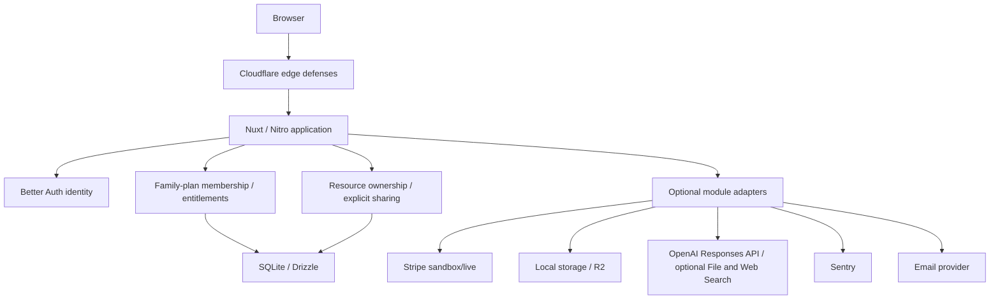

# Canonical Baseline Contract

Status: **approved by the project owner on 2026-07-09, amended through 2026-07-16 by ADR 0014**. This directory is the canonical target contract and supersedes the provisional external guides and pre-audit “complete locally” claims. It describes target behavior, not current readiness.

Current-state evidence lives in [the dated audit](../audits/2026-07-09/README.md).

## Purpose

The baseline is a small production-quality application that can be forked without first replacing its identity, tenancy, configuration, testing, and deployment foundations. It proves one complete private product journey and installs optional provider modules behind stable boundaries.

It is not a product template for Bible, baby-name, polling, or other domain-specific features. Those belong in forks.

## Normative authority and implementation evidence

When target requirements conflict, use this order:

1. explicit owner decisions;
2. current official documentation for the exact selected version;
3. this owner-approved canonical contract;
4. historical/provisional guides and examples.

Source inspection, deterministic tests, runtime probes, and staging evidence determine whether an implementation conforms to the target; current behavior does not redefine it. An example is never authority for security, runtime configuration, or provider behavior. A passing presence/regex check is not behavior evidence.

## Locked decisions

- Node `>=24.11.0 <25.0.0` is the supported local, test, build, and production range. pnpm is pinned exactly to 11.1.2 and is available through the repository's npm-based bootstrap without requiring Corepack or a global pnpm install.
- Nuxt 4, Vue 3, Nitro/H3 monolith in a pnpm workspace.
- SQLite with Drizzle first; one host, one persistent volume, one app replica unless later evidence justifies a different database/deployment.
- Better Auth Organization owns the sole family-plan organization, membership, invitation-record, and organization-role authority. The product may call organizations “workspaces,” but membership supplies entitlements only; private-resource repositories authorize the authenticated owner or a feature-specific collaborator.
- Keep entitlement and data access independent: user identity → one current family-plan billing authority → paid capability, while user identity → resource owner or explicit feature collaborator → private data. A person may be independent, manage their own family, or be covered by one other family, never operate those paid relationships in parallel.
- Every user receives a lightweight personal workspace. Simple forks may keep workspace UI unobtrusive.
- The authenticated product shell uses clean personal routes under `/app`; the invisible family-plan organization is not a navigation scope. Private-resource routes remain user-scoped, such as `/api/projects`, while family-plan owner operations derive the immutable organization ID on the server and reauthorize current persisted membership.
- Passwordless magic link plus configurable social login. Passwords and MFA are not default baseline features.
- Native HTML, Vue SFCs, raw CSS, and app-owned components.
- Exact `reka-ui@2.10.1` named primitives for one app-owned accessible account/family action menu; no Nuxt module or product-wide component kit.
- No PrimeVue, Tailwind CSS, Nuxt UI, shadcn-vue, or product-wide component kit by default.
- Optional Stripe, R2/files, direct OpenAI, Turnstile, Sentry, and Jobs modules are installed/tested but independently enabled.
- Full application-visible AI prompt/response history is user-owned private application data by default, with clear and deletion behavior. The baseline stores no raw tool/attachment/reasoning/search envelope and retains only minimized attempt/quota metadata plus one transient, content-free owner concurrency lease. Optional File Search uses one deployment-owned, read-only reference corpus and stores at most ten ordered title-only citations. Optional Web Search uses one server-owned allowlist and stores at most 20 ordered HTTPS title/URL/source-span citations. Both remain subordinate fork switches; neither turns family-plan membership into conversation access. A fork that shares a conversation adds explicit feature-specific collaboration. Prompt/response history, search queries/actions/results, and citation metadata never enter ordinary logs or Sentry; bounded history is sent to OpenAI only for the current generation.
- The baseline is responsive web only; it does not ship an installable PWA, service worker, or offline shell.
- `master` is the canonical/default branch. The repository ships local verification commands and no hosted workflow or required status context.
- One persistent `baseline-staging` deployment uses isolated provider sandboxes. There is no permanent staging code fork.

## Architecture



### Source boundaries

- `app/pages`: route-level screens and route metadata.
- `app/layouts`, `app/components`: semantic UI and app-owned primitives.
- `app/composables`: browser-safe UI/data orchestration.
- `server/api`: HTTP boundaries; validate, authenticate, authorize, call services/repositories, minimize responses.
- `server/utils`: request/session/workspace/config/error helpers.
- `server/services`: provider/domain adapters and module policy.
- `server/db/schema`: schema source of truth.
- `server/db/repositories`: scope-required persistence operations.
- `shared`: pure serializable browser/server types and validators only.

No client path imports database/provider/server secrets. No provider SDK call appears outside its adapter or dedicated operations tooling.

## Identity, family-plan, and private-data model

Use `account` only for Better Auth provider/credential accounts. Better Auth's `organization` is the invisible family-plan membership and entitlement group, not the default owner of every member's private data. The plugin's nullable `activeOrganizationId` session field is optional UX state and never the application's authorization boundary. [ADR 0002](../adr/0002-better-auth-organization-workspace-authority.md) records the membership authority and supersedes ADR 0001; [ADR 0003](../adr/0003-family-plan-entitlements-and-user-owned-data.md) separates that authority from private resource ownership; [ADR 0004](../adr/0004-owner-member-family-plan-boundary.md) narrows live product roles and invitations to owner/member family access; and [ADR 0009](../adr/0009-direct-stripe-family-plan-authority.md) records current billing authority.

Minimum relationships:

```text
user
  ├─ owns private project/file/conversation rows by user ID
  └─ member (product role: owner | member)
       └─ organization (invisible family-plan group)
            └─ billing subscription/entitlement
```

Private project repository functions require the authenticated immutable user ID and include it in every database predicate. Resource and mutation DTOs do not accept `ownerId`, `ownerUserId`, or a caller-asserted organization ID. Family-plan entitlement checks remain separate and use current persisted membership plus provider subscription state; membership never grants another person's private data. Feature-specific sharing is additive in a fork that needs it, not a generic baseline ACL.

The current local entitlement is one subscription projection per billing owner, mapped to exactly one recognized Personal or Family offering. Verified active state grants the same premium capability: Personal covers only its purchaser; Family covers its manager plus five non-manager seats. Pending unexpired invitations reserve seats alongside accepted members; if their original expiry passes during a valid recoverable Family dunning episode, they remain frozen and seat-reserving until recovery re-applies ordinary expiry or the Family lifecycle releases them. Renewal failure enters grace only until the fixed deadline derived from the earliest authenticated failure event, at most 14 days; `past_due` after that deadline and unexpected `trialing` do not grant. A covered member keeps their personal organization and any verified nonrenewing residual Personal paid-through date but cannot purchase or reactivate while Family supplies access. Caller self-leave or manager removal releases the exact seat, preserves private data, and restores unexpired residual Personal entitlement. Stripe always receives one item with quantity `1`; cadence selects billing frequency, not authorization class.

Membership role, onboarding state, entitlement, and global staff privilege are separate policy axes. Do not store them as one flat role string.

### Personal family-plan group

When Better Auth inserts a user, the migrated SQLite trigger must atomically ensure:

1. user identity exists;
2. personal workspace exists;
3. owner membership exists;
4. the user's personal `/app` destination resolves without selecting or exposing the organization;
5. optional product onboarding begins or the user enters `/app`.

### Executable pre-release database baseline

[Issue #151](https://github.com/smallwiselabs/swl-step-by-step/issues/151) and [ADR 0015](../adr/0015-final-pre-release-database-rebaseline.md) establish preserved baseline entries `0000_pre_release_baseline.sql` and `0001_runtime_invariants.sql`; their hashes remain unchanged. #169 adds generated forward migration `0002_stripe_subscription_persistence.sql` and custom `0003_stripe_subscription_invariants.sql`. The four-entry package preserves existing Stripe rows, adds catalog/transition/dunning/Family-join/deletion-cancellation state, restores authority triggers dropped around table rebuilds, and ends with exactly 30 triggers plus accepted-and-reserved seat constraints. It contains no Search/FTS/cache objects. Every later schema change remains forward-only. See [ADR 0010](../adr/0010-remove-local-search-and-fts.md), [ADR 0011](../adr/0011-private-files-local-and-r2-lifecycle.md), [ADR 0012](../adr/0012-direct-openai-responses-and-local-history.md), [ADR 0013](../adr/0013-deployment-owned-openai-file-search.md), and [ADR 0014](../adr/0014-server-owned-openai-web-search.md) for the preserved feature decisions.

The schema implements the retained outcomes of [ADR 0004](../adr/0004-owner-member-family-plan-boundary.md), [ADR 0005](../adr/0005-immediate-account-deletion-and-billing-detachment.md), and [ADR 0009](../adr/0009-direct-stripe-family-plan-authority.md): each marked personal organization has one owner; accepted invitee roles are constrained to `member`; a person has at most one accepted external family membership; external coverage cannot coexist with an operated personal family or current personal billing authority; billing customers, durable Checkout attempts, and current subscription snapshots belong to the organization; webhook receipts remain minimized; and detached subscription records remain identity-free and constrained. Project records remain private and user-owned by immutable user ID. Create and update bodies contain only `name`, duplicate project names are allowed, API responses contain no project slug, and immutable project IDs address records.

Deleting an organization cascades its plugin-owned membership and invitation rows, so native or caller-scoped organization delete, leave, and transfer entry points remain disabled. The only leave exception is authenticated `POST /api/account/family/leave`, which derives and removes the caller's own external `member` row without accepting organization or member scope; it is core account behavior and remains available when Billing is disabled. R-018C/#80 coordinates immediate owner-account deletion with the owned family-plan group, user-owned application resources, invitee-account preservation, and minimized billing-history retention. The restrictive user references are released only inside those reviewed transactions. SQLite foreign-key enforcement remains enabled on each connection and child keys used for parent checks are indexed, following SQLite's official [foreign-key and delete-action contract](https://www.sqlite.org/foreignkeys.html).

Fresh initialization must apply and verify all four packaged entries before the application starts, and repeating that maintenance operation is idempotent. Verification requires the complete relational schema; exactly 30 triggers; original family/billing indexes; one-open transition/join and unique deletion/subscription-item/grace-invoice invariants; accepted-plus-pending-unexpired capacity; integrity; foreign keys; and final absence of Search/FTS/cache objects. Upgrade evidence preserves recognized Family rows, moves open legacy Checkout and cadence-unknown nonterminal Family state to reconciliation without inventing cadence, and proves transactional failure plus corrected retry. Only a fresh database or one carrying an exact packaged prefix is supported; any other populated or ambiguous state fails closed without adoption or repair. Reset is allowed only with every writer stopped and confirmation that no valuable user or application data exists; a failed first initialization additionally requires confirmation that no migration completed. The operator removes the database and its `-wal`, `-shm`, and `-journal` sidecars together. Unknown state and backups remain preserved until explicitly classified. Forward transactional migrations are the only supported schema-change path. This follows the documented [Drizzle generate](https://orm.drizzle.team/docs/drizzle-kit-generate), [custom migration](https://orm.drizzle.team/docs/kit-custom-migrations), [migrate](https://orm.drizzle.team/docs/drizzle-kit-migrate), and [SQLite transaction](https://www.sqlite.org/lang_transaction.html) behavior; it does not invent a down-migration or generic migration-squashing subsystem.

## Authentication

- Magic link is the universal fallback.
- Social providers are configured independently; a provider that is disabled needs no credentials, while an enabled provider with incomplete credentials prevents startup.
- Configure Better Auth magic links explicitly with `storeToken: "hashed"` and `expiresIn: 300`; prove that the selected database or secondary-storage path consumes each token atomically once.
- Rate-limit request and redemption paths and return neutral request responses to reduce account enumeration.
- Link accounts only when the provider verifies the email under the chosen policy or when an already authenticated user explicitly links it.
- Request minimum social-provider scopes and do not retain OAuth access/refresh tokens when the product does not need them. If retained, encrypt them through reviewed hooks with a rotatable key; never emit them in logs or ordinary user exports; test unlink, account deletion, provider revocation, and key rotation.
- Use safe allowlisted return URLs and explicit trusted origins.
- Email delivery uses a provider-neutral application adapter. Local tests use a deterministic capture transport.
- Account deletion requires the exact app confirmation plus a Better Auth session younger than 24 hours; linked-account changes retain their separate fresh-session policy.

R-005A established the dependency-safe starting point for this target: Better Auth and the directly declared `@better-auth/drizzle-adapter` are pinned to `1.6.23`, and the application imports the dedicated adapter package. A focused compatibility fixture checks the advisory's OIDC/MCP redirect validators and disposable SQLite/Drizzle initialization without enabling either plugin. Current passwordless behavior is owned by R-014 below.

### Executable R-014 email and passwordless boundary

R-014/[#16](https://github.com/smallwiselabs/swl-step-by-step/issues/16) enabled Better Auth's `magicLink()` server plugin and `magicLinkClient()` Vue plugin on the then-interim `/auth` route. It explicitly configured `expiresIn: 300`, `storeToken: "hashed"`, and database-backed verification. Better Auth documents the request, generated bearer URL, five-minute default, hashed-storage option, and single-use storage requirements in its [magic-link guide](https://github.com/better-auth/better-auth/blob/v1.6.23/docs/content/docs/plugins/magic-link.mdx). R-020A/[#115](https://github.com/smallwiselabs/swl-step-by-step/issues/115) removes that frontend bridge: `/login` and `/signup` now present one shared passwordless/social system with different user-intent copy, while Better Auth's framework endpoints remain under `/api/auth/**`. Either intent can create an unknown user, so neither route performs account lookup or promises existing-user-only enforcement.

The current callback policy is parameter-specific and requires the complete three-field tuple on issuance, social handoff, and magic-link redemption. `callbackURL` and `newUserCallbackURL` accept only `/app` or one exact anchored `/invite/:invitationId` relative path; `errorCallbackURL` accepts only `/login` or `/signup`. The invitation identifier is limited to the opaque Better Auth-compatible character/length contract; omissions, prefixes, suffixes, query strings, fragments, absolute URLs, protocol-relative URLs, and encoded path expansion are rejected before delivery, OAuth state creation, or verification-token consumption. `/auth`, `/`, and every other app path are outside the current allowlist. Requiring every field is deliberate because pinned Better Auth makes them optional and otherwise defaults omitted magic-link destinations to `/` and social success to the auth base URL. A supplied request `Origin` for magic-link issuance must exactly equal the configured auth origin; missing `Origin` remains available to non-browser clients. These are application-owned before-hook checks implemented through Better Auth's documented [hook boundary](https://better-auth.com/docs/concepts/hooks) and verified against the pinned [magic-link](https://github.com/better-auth/better-auth/blob/v1.6.23/packages/better-auth/src/plugins/magic-link/index.ts) and [OAuth state](https://github.com/better-auth/better-auth/blob/v1.6.23/packages/better-auth/src/oauth2/state.ts) sources, not a claim that arbitrary local callback paths are safe. Password UI is absent, and the exact email sign-up/sign-in, password-reset request, reset, change, and verify endpoints return `404`; the token-bearing reset child is rejected by the same hook because Better Auth's documented [`disabledPaths`](https://better-auth.com/docs/reference/options#disabledpaths) option and pinned [request implementation](https://github.com/better-auth/better-auth/blob/9dfceee14021fc15a2fb93023f39635f25b0b5ba/packages/better-auth/src/api/index.ts#L295-L301) match exact normalized paths. Better Auth's credential-shaped schema columns remain part of its current adapter schema but have no public password route.

Both magic-link request and redemption use an explicit five-request, 60-second plugin rule. The [Better Auth rate-limit guide](https://better-auth.com/docs/concepts/rate-limit) states that `auth.api` server calls bypass rate limiting, so behavioral evidence uses the real HTTP handler and verifies `429` plus `X-Retry-After`, no sixth delivery/verification row, no rate-limited token consumption, and independent trusted Cloudflare client buckets. The selected storage remains the existing process-local memory limiter, so the one-replica restriction still applies. The pinned plugin's exact [path matcher and limits](https://github.com/better-auth/better-auth/blob/9dfceee14021fc15a2fb93023f39635f25b0b5ba/packages/better-auth/src/plugins/magic-link/index.ts#L443-L454) must be reverified on an auth pin change.

Atomicity is claimed only for the verification-row gate. Pinned Better Auth consumes the verification value before user lookup or session creation. Its database path selects the latest row under a same-process lock, then gates the winner through `consumeOne`; the selected SQLite Drizzle adapter implements that claim with one `DELETE ... RETURNING` statement. Concurrent HTTP evidence proves one successful session, one invalid-token result, and no remaining verification row. This is not a transaction spanning token consumption, user creation, and session creation: a downstream failure after consumption burns the link and requires a new one. The exact source boundaries are the pinned [verification consumer](https://github.com/better-auth/better-auth/blob/9dfceee14021fc15a2fb93023f39635f25b0b5ba/packages/better-auth/src/db/internal-adapter.ts#L1229-L1382), [SQLite Drizzle row claim](https://github.com/better-auth/better-auth/blob/9dfceee14021fc15a2fb93023f39635f25b0b5ba/packages/drizzle-adapter/src/drizzle-adapter.ts#L978-L1028), and [magic-link redemption order](https://github.com/better-auth/better-auth/blob/9dfceee14021fc15a2fb93023f39635f25b0b5ba/packages/better-auth/src/plugins/magic-link/index.ts#L345-L429).

The provider-neutral email service has two core modes. Local-test `capture` publishes a stable versioned JSON message shape through an atomically renamed private file in a `0700` directory with `0600` files. Filenames and timestamps vary, and each capture contains the recipient and complete raw bearer link; captures must stay out of source control, logs, and shared artifacts and be removed when no longer needed. Deployed production rejects capture; `CI=true` permits it only for production-mode test processes and must never be set on a deployment. Authenticated `smtp` uses Nodemailer with certificate validation, bounded connection/greeting/DNS/socket timeouts, disabled transport debugging, and file/URL message access disabled in accordance with the official [SMTP](https://nodemailer.com/smtp) and [message security](https://nodemailer.com/message) options. Configuration-complete SMTP does not mean delivery-ready: startup and readiness make no SMTP connection or authentication attempt, and R-033 retains real sending-domain, inbox, provider rejection, bounce, and operational certification.

### Executable R-015 social identity boundary

R-015/[#17](https://github.com/smallwiselabs/swl-step-by-step/issues/17) installs Google as the only currently approved social provider behind an app-owned provider manifest. Exact `NUXT_SOCIAL_PROVIDERS_GOOGLE_ENABLED=false` is healthy-disabled and needs no client credentials; exact `true` requires both `NUXT_SOCIAL_PROVIDERS_GOOGLE_CLIENT_ID` and `NUXT_SOCIAL_PROVIDERS_GOOGLE_CLIENT_SECRET` before the server can listen. Missing or scalar-coerced flags and incomplete enabled credentials fail through the existing runtime evaluator without logging values. `/api/baseline` exposes only `disabled` or `ready`; the private credentials never enter public runtime configuration. A second provider requires its own reviewed implementation and certification rather than an inferred copy of Google's settings.

The selected Google flow is an authorization-code handoff to `/api/auth/callback/google` with database-backed state, the state-cookie check enabled, and PKCE supplied by pinned Better Auth. It disables the provider's broader defaults and requests exactly `openid email`, uses online access, and disables direct client-supplied ID-token sign-in. Google's official [OpenID Connect guide](https://developers.google.com/identity/openid-connect/openid-connect) documents that `code` selects the basic authorization-code flow, that the `email` scope supplies `email` and `email_verified`, and that applications should request only the scopes they need. Because Google documents `name` under the optional `profile` scope while the local user schema requires a display name, the provider mapping uses the verified email as a deterministic fallback when the ID token omits `name`. The hook rejects caller-supplied scopes, ID tokens, sign-up overrides, login hints, additional data, hostile origins, and an omitted or invalid member of the complete parameter-specific `/app`, `/invite/:invitationId`, `/login`, and `/signup` callback tuple before OAuth state is created. These options and the unconditional `include_granted_scopes=true` parameter are verified against the exact pinned [Better Auth Google provider source](https://github.com/better-auth/better-auth/blob/9dfceee14021fc15a2fb93023f39635f25b0b5ba/packages/core/src/social-providers/google.ts), not assumed from a different release.

Account linking uses Better Auth's verified-email implicit policy: linking is enabled, the existing local email and provider assertion must both be verified, `trustedProviders` is empty, different emails are refused, and provider profile data does not overwrite the local user. The application additionally rejects creation of any social user whose provider assertion is not verified; this prevents an unverified social identity from surviving the later magic-link ownership transition. Explicit `/link-social` is disabled. A user links Google by signing out and starting the guarded Google sign-in flow with the same verified email; no signed-in control starts an ordinary sign-in flow that could replace the current session. Authenticated `/account` lists exact local account mappings and allows unlinking one Google mapping at a time while preserving email sign-in. This matches Better Auth's documented [implicit-linking and unlinking behavior](https://better-auth.com/docs/concepts/users-accounts), the exact pinned [linking gate](https://github.com/better-auth/better-auth/blob/9dfceee14021fc15a2fb93023f39635f25b0b5ba/packages/better-auth/src/oauth2/link-account.ts), and the pinned [fresh-session unlink route](https://github.com/better-auth/better-auth/blob/9dfceee14021fc15a2fb93023f39635f25b0b5ba/packages/better-auth/src/api/routes/account.ts#L380-L435).

The baseline persists the stable provider/account mapping and scope metadata, but no Google access token, refresh token, ID token, or token expiry. Account create/update hooks null every token field, sign-in does not refresh stored account credentials, account cookies are disabled, and `/get-access-token`, `/refresh-token`, and `/account-info` are absent. Better Auth token encryption remains enabled only as defense in depth before the authoritative no-retention hooks, and its logger emits a fixed severity event without provider messages or arguments. The canonical rotation requirement is conditional on retaining provider tokens; this authentication-only implementation retains none, so it does not add a dormant token keyring or claim a rotation workflow.

Local unlink requires a fresh Better Auth session and removes only the selected Google account row while magic link remains the universal recovery path. A stale session receives `SESSION_NOT_FRESH` and leaves every mapping intact. Deleting the Better Auth user cascades its social account/session rows, and a rejected or already-consumed provider authorization code leaves no user, account, session, or OAuth state. Pinned Better Auth's [unlink route](https://github.com/better-auth/better-auth/blob/9dfceee14021fc15a2fb93023f39635f25b0b5ba/packages/better-auth/src/api/routes/account.ts) deletes only the local mapping; it does not call Google's revocation endpoint. Because this app deliberately retains no provider token, it cannot later submit one to Google's documented [revocation endpoint](https://developers.google.com/identity/protocols/oauth2/web-server#tokenrevoke). R-033 therefore retains real consent, callback/denial, account-removal, relink, and Google-side revocation certification; local evidence must not be described as upstream revocation.

R-015 uses the existing Better Auth `user`, `session`, `account`, and `verification` tables and adds no schema migration. Rolling the code back can disable Google while leaving already-created user/provider mappings available for a later reviewed transition; it does not recreate an account mapping that a user unlinked or that coordinated deletion removed.

### Executable Organization family-plan boundary

R-016/[#18](https://github.com/smallwiselabs/swl-step-by-step/issues/18) is preserved history for the first personal-workspace implementation. The owner-approved shared-account requirement supersedes its custom authority through R-017/[#19](https://github.com/smallwiselabs/swl-step-by-step/issues/19): Better Auth Organization `1.6.23` now exclusively owns organizations, members, invitation records, and roles, while the UI and routes retain “workspace” terminology.

The server and Vue client install the pinned Organization plugins with one shared static access-control definition. The Drizzle adapter leaves its optional transaction wrapper disabled: Better Auth supplies an async callback, while `better-sqlite3` `12.10.0` documents that its transaction functions do not work with async functions. Better Auth `1.6.23` also intentionally queues database `after` hooks until after commit. Custom baseline migration `0001_runtime_invariants.sql` therefore installs an SQLite `AFTER INSERT` trigger on `user`; the trigger inserts one opaque personal organization and owner member within the same SQLite statement. New-user behavior tests cover the actual magic-link and Google paths and prove user, organization, and owner-member commit or roll back together. Returning sign-in performs no user insert and cannot create a duplicate.

Public Organization HTTP endpoints for client-created additional organizations, teams, dynamic roles, organization deletion, generic leave/transfer, member management, invitation mutations, and broad member/invitation reads remain disabled. R-018A/[#78](https://github.com/smallwiselabs/swl-step-by-step/issues/78) exposes a smaller owner/member family-plan surface: one automatically provisioned marked organization per user, one owner for that group, and `member` for everyone invited into it. R-024A2 adds only the app-owned caller self-leave command; it is not a generic Organization endpoint. The application retains an internal no-authority `admin` compatibility role only because pinned Better Auth merges and validates its built-in role names internally; the relational owner/member check and custom runtime triggers prevent it from becoming new live product state. Project actions remain absent from Organization access control, and private project CRUD derives only the authenticated user ID. Staff, onboarding, resource authorization, and entitlements are separate policy axes.

R-020B/[#114](https://github.com/smallwiselabs/swl-step-by-step/issues/114) supersedes the visible workspace bootstrap recorded by R-016. `GET /api/me` now returns only minimized identity and the safe enabled-module projection; public `GET /api/workspaces` and `GET /api/workspaces/:workspaceSlug` routes are absent. `/app` is the authenticated, private, non-cacheable personal shell and renders no organization name, slug, membership, role, capability, or `activeOrganizationId`. The generated organization slug and immutable ID remain stored for Better Auth compatibility and server-derived family-plan operations, but they are not navigation state. Better Auth acceptance may write the joined organization to `activeOrganizationId`, yet application authorization continues to ignore that value and re-read current persisted membership when a family-plan operation requires it. [ADR 0006](../adr/0006-personal-app-shell-and-invisible-family-plan-routing.md) records the route correction.

R-020A/[#115](https://github.com/smallwiselabs/swl-step-by-step/issues/115) completes the public identity/account route correction. `/login` and `/signup` are separate user-intent pages backed by one shared component and the same Better Auth operations. Both show Terms and Privacy acknowledgment because either can create an account; the acknowledgment is disclosure, not a persisted-consent record. Signed-in visits continue to `/app`, signed-out `/account` requests continue to `/login`, and private account identity never renders before session verification. `/account` owns minimized identity plus linked-Google status and fresh-session unlinking; R-021 moves sign-out into the authenticated account menu. `/` is user-facing, `/legal/privacy` and `/legal/terms` are clearly marked fork-customization templates, and the former frontend `/auth` route is absent.

R-020C/[#116](https://github.com/smallwiselabs/swl-step-by-step/issues/116) composes the existing invitation and account-deletion commands into `/account`. An independent owner manages only their automatically provisioned family-plan group; after joining another group, the owner relationship remains stored but its invitation and billing manager actions are dormant until self-leave. The page sends only an email for invitation creation and opaque invitation IDs for resend/cancel. #169 adds a manager-only accepted-member list whose visible fields are exactly display name and email; its opaque reference is used only behind the narrow remove action. The surface exposes no organization, slug, role, provider identifier, or private-resource state. Sender failure refreshes the pending list and offers explicit same-ID resend without claiming delivery. Deletion sends only exact `DELETE`, distinguishes stale-session reauthentication from an uncertain network/server result, and clears the local session only after pinned Better Auth's terminal `User deleted` result. Its other documented success response is not treated as committed deletion. All feature-specific styles extend the existing `components` layer.

R-021/[#23](https://github.com/smallwiselabs/swl-step-by-step/issues/23) pins `reka-ui@2.10.1` and implements one app-owned account action menu containing the minimized signed-in identity, Account, and Sign out. Reka's named dropdown primitives are imported directly inside that component; there is no Reka Nuxt module, product-wide kit, workspace selector, organization/slug display, role mode, or member administration. App remains ordinary native navigation; the retired `/billing` link is absent, and `/account` conditionally links to `/account/billing` only when Billing is ready while Family controls appear only after persisted manager authority is confirmed. A shared session composable projects only user ID, name, and email into Nuxt hydration, so Better Auth organization selection state does not become menu or client-payload authority.

R-022/[#30](https://github.com/smallwiselabs/swl-step-by-step/issues/30) implements the private project reference journey at `/app/projects` and `/app/projects/[projectId]`. The pages authenticate before requesting project data, scope every rendered operation to the current user through the existing API, and clear stale private content when that identity is lost. Create and rename submit only `name`; immutable IDs select records; duplicate names remain valid. Malformed, missing, deleted, and foreign IDs share one concealed unavailable presentation, while retryable failures remain distinct. App is current only at exact `/app`, and Projects is the single current primary link for both project routes. Native/component-layer controls provide validation, pending, failure, retry, success, focus, responsive, and inline irreversible-delete behavior without adding another UI kit.

Focused HTTP/Vitest behavior remains primary for authentication, user predicates, same-family cross-user isolation, duplicate names, concealment, and active-organization irrelevance. Route-controlled Playwright cases own the rendered state matrix, request shapes, keyboard/focus, session-loss clearing, narrow Chromium viewport/root-font stress, Axe, overflow, and clean console/network behavior. One desktop-Chromium magic-link journey performs create/read/update/delete through the built Nitro application and migrated temporary SQLite database; it proves packaged composition rather than duplicating the focused authorization matrix.

Nuxt's global `app/error.vue` owns unknown-route and fatal-error presentation rather than literal `/404` or `/error` pages. It gives 404 and general failures distinct non-sensitive titles and one guarded recovery action back to `/`, while retaining the stable module-disabled explanation. This follows the pinned [Nuxt 4.5.1 error-handling contract](https://github.com/nuxt/nuxt/blob/v4.5.1/docs/1.getting-started/12.error-handling.md).

### Executable R-017I/R-018A invitation boundary

R-017I/[#64](https://github.com/smallwiselabs/swl-step-by-step/issues/64) exposes Better Auth's invitation records through a deliberately smaller application surface, and R-018A/[#78](https://github.com/smallwiselabs/swl-step-by-step/issues/78) narrows it to family-plan owners inviting members. Manager routes return fixed-limit, role-free allowlisted projections; recipient routes return only workspace display name and expiry after Better Auth verifies a matching, verified email, following the pinned [Organization invitation advisory](https://github.com/better-auth/better-auth/security/advisories/GHSA-fmh4-wcc4-5jm3). `/invite/:invitationId` is private/no-store, no-referrer, non-mutating on `GET`, and preserves only its exact anchored relative path through magic-link or Google authentication. Accept and reject require explicit `POST`. Acceptance returns `/app` only after the application re-reads the new persisted `member` membership by immutable organization ID; joining the family plan never reveals another member's private data.

`POST /api/invitations` authenticates before validating its strict email-only body, derives the caller's uniquely marked organization, re-reads the caller's owner membership, fixes the role to `member`, calls Better Auth with that immutable organization ID, and then synchronously sends one safely rendered application link through the existing capture/SMTP adapter. The API never accepts a caller-selected organization, slug, role, or resend flag. It does not configure `sendInvitationEmail`: pinned Better Auth runs that callback through [`runInBackgroundOrAwait`](https://github.com/better-auth/better-auth/blob/v1.6.23/packages/better-auth/src/context/create-context.ts#L403-L425), which catches callback failures. The application reports success only after the selected capture/SMTP sender resolves. That proves private capture publication or SMTP transport acceptance, not inbox delivery; R-033 retains hosted inbox, rejection, bounce, and provider certification. A sender failure returns one generic retryable `503` and deliberately leaves Better Auth's pending record; explicit `POST /api/invitations/:invitationId/resend` is owner- and organization-bound, reuses the same unexpired invitation ID, and extends its expiry.

The configured invitation and membership caps are each 100 and invitation expiry uses the pinned 48-hour default. `GET /api/invitations` lists pending invitations that are unexpired or temporarily frozen by a valid recoverable Family dunning episode; cancel remains available, while resend/accept require ordinary unexpired billing-current authority. Pinned Better Auth guards acceptance but performs reject/cancel status writes without a source-status condition, and resend returns before its create hook. The application therefore hard-codes `member` at every exposed creation/resend call and rejects non-member pending state at the database boundary. App-owned cancel and reject use pending-to-terminal compare-and-set updates inside `BEGIN IMMEDIATE`; create, resend, and accept reauthorize inside application-owned SQLite transactions with the capacity constraints. Process-local queues order async work sharing the synchronous connection and same-ID resend delivery in the current one-replica topology, but terminal membership and capacity correctness are database-owned rather than dependent only on that queue. No generic distributed delivery coordination is claimed. The matching recipient may still reject an expired pending invitation, and create rejects an already-member recipient. These semantics are grounded in the exact [1.6.23 invitation implementation](https://github.com/better-auth/better-auth/blob/v1.6.23/packages/better-auth/src/plugins/organization/routes/crud-invites.ts), not inferred from a later guide.

Two limits remain explicit. First, direct `auth.api` calls [bypass Better Auth's HTTP rate limiter](https://github.com/better-auth/better-auth/blob/v1.6.23/docs/content/docs/concepts/rate-limit.mdx); authentication, persisted permission, the pending cap, and the global app-command origin boundary apply, but R-017I does not claim a separate resend-frequency limit. Second, the configured synchronous SQLite adapter has `transaction: false`. Better Auth can insert the member, fail the subsequent active-session update, and restore the invitation to pending. Application acceptance owns the characterized repair inside `BEGIN IMMEDIATE`: after either Better Auth outcome it requires the exact persisted member, repairs that invitation to accepted, completes any join attempt, and commits success. `activeOrganizationId` may remain null and authorization ignores it. If the member is absent or the repair cannot be applied, the command fails and rolls back. Better Auth itself is still not transactionally atomic, but the exposed command no longer reports failure after the intended membership has persisted.

The `beforeAcceptInvitation` hook rejects any non-`member` pending state. #169 keeps six total Family seats: the manager consumes one, and each accepted member or pending unexpired invitation consumes one of five non-manager seats. A pending invitation whose unchanged original expiry passes during valid recoverable `past_due` or `unpaid` Family dunning remains visible, cancelable, and seat-reserving; it cannot be created, resent, or accepted, and active recovery re-enables ordinary expiry. Cancellation, downgrade, and terminal lifecycle keep their release behavior. Application transactions, compare-and-set revisions, and database constraints serialize reservations and acceptance across the one web process and worker; canceled/declined/rejected invitations release their seat, and partial acceptance cannot count twice. Create/resend/accept require an active renewal-on Family manager with no grace, suspension, cancellation, downgrade, or reconciliation conflict. A current Personal subscriber may join only through durable Stripe renewal-off confirmation that preserves the paid-through date as residual Personal state. Stripe quantity remains `1`; it is never a per-seat quantity. No broad Better Auth member-directory, admin, role editor, transfer, export, or public organization-delete surface exists. The manager-visible accepted-member fields are exactly display name and email; an undisplayed opaque selector exists only for the narrow non-manager removal command. Manager removal and caller self-leave release only that seat, preserve identities/private data, and restore unexpired residual Personal entitlement. Family downgrade/cancellation/terminal state or manager deletion dissolves coverage at the approved effective time while preserving member accounts. R-019C/#84 keeps projects user-owned, so membership grants no private-data access. Hosted delivery, inbox, bounce, and provider certification remain R-033/#37.

### Executable R-018C account-deletion boundary, amended by #169

`DELETE /api/account` authenticates before parsing and accepts only `{ "confirmation": "DELETE" }`. Better Auth `session.freshAge` is fixed at 86,400 seconds; before provider work the application explicitly requires a session inside that window. The eventual Better Auth command supplies no password, token, callback URL, or delete-verification callback, so Better Auth rechecks freshness. Better Auth's native `/delete-user` and `/delete-user/callback` HTTP paths remain disabled, while the app calls its public server API and preserves the returned cookie expirations.

The `/account` control enables deletion only for exact confirmation and does not call sign-out after success; Better Auth's expired cookies and the cleared local session return the user to `/login`. A stale-session response asks the user to sign in again. A lost or failed response cannot establish whether the transaction committed, so the page instructs the user to try signing in again and retry only if the account still opens.

For a Stripe-backed billing owner, the route first durably records an exact-subscription cancellation request. It then requests immediate cancellation with no automatic refund or proration and retrieves the subscription from Stripe. Only retrieved confirmation of cancellation permits local deletion; the flow does not delete the Stripe Customer. A timeout, connection failure, or unconfirmed result retains the user, credentials, sessions, organization, and private data. The existing worker may retry cancellation and retrieval only. It can never call Better Auth deletion or interpret the durable request as continuing consent. After worker confirmation, the person must return with another fresh session and exact `{ "confirmation": "DELETE" }`.

Once no Stripe cancellation is required or confirmed cancellation is durable, the documented `beforeDelete` hook runs one synchronous SQLite `IMMEDIATE` transaction. It detaches only minimum justified provider continuity; deletes caller project/file/live-billing rows; clears the deleted group from surviving invitee sessions; deletes the owned group plus the caller's memberships and invitations elsewhere; purges outstanding magic links; then deletes sessions, accounts, and the user. The hook itself performs no Stripe, local-storage, R2, or OpenAI call. Failure at any checkpoint rolls back for retry. Once committed, a lost response leaves no authoritative session, so the stale cookie cannot authenticate. File metadata has a live-user foreign key; deletion commits an empty orphan-cleanup job for after the upload-capability window and performs no local-storage or R2 call in the transaction. After streaming, local publication rechecks the exact pending row and expiry immediately before linking and rechecks authoritative state before removing its authenticated crash marker; R2 uses one persisted-and-signed expiry, conditional upload, and delayed reconciliation. File completion and stale cleanup condition their state changes so cleanup never deletes another user's successful completion.

R-025 implements bounded replay-safe current-prefix reconciliation beneath the existing lease, opaque R2 continuation-token handling, multi-delete failure inspection, and provider-outage retry. After the local transaction is permitted and commits, account access and metadata disappear immediately; physical bytes converge when the configured storage and worker recover. Local/fake evidence is not real R2 lifecycle certification, so #37 retains deployed token, CORS, late-write, provider-listing, retry, and deletion evidence.

The detached table has provider/customer references, status/order timestamps, fixed reconciliation purpose, provider lifecycle policy, and optional purge time—never user ID, email/hash, profile, organization, Price, payload, receipt, credentials, prompts, files, or private content. A projected subscription uses its provider reference; an unresolved Checkout attempt uses its opaque attempt reference; and a known customer with neither uses a customer continuity reference. With none of those justified states, deletion retains no billing row. Late events resolve exact provider references, use provider ordering, and recheck detached state after a deletion race; a referenced organization must still exist before new live billing state can be written. Same-email re-registration creates a new identity/group and does not relink history. R-024A owns durable in-flight Checkout/deletion correlation, the official Stripe SDK, event ordering, and terminal/current projection. Future Apple work owns signed App Store state. See [ADR 0005](../adr/0005-immediate-account-deletion-and-billing-detachment.md) and [ADR 0009](../adr/0009-direct-stripe-family-plan-authority.md).

## Browser request security

- App-owned commands enforce one documented same-origin policy using verified `Origin`/Fetch Metadata signals or a CSRF token; trusted-origin configuration for Better Auth does not implicitly protect custom routes.
- Every command family has a disallowed-origin test, including workspace, project, file, billing, and account lifecycle commands. Policy fixtures for a route that does not exist yet must be labeled as prospective rather than claimed as route-integration evidence.
- Pinned `nuxt-security@2.6.0` owns an enforced, deny-by-default Content Security Policy, per-response nonces, emitted-asset SRI, and standard browser-security headers. Exact browser-provider sources are added only when their module is enabled.
- CSP and edge controls are defense in depth; server authentication, resource authorization, family-plan entitlement checks, quotas, and input validation remain authoritative.

### Executable R-023B browser-security ownership

R-023B/[#24](https://github.com/smallwiselabs/swl-step-by-step/issues/24) deletes the parallel custom security-header middleware and makes pinned `nuxt-security@2.6.0` the sole owner of standard browser headers, enforced CSP generation, per-response nonces, emitted-asset SRI, and `X-Powered-By` removal. The reviewed configuration is explicit and runtime environment overrides of its `NUXT_SECURITY*` and `NITRO_SECURITY*` object are rejected before listen. Production CSP upgrades insecure requests; scripts require a request nonce and `strict-dynamic`, inline script attributes are denied, production style elements require a nonce, and only `style-src-attr 'unsafe-inline'` remains for Reka's runtime positioning. Development alone uses `style-src 'self' 'unsafe-inline'` without a style nonce because Vite/Nuxt DevTools insert styles after the response; the exact pinned guide documents that a nonce would cancel that fallback. The global referrer policy is `strict-origin-when-cross-origin`, while `/invite/**` remains `no-referrer`.

The runtime policy adds only the exact Sentry DSN origin to `connect-src` when Observability is ready and only `https://challenges.cloudflare.com` to Turnstile's `script-src` and `frame-src` when Turnstile is ready. It preauthorizes no browser source for server-side Stripe, R2, or AI traffic, or Google's full-page authorization redirect. COOP and CORP remain enabled; COEP is disabled because Stripe does not support cross-origin isolation. SRI covers assets emitted with integrity metadata and requires edge/CDN transformations that alter those bytes to remain off until tested.

The module's generic request-size limiter, rate limiter, XSS body filter, CORS handler, method restriction, CSRF middleware, Basic Auth, logger removal, and SSG support are disabled. Better Auth retains its stricter auth CSRF/origin/rate policy; application code retains command-origin enforcement, provider signatures/tokens, raw webhook bodies, feature payload limits, resource authorization, and secret-safe logging. Focused Vitest owns evaluated configuration and provider-source projection. Playwright owns final enforced CSP, fresh nonces, blocking a parser-inserted nonce-less script, hydration/navigation, console behavior, and emitted SRI. The existing invitation browser journey owns `no-referrer`; deployment smoke owns effective header presence; the built runtime retains only the distinct pre-listen security-override rejection. See [ADR 0007](../adr/0007-nuxt-security-ownership-and-csp.md).

### Executable R-008B app-command origin boundary

R-008B/[#11](https://github.com/smallwiselabs/swl-step-by-step/issues/11) applies a fail-closed application policy to every unsafe method under `/api`, not only to routes that already inspect a session cookie. This makes future app-owned commands protected by default. Safe `GET`, `HEAD`, and `OPTIONS` requests and non-API paths are outside this gate. The middleware compares signals only with the exact origin of validated `NUXT_PUBLIC_APP_URL`; inbound `Host` and forwarded host/protocol headers cannot select the trusted target.

An exact `Origin`, `Sec-Fetch-Site: same-origin`, or same-origin `Referer` fallback can verify a request. Every supplied recognized signal must agree: missing, malformed, `null`, `cross-site`, `same-site`, `none`, or conflicting signals return a redacted `403` with stable `data.code = CROSS_ORIGIN_REQUEST_BLOCKED`. An unknown future `Sec-Fetch-Site` value is ignored only when `Origin` or `Referer` independently verifies the configured origin. Protected responses include `Cache-Control: no-store` and `Vary: Origin, Sec-Fetch-Site`. Requiring all supplied signals to agree, rejecting `same-site` and `none`, and protecting every unsafe app API method before it becomes cookie-authenticated are explicit application choices. They are a conservative application of the [OWASP CSRF Prevention Cheat Sheet](https://cheatsheetseries.owasp.org/cheatsheets/Cross-Site_Request_Forgery_Prevention_Cheat_Sheet.html), [MDN Fetch Metadata guidance](https://developer.mozilla.org/en-US/docs/Web/HTTP/Guides/Fetch_metadata), and the [W3C Fetch Metadata specification](https://www.w3.org/TR/fetch-metadata/).

Exemptions are exact and keep independent authentication boundaries:

- `/api/auth` and `/api/auth/**` remain owned by Better Auth's documented [CSRF, Fetch Metadata, and trusted-origin policy](https://better-auth.com/docs/reference/security).
- `POST /api/webhooks/stripe` remains owned by official `stripe@22.3.1` raw-body signature verification; [Stripe requires the unmodified payload, `Stripe-Signature`, and endpoint secret](https://docs.stripe.com/webhooks/signature).
- `POST /api/observability/client-test` and `POST /api/observability/test-error` remain owned by the private operational token.

Local `PUT /api/files/:id/content` is not exempt: it must satisfy the origin gate before its session, short-lived signed capability, and persisted-owner checks. An R2 browser PUT targets Cloudflare's S3 API and relies on exact-origin bucket CORS rather than this middleware. No generic bearer/`Authorization` bypass exists, and neighboring methods or paths are protected. `nuxt-security` owns standard response headers outside the numbered application middleware. The remaining numbered middleware runs the optional-module gate before this origin gate, so a disabled exclusive module retains stable `404 MODULE_DISABLED` before origin evaluation or route work. [Nuxt documents](https://nuxt.com/docs/4.x/directory-structure/server#server-middleware) that server middleware runs before server routes. The exact filename order remains an installed-source convention; focused composition and the built Nitro server protect its meaningful behavior instead of a filename/source contract.

The focused policy suite covers the workspace, project, file, billing, and account-lifecycle families plus exact exemptions, neighbor paths, signal policy, encoded routes, and middleware ordering. One built encoded-project canary owns the distinct packaged Nuxt/Nitro decoded-path, middleware-registration, stable header, and no-write failures. Focused real-H3 and service cases own invalid-signature/no-write, duplicate/out-of-order provider semantics, reconciliation, and minimized projection. The isolated packaged-app suite keeps one Stripe canary only for canonical `/api/webhooks/stripe` route/config mounting, official SDK test-header verification over Nitro's exact raw body, and duplicate receipt idempotency. Deterministic local signatures are not Stripe sandbox certification. Read-only workspace resolvers, user-owned project CRUD, family billing, and the account-lifecycle command now exist; workspace mutation remains prospective. The origin check remains independent of project authorization: project handlers authenticate and predicate every operation on the session user ID.

## Configuration and module states

Use one validated server environment boundary. Private runtime values must be read when the built server starts and must not depend on build-time substitution from differently named variables. Public client values are explicitly separated.

Every optional module has three observable states:

| State                  | Required behavior                                                                                                                                                                      |
| ---------------------- | -------------------------------------------------------------------------------------------------------------------------------------------------------------------------------------- |
| Disabled               | No provider credentials required; no provider network call; routes/UI hidden or return a stable disabled response; readiness is not degraded merely because the module is disabled.    |
| Enabled but incomplete | Startup/readiness fails with a non-secret actionable error. Never fall back silently to a different production backend or security mode.                                               |
| Enabled and ready      | Runtime configuration passes validation and the adapter is available; deterministic contract tests prove the local boundary. External staging certification remains separate evidence. |

No production cryptographic fallback is permitted. Local/test values are explicit and isolated.

### Executable R-006/R-008A startup and auth boundary

R-006 implements the startup-completeness slice of this target. The built Nitro server synchronously evaluates configuration before listening, caches one deeply frozen normalized result for the process, and reports only safe keys/codes/messages. It accepts no legacy runtime aliases and requires the runtime environment to match Nuxt's resolved values. The readiness command calls the same nonthrowing evaluator. Its environment adapter deliberately mirrors pinned Nitro `2.13.4` leaf parsing through exact `destr 2.0.5`: core/flags and enabled-module requirements fail closed, while disabled provider staleness is ignored for startup completeness.

The same cache has an explicit standalone branch because [Nuxt auto-imported composables require Nuxt context](https://nuxt.com/docs/4.x/guide/concepts/auto-imports). In Nuxt it validates the real [`useRuntimeConfig`](https://nuxt.com/docs/4.x/api/composables/use-runtime-config) result; when that binding is absent, it validates the canonical process environment through the shared evaluator. The worker resolves this configuration before database/provider work. It does not catch or replace a present but broken Nuxt binding.

Only documented `NUXT_` leaves are valid app configuration. Aggregate object-node variables such as `NUXT_BETTER_AUTH`, all app-path-equivalent `NITRO_` aliases, and `NITRO_ENV_EXPANSION` are rejected before shape parsing. Nuxt also pins Nitro expansion off. `NITRO_ENV_PREFIX` is inert because the compiled literal `NUXT_` prefix wins; it is not an alternate application namespace.

Core startup requires `NUXT_DATABASE_URL` (`file:`, absolute in production), private `NUXT_READINESS_TOKEN`, `NUXT_BETTER_AUTH_SECRET` (at least 32 characters after trimming surrounding whitespace), origin-only HTTP(S) `NUXT_BETTER_AUTH_URL`, absolute and already-trimmed HTTP(S) `NUXT_PUBLIC_APP_URL`, and one complete core email transport. The readiness token is app-owned policy: exact bytes, already trimmed, an ASCII-letter prefix, and at least 32 characters from the documented header-safe alphabet; production rejects the committed local sample. It remains private runtime config and is never a public key, URL value, build argument, or diagnostic. The auth URL must equal the app URL's origin. Production requires HTTPS; HTTP is accepted only for explicit loopback origins used by local/built tests. Host-splitting auth is not a supported baseline configuration: cross-subdomain cookies are explicitly disabled, and built evidence requires the actual session `Set-Cookie` to omit `Domain`. A cross-origin/subdomain design needs separate proxy, credentialed CORS, cookie-domain/SameSite, and browser evidence; this follows Better Auth's [cookie guidance](https://better-auth.com/docs/concepts/cookies) to enable the broader cookie scope only when necessary. `NUXT_PUBLIC_APP_NAME` is optional and defaults literally to `SmallWiseLabs Base App` when omitted; when supplied, it must be nonblank and already trimmed. Credentials preserve exact bytes; validation may inspect a trimmed view only for blankness/length. Startup rejects known defaults but does not claim to measure arbitrary secret entropy, so production provisioning must still generate random high-entropy values.

Every environment supplies already-trimmed `NUXT_EMAIL_TRANSPORT=capture|smtp` and `NUXT_EMAIL_FROM`. Capture also requires already-trimmed `NUXT_EMAIL_CAPTURE_DIRECTORY`; it is permitted in development and production-mode test processes that set exact `CI=true`, but other production processes fail before listen. SMTP instead requires already-trimmed host, integer port 1–65535, exact `NUXT_EMAIL_SMTP_SECURITY=tls|starttls`, and nonblank username/password whose bytes are preserved. `tls` maps to TLS from connection start; `starttls` requires the upgrade and fails rather than continuing unencrypted, matching Nodemailer's [SMTP option contract](https://nodemailer.com/smtp). Use a certificate-valid SMTP hostname: the implementation uses that same name for TLS SNI and does not expose a distinct server name for an IP endpoint. These private keys are defined as nested Nuxt runtime configuration and overridden only through their matching `NUXT_` paths, following [Nuxt's runtime-config environment contract](https://nuxt.com/docs/4.x/guide/going-further/runtime-config#environment-variables). Startup validates shape/completeness only and deliberately does not call Nodemailer's networked `verify()`; hosted delivery evidence remains R-033.

R-008A rejects Better Auth's pinned ambient inputs that can alter, or may later alter, the reviewed policy. Runtime may not set `BETTER_AUTH_SECRETS`, `BETTER_AUTH_TRUSTED_ORIGINS`, `BETTER_AUTH_TELEMETRY`, `BETTER_AUTH_TELEMETRY_ENDPOINT`, `BETTER_AUTH_TELEMETRY_DEBUG`, or `BETTER_AUTH_TELEMETRY_ID`; production also rejects `TEST`. `BETTER_AUTH_TELEMETRY` can enable telemetry despite the explicit config, while endpoint and debug inputs alter delivery only when telemetry is enabled; the pinned runtime declares the ID input but does not consume it. Rejecting the whole ambient surface makes future upstream use fail closed. Both build and runtime reject `NEXT_PUBLIC_AUTH_URL`, `NEXTAUTH_URL`, and `VERCEL_URL`, which pinned Better Auth `1.6.23` client source can otherwise consider even though its Vue factory calls the shared resolver with standard environment loading disabled. Diagnostics contain the rejected key, never its value. Production additionally rejects the pinned Better Auth default, the repository's removed historical fallback, and the explicit local-development example; local/test must still provide their own documented value. Rejecting `BETTER_AUTH_SECRETS` deliberately excludes Better Auth's documented non-destructive rotation path: a fork that needs rotation must add one canonical versioned-secret interface and test old/new overlap and retirement explicitly.

The server uses one static base URL and exact base origin, keeps CSRF and redirect-origin validation enabled, refuses forwarded-host/protocol derivation, disables Better Auth telemetry, and sets host-only `HttpOnly`, `SameSite=Lax`, root-path cookies with `Secure` tied to the canonical scheme. The app pins the Vue client to relative `/api/auth`. Although Better Auth's pinned [Nuxt integration](https://github.com/better-auth/better-auth/blob/v1.6.23/docs/content/docs/integrations/nuxt.mdx) recommends `authClient.useSession(useFetch)`, pinned `1.6.23` produces different server/client request URLs and Nuxt hydration keys; the exact defect remains open in [Better Auth #5358](https://github.com/better-auth/better-auth/issues/5358). The `/login`, `/signup`, `/app`, `/account`, and `/account/billing` pages therefore read the public session endpoint with a literal relative Nuxt `useFetch`, following Nuxt's documented [local SSR cookie-forwarding behavior](https://github.com/nuxt/nuxt/blob/v4.5.1/docs/4.api/2.composables/use-request-fetch.md), and packaged evidence requires identical signed-in initial HTML and hydrated DOM. Trusted origins are not treated as credentialed CORS. The app explicitly sets a 100-request, 60-second memory rate-limit window; this is application policy, not a claim about Better Auth's version-dependent default. Only a single-valued `CF-Connecting-IP` is accepted as client IP; `X-Forwarded-For` and `X-Real-IP` are ignored, and a comma-delimited Cloudflare value is rejected by pinned `1.6.23` behavior. The origin must therefore be reachable only through Cloudflare, following Cloudflare's [origin-protection guidance](https://developers.cloudflare.com/fundamentals/security/protect-your-origin-server/) and [non-Cloudflare traffic restriction guidance](https://developers.cloudflare.com/fundamentals/concepts/cloudflare-ip-addresses/), or an equivalent authenticated boundary that overwrites this header. That external deployment control is not certified locally. The one-replica limit is an inference from the pinned limiter's process-local `Map`; a multi-process or multi-replica fork must choose and test shared atomic storage before scaling.

Official public behavior and exact installed-source boundaries are kept distinct. [Better Auth `1.6.23` publication provenance](https://registry.npmjs.org/-/npm/v1/attestations/better-auth@1.6.23) identifies commit `9dfceee14021fc15a2fb93023f39635f25b0b5ba`; the relevant pinned sources are [context creation and secret handling](https://github.com/better-auth/better-auth/blob/9dfceee14021fc15a2fb93023f39635f25b0b5ba/packages/better-auth/src/context/create-context.ts), [static base-URL resolution](https://github.com/better-auth/better-auth/blob/9dfceee14021fc15a2fb93023f39635f25b0b5ba/packages/better-auth/src/utils/url.ts), [trusted-origin resolution](https://github.com/better-auth/better-auth/blob/9dfceee14021fc15a2fb93023f39635f25b0b5ba/packages/better-auth/src/context/helpers.ts), [client URL resolution](https://github.com/better-auth/better-auth/blob/9dfceee14021fc15a2fb93023f39635f25b0b5ba/packages/better-auth/src/client/config.ts), [Vue client behavior](https://github.com/better-auth/better-auth/blob/9dfceee14021fc15a2fb93023f39635f25b0b5ba/packages/better-auth/src/client/vue/index.ts), [cookie construction](https://github.com/better-auth/better-auth/blob/9dfceee14021fc15a2fb93023f39635f25b0b5ba/packages/better-auth/src/cookies/index.ts), [IP resolution](https://github.com/better-auth/better-auth/blob/9dfceee14021fc15a2fb93023f39635f25b0b5ba/packages/core/src/utils/ip.ts), [rate limiting](https://github.com/better-auth/better-auth/blob/9dfceee14021fc15a2fb93023f39635f25b0b5ba/packages/better-auth/src/api/rate-limiter/index.ts), [telemetry precedence](https://github.com/better-auth/better-auth/blob/9dfceee14021fc15a2fb93023f39635f25b0b5ba/packages/telemetry/src/index.ts), and [environment declarations](https://github.com/better-auth/better-auth/blob/9dfceee14021fc15a2fb93023f39635f25b0b5ba/packages/core/src/env/env-impl.ts). [Nuxt `4.5.1` publication provenance](https://registry.npmjs.org/-/npm/v1/attestations/nuxt@4.5.1) identifies commit `452dd50d92ccdf6f456b500e71d0f26baaeff796`; its pinned [local SSR fetch selection](https://github.com/nuxt/nuxt/blob/452dd50d92ccdf6f456b500e71d0f26baaeff796/packages/nuxt/src/app/composables/fetch.ts) supports the relative-path evidence. These source-dependent assumptions must be reverified when either pin changes.

Each flag below is always required as exact lowercase `true` or `false`:

| Module        | Flag                                 | Additional values required when `true`                                                                                                                                                                                                                                                                                                                                 |
| ------------- | ------------------------------------ | ---------------------------------------------------------------------------------------------------------------------------------------------------------------------------------------------------------------------------------------------------------------------------------------------------------------------------------------------------------------------- |
| Billing       | `NUXT_MODULES_BILLING_ENABLED`       | `NUXT_MODULES_JOBS_ENABLED=true`; `NUXT_STRIPE_SECRET_KEY`, `NUXT_STRIPE_WEBHOOK_SECRET`, `NUXT_STRIPE_PORTAL_CONFIGURATION_ID`, `NUXT_STRIPE_PERSONAL_WEEKLY_PRICE_ID`, `NUXT_STRIPE_PERSONAL_MONTHLY_PRICE_ID`, `NUXT_STRIPE_PERSONAL_ANNUAL_PRICE_ID`, `NUXT_STRIPE_FAMILY_MONTHLY_PRICE_ID`, and `NUXT_STRIPE_FAMILY_ANNUAL_PRICE_ID`; all five Price IDs distinct |
| Files         | `NUXT_MODULES_FILES_ENABLED`         | `NUXT_MODULES_JOBS_ENABLED=true` and `NUXT_FILES_DRIVER=local\|r2`; R2 also needs `NUXT_CLOUDFLARE_ACCOUNT_ID`, `NUXT_CLOUDFLARE_R2_BUCKET`, `NUXT_CLOUDFLARE_R2_ENDPOINT`, `NUXT_CLOUDFLARE_R2_ACCESS_KEY_ID`, and `NUXT_CLOUDFLARE_R2_SECRET_ACCESS_KEY`                                                                                                             |
| AI            | `NUXT_MODULES_AI_ENABLED`            | Server-only `NUXT_OPENAI_API_KEY`, `NUXT_OPENAI_PROJECT_ID`, and exact allowlisted `NUXT_OPENAI_MODEL=gpt-5.6-luna`                                                                                                                                                                                                                                                    |
| Turnstile     | `NUXT_MODULES_TURNSTILE_ENABLED`     | `NUXT_CLOUDFLARE_TURNSTILE_SECRET_KEY`, `NUXT_PUBLIC_TURNSTILE_SITE_KEY`                                                                                                                                                                                                                                                                                               |
| Observability | `NUXT_MODULES_OBSERVABILITY_ENABLED` | Already-trimmed `NUXT_SENTRY_DSN`, `NUXT_PUBLIC_SENTRY_DSN`; sample-rate variables may be omitted for literal `0.05`, but supplied values must be nonblank, finite, and between 0 and 1                                                                                                                                                                                |
| Jobs          | `NUXT_MODULES_JOBS_ENABLED`          | Core database only                                                                                                                                                                                                                                                                                                                                                     |

AI also requires private subordinate `NUXT_OPENAI_FILE_SEARCH_ENABLED` and `NUXT_OPENAI_WEB_SEARCH_ENABLED` switches as exact `true` or `false`, both defaulting to `false`. Neither can be true while AI is disabled. File Search true requires one trimmed server-owned `NUXT_OPENAI_FILE_SEARCH_VECTOR_STORE_ID` of at most 512 characters. Web Search true requires one through 100 canonical comma-separated ASCII hostnames in `NUXT_OPENAI_WEB_SEARCH_ALLOWED_DOMAINS`; caller-selected domains are never accepted. False switches normalize stale subordinate values away. These capabilities do not add public module states.

### Executable R-007 module-state boundary

R-007/[#8](https://github.com/smallwiselabs/swl-step-by-step/issues/8) adds one authoritative runtime-policy manifest in `shared/modules.ts`, now containing six optional modules after [ADR 0010](../adr/0010-remove-local-search-and-fts.md). Runtime validation, readiness, flags, requirements, exclusive route prefixes, and exact UI routes consume that policy. Service/provider behavior is exercised directly; the former exhaustive file, dependency, integration, and test-scope inventories were development bookkeeping and were removed by CI-S02A2/#89.

The evaluator reports `disabled`, `incomplete`, or `ready`. Missing, malformed, or Nuxt-mismatched flags are `incomplete`; an exact validated `false` is `disabled`; and an enabled module is `ready` only after its core and manifest-declared requirements pass. Because startup rejects incomplete configuration before listen, a running process exposes only `disabled` or `ready`.

Disabled exclusive API prefixes and exact manifest-declared UI routes return status 404 with stable `data.code = MODULE_DISABLED` before auth, body parsing, page rendering, database, filesystem, queue, HMAC, SDK, or provider work. Page-level guards repeat the UI check for client-side navigation, and the app-owned [`error.vue`](https://github.com/nuxt/nuxt/blob/v4.5.1/docs/1.getting-started/12.error-handling.md) turns documented `NuxtError.data` into an accessible, non-sensitive module-disabled page with one main landmark and recovery. The same global boundary gives ordinary 404 and general failures distinct safe titles without rendering arbitrary error details. Direct service/repository/worker boundaries repeat the service guard so internal calls cannot bypass it. Turnstile is an optional modifier and returns a no-call bypass when disabled. A Jobs-ready/Files-disabled worker leaves cleanup jobs queued without consuming an attempt, retaining an error or lock, or touching object storage; a Jobs-disabled worker stays inert without opening SQLite and exits cleanly on shutdown.

Nuxt receives only `Record<moduleId, 'disabled' | 'ready'>`. The first numbered application middleware overwrites `runtimeConfig.public.moduleStates` from the validated private flags for every request before SSR serialization or route gating; the second applies the app-command origin policy when the module gate permits the request. `nuxt-security` independently owns standard response headers and CSP. Aggregate and leaf `NUXT_PUBLIC_MODULE_STATES*` plus corresponding `NITRO_*` inputs are rejected at build/startup, as are runtime attempts to override the reviewed security object, and the lean client helper treats every value other than exact `ready` as disabled. Billing APIs and both operational test pages fail closed; disabled Turnstile never loads Cloudflare's script or gains a CSP source; disabled Observability makes no client/server `Sentry.init`, capture, test-control, source-map-upload call, or CSP source expansion even when stale DSNs/tokens exist.

That overwrite and the current numbered middleware convention rely on exact pinned publication sources, not on a general Nuxt mutation guarantee. Nuxt's public runtime-config documentation describes server-side runtime config as read-only. npm registry publication metadata for `nitropack@2.13.4` identifies commit `039b841669cd0641e54b443cba875b6552b24e05`; its pinned [runtime-config source](https://github.com/nitrojs/nitro/blob/039b841669cd0641e54b443cba875b6552b24e05/src/runtime/internal/config.ts) creates and event-caches a mutable request clone after applying runtime environment values, and its pinned [directory scanner](https://github.com/nitrojs/nitro/blob/039b841669cd0641e54b443cba875b6552b24e05/src/core/scan.ts) orders discovered relative paths with `localeCompare`. Nuxt `4.5.1` tag commit `452dd50d92ccdf6f456b500e71d0f26baaeff796` then [builds the SSR context from `useRuntimeConfig(event)`](https://github.com/nuxt/nuxt/blob/452dd50d92ccdf6f456b500e71d0f26baaeff796/packages/nitro-server/src/runtime/utils/renderer/app.ts) and [exposes that context's public config to the client payload](https://github.com/nuxt/nuxt/blob/452dd50d92ccdf6f456b500e71d0f26baaeff796/packages/nuxt/src/app/nuxt.ts). Nitro's pinned [production error handler](https://github.com/nitrojs/nitro/blob/039b841669cd0641e54b443cba875b6552b24e05/src/runtime/internal/error/prod.ts) replaces the baseline `Referrer-Policy` with the stricter `no-referrer` and adds its error-only `script-src 'none'; frame-ancestors 'none';` CSP. Packaged error evidence retains `nosniff`, `X-Frame-Options`, and production HSTS; it does not claim browser-document-only COOP or Permissions Policy on Nitro's JSON error path. CI-S02A2 removed the exact source-filename contract; focused and built/browser regressions protect effective behavior and must be rerun before pin changes.

That pinned error-header behavior applies specifically to JSON error responses handled directly by Nitro's production error handler.

`/api/baseline` exposes safe state strings only; protected readiness consumes the manifest without returning those strings. Intentionally disabled modules remain healthy. The focused matrix omits every manifest requirement, covers local Files without R2, all seven bad-flag forms, stale disabled credentials, exact-prefix collisions, direct no-call/no-mutation paths, deterministic ready provider doubles, and Sentry preload call boundaries. Focused worker-entry evidence covers the standalone command and cleanup mappings. Built runtime/browser evidence covers pre-auth/body ordering, safe hydration, disabled UI, and security headers. Here, runtime `ready` does not claim a real provider account exists. R-028C owns production preload, client-only hidden-map upload, fail-closed deployable-output removal, and the build-secret boundary; R-033/[#37](https://github.com/smallwiselabs/swl-step-by-step/issues/37) retains persistent staging/provider certification.

Official behavior references: [Nuxt runtime config and public hydration](https://nuxt.com/docs/4.x/guide/going-further/runtime-config), [Nuxt server middleware](https://nuxt.com/docs/4.x/directory-structure/server#server-middleware), [Nuxt shared code](https://nuxt.com/docs/4.x/directory-structure/shared), [Nuxt `createError`](https://nuxt.com/docs/4.x/api/utils/create-error), [the exact Nitro runtime-config request-clone source](https://github.com/nitrojs/nitro/blob/039b841669cd0641e54b443cba875b6552b24e05/src/runtime/internal/config.ts), [the exact Nitro directory-ordering source](https://github.com/nitrojs/nitro/blob/039b841669cd0641e54b443cba875b6552b24e05/src/core/scan.ts), [the exact Nitro production error-handler source](https://github.com/nitrojs/nitro/blob/039b841669cd0641e54b443cba875b6552b24e05/src/runtime/internal/error/prod.ts), [the exact Nuxt SSR runtime-config source](https://github.com/nuxt/nuxt/blob/2bfc2c87a6f3bb9b17b4b6a2e9c117ef06b278d4/packages/nitro-server/src/runtime/utils/renderer/app.ts), [the exact Nuxt client-payload config source](https://github.com/nuxt/nuxt/blob/2bfc2c87a6f3bb9b17b4b6a2e9c117ef06b278d4/packages/nuxt/src/app/nuxt.ts), [Sentry Nuxt manual setup](https://docs.sentry.io/platforms/javascript/guides/nuxt/manual-setup/), and [Cloudflare Turnstile explicit rendering](https://developers.cloudflare.com/turnstile/get-started/client-side-rendering/).

### Executable R-009 liveness and readiness boundary

R-009/[#12](https://github.com/smallwiselabs/swl-step-by-step/issues/12) retires `/api/health`. Public `GET /api/live` returns an exact empty, non-cacheable `204`; its app-owned request path bypasses runtime-configuration, module-state, database, filesystem, and provider work. `nuxt-security` independently applies the standard response-header policy to the route. Operational process monitors consume that endpoint directly; the public homepage does not fetch or render liveness, database checks, module states, paths, timing, or deployment topology. Nuxt-wide instrumentation can still wrap middleware. Disabled Observability makes no Sentry call; when enabled, R-028B locally zero-samples exact decoded `/api/live` and `/api/ready` roots, terminal-filters surviving health transactions and child spans, and excludes both canonical paths from client trace propagation. Neighbor paths remain traceable. Provider-side filtering is not used as evidence because it would receive traffic before discarding it.

Protected `GET /api/ready` first requires an exact `Authorization: Bearer <NUXT_READINESS_TOKEN>` credential. Missing or incorrect authorization returns redacted `401 READINESS_AUTH_REQUIRED`; valid local readiness returns exact `200 {"status":"ready"}`; dependency failure returns exact `503 {"status":"not_ready","code":"SERVICE_NOT_READY"}`. All responses are `no-store`. The policy hashes the presented and expected tokens to equal-length SHA-256 digests before Node's constant-time comparison, checks only manifest-defined `disabled`/`ready` health without provider calls, and opens a fresh read-only `better-sqlite3` connection with a one-second busy timeout for `SELECT 1`. The connection is closed after every probe, and a missing database is not created.

The Dockerfile executes this protected probe inside the container, reads the token only from runtime environment, accepts exact HTTP `200` plus the one-key ready body, stays silent, and exits `1` for every other status/body, timeout, or network failure. A bounded local disposable-container check injects an on-disk database-path failure and requires Docker to move from `healthy` to `unhealthy` while `/api/live` remains `204`. A real Coolify control plane is still external evidence, but [Coolify's official documentation](https://coolify.io/docs/knowledge-base/health-checks) states that Dockerfile health checks take precedence over UI checks and failed checks stop Traefik from routing traffic.

Nuxt's private runtime-config placement and environment naming, H3 status/header mechanics, Node's digest comparison, the pinned database options, and Docker exit semantics follow [Nuxt runtime config](https://nuxt.com/docs/4.x/guide/going-further/runtime-config), [H3 response utilities](https://v1.h3.dev/utils/response), [Node 24 `timingSafeEqual`](https://nodejs.org/docs/latest-v24.x/api/crypto.html#cryptotimingsafeequala-b), pinned [`better-sqlite3` `12.10.0`](https://github.com/WiseLibs/better-sqlite3/blob/v12.10.0/docs/api.md), and [Docker `HEALTHCHECK`](https://docs.docker.com/reference/dockerfile/#healthcheck). The paths, token syntax/length/default rejection, Bearer realm, redacted bodies, module policy, and timeout are explicit app policy from this guide, not vendor defaults.

R-010/[#14](https://github.com/smallwiselabs/swl-step-by-step/issues/14) makes the production context deny-by-default, runs the image as `node:node`, and packages a same-image one-off maintenance job with only the pinned Drizzle ORM migrator, committed SQL, and backup/restore entry point. Docker's post-`COPY` check and local container commands prove secret-shaped root and nested canaries are absent from the image and its configuration/history. Current focused behavior must cover successful fresh/repeat initialization and exact-prefix upgrade through the four-entry package; exact-ledger, incomplete-internal-state, generic foreign/drifted/empty-state, wrong-app, and forged-schema rejection; transactional failure/corrected retry; absent/empty main-database sidecars left untouched; atomic verified backup; path and symlink confinement; held-writer and corruption behavior; compatible same-image backup verification and staged restore; complete journal/WAL/SHM handling; and replacement rollback. A fresh named volume proves non-root migration, online backup, staged stopped-app restore, replacement persistence for SQLite/local objects/backups, and the existing readiness failure transition. The maintenance job must complete before the application starts; `/api/ready` only proves current database availability and does not validate the ledger. This is local Docker evidence; real Coolify volume and stop-first release ordering remain staging evidence.

The mechanics follow Docker's official [context/ignore](https://docs.docker.com/build/concepts/context/#dockerignore-files), [`USER`](https://docs.docker.com/reference/dockerfile/#user), [volume persistence](https://docs.docker.com/engine/storage/volumes/), and [`service_completed_successfully`](https://docs.docker.com/compose/how-tos/startup-order/) contracts; Drizzle's official [`migrate`](https://orm.drizzle.team/docs/drizzle-kit-migrate) flow plus the pinned [`better-sqlite3` wrapper](https://github.com/drizzle-team/drizzle-orm/blob/273c78071d4841b497f5144734b38294df7ec64b/drizzle-orm/src/better-sqlite3/migrator.ts) and [SQLite dialect](https://github.com/drizzle-team/drizzle-orm/blob/273c78071d4841b497f5144734b38294df7ec64b/drizzle-orm/src/sqlite-core/dialect.ts#L964-L993); SQLite's [Online Backup API](https://www.sqlite.org/backup.html), [integrity/foreign-key checks](https://www.sqlite.org/pragma.html#pragma_integrity_check), and [active-transaction restore warning](https://www.sqlite.org/howtocorrupt.html#_backup_or_restore_while_a_transaction_is_active); and Coolify's documented [environment phases](https://coolify.io/docs/knowledge-base/environment-variables#build-time-vs-runtime-variables), [Docker Compose deployment](https://coolify.io/docs/applications/build-packs/docker-compose), and lack of [Compose rolling updates](https://coolify.io/docs/knowledge-base/rolling-updates). Packaging maintenance with the application, requiring stopped writers, accepting backup files only directly below `/app/data/backups`, validating the migration ledger, automatically backing up verifiable state, and gating service startup on migration are explicit application policies—not Docker, Drizzle, SQLite, or Coolify defaults.

R-029J/[#26](https://github.com/smallwiselabs/swl-step-by-step/issues/26) supplements the R-010 image with the bundled long-lived worker entry. Focused child-process behavior owns continuous draining, Jobs-disabled inert/no-database behavior, Files cleanup mapping, and catchable-signal shutdown; queue behavior owns retry/final failure, bounded fixed diagnostics, stale recovery, and token fencing. Production runs one worker by default and stops both web and worker before maintenance.

### Executable R-011 smoke boundary

R-011/[#15](https://github.com/smallwiselabs/swl-step-by-step/issues/15) makes `ops:smoke` the only production-targetable smoke. It issues credential-free `GET` requests and derives ready/disabled expectations from the deployed `/api/baseline` projection. The built-runtime worker wraps the same smoke with one read-only SQLite observer using [`PRAGMA data_version`](https://www.sqlite.org/pragma.html#pragma_data_version) plus a local-provider-directory fingerprint and requires both to remain unchanged.

The mutating `api:smoke` command accepts no target argument and refuses ambient app/provider configuration before creating state. The runner builds and migrates the production app into a fresh named temporary SQLite database, starts it only on loopback from a fresh runtime working directory, and exercises representative identity, family-plan, project, local Files, and locally signed Stripe packaging behavior before removing the database, local provider state, and runtime working directory on ordinary success or failure. The Stripe check owns only canonical route/config/raw-body/signature composition and duplicate receipt idempotency; focused Vitest owns the billing behavior matrix. That filesystem working directory is not an app-owned workspace. Node's official [`mkdtemp`](https://nodejs.org/docs/latest-v24.x/api/fs.html#fsmkdtempsyncprefix-options) and recursive [`rm`](https://nodejs.org/docs/latest-v24.x/api/fs.html#fsrmsyncpath-options) document the disposable-state mechanics. Real Stripe and other provider certification remains isolated persistent-staging work using provider [sandboxes](https://docs.stripe.com/sandboxes), not a claim made by the local signed fixture.

R-028B keeps configured Sentry environment and release as explicit safe telemetry metadata. R-033/[#37](https://github.com/smallwiselabs/swl-step-by-step/issues/37) retains operational/default and provider-presentation certification for those fields; R-006 does not impose a different policy.

Root operational scripts use Node 24 `--env-file-if-exists=.env`; exported process values win. The isolated API smoke is deliberately outside that dotenv boundary and refuses ambient app/provider values. Nuxt build instead uses the committed assignment-free `.env.build`, so an ignored root `.env` cannot become an implicit build input. Static generation is unsupported because this server baseline needs configuration after build.

Official behavior references: [Nuxt runtime-config environment variables](https://nuxt.com/docs/4.x/guide/going-further/runtime-config#environment-variables), [Nuxt `.env` and production behavior](https://nuxt.com/docs/4.x/directory-structure/env), [Nuxt auto-import context](https://nuxt.com/docs/4.x/guide/concepts/auto-imports), [Nuxt `useRuntimeConfig`](https://nuxt.com/docs/4.x/api/composables/use-runtime-config), [Nuxt server plugins](https://nuxt.com/docs/4.x/directory-structure/server#server-plugins), [Nitro's Node server preset](https://nitro.build/deploy/runtimes/node), [the exact Nitro `2.13.4` publication-source environment parser](https://github.com/nitrojs/nitro/blob/039b841669cd0641e54b443cba875b6552b24e05/src/runtime/internal/utils.env.ts), [Better Auth options](https://better-auth.com/docs/reference/options), [security](https://better-auth.com/docs/reference/security), [cookies](https://better-auth.com/docs/concepts/cookies), [rate limiting](https://better-auth.com/docs/concepts/rate-limit), [Nuxt integration](https://better-auth.com/docs/integrations/nuxt), [Cloudflare request headers](https://developers.cloudflare.com/fundamentals/reference/http-headers/), and [Sentry's Nuxt manual setup/preload constraint](https://docs.sentry.io/platforms/javascript/guides/nuxt/manual-setup/).

The canonical baseline certification exercises disabled, incomplete-enabled, and ready behavior for every installed optional module and enables each provider-backed module at least once in persistent staging. A fork must retain disabled-state/no-call tests for modules it leaves off, but needs real sandbox evidence only for modules it enables. Runtime provider modules are validated at startup/readiness; local Jobs behavior is validated against its schema and worker boundaries rather than external credentials.

## Global reference journey

The baseline is incomplete until browser and route tests prove:

1. public home;
2. magic-link/social authentication;
3. personal authenticated `/app` shell without visible workspace selection;
4. Reka account/family menu;
5. authenticated user-owned project list/create;
6. project detail/update/delete;
7. account, family-access, and conditional `/account/billing` settings;
8. sign-out;
9. loading, empty, validation, error/retry, success, unauthorized, and not-found/concealed behavior, with forbidden states only where a feature intentionally distinguishes them;
10. account-deletion entry point and legal/privacy disclosure templates.

R-020C makes the rendered family-access states and account-deletion entry point executable, including one real packaged deletion/session transition. R-021 makes the Reka menu and sign-out interaction executable. R-022 completes the private project list/create and detail/update/delete portion with authentication-first loading, concealed unavailable records, session-loss clearing, and one real packaged CRUD path.

See [routes-and-server-boundaries.md](routes-and-server-boundaries.md).

## Optional modules

### Stripe

The server pins the official `stripe@22.3.1` SDK and API version `2026-06-24.dahlia`. Runtime configuration uses private `NUXT_STRIPE_SECRET_KEY`, `NUXT_STRIPE_WEBHOOK_SECRET`, `NUXT_STRIPE_PORTAL_CONFIGURATION_ID`, `NUXT_STRIPE_PERSONAL_WEEKLY_PRICE_ID`, `NUXT_STRIPE_PERSONAL_MONTHLY_PRICE_ID`, `NUXT_STRIPE_PERSONAL_ANNUAL_PRICE_ID`, `NUXT_STRIPE_FAMILY_MONTHLY_PRICE_ID`, and `NUXT_STRIPE_FAMILY_ANNUAL_PRICE_ID`; all five Price IDs must be distinct. The client submits only an allowlisted application tier/cadence, never an arbitrary Stripe Price, customer, quantity, or checkout mode. The server maps the selection to a private configured Price, fixes subscription quantity to `1`, derives server-owned authority, creates a durable logical Checkout-attempt record, and reuses that attempt's stable provider idempotency key on retries. A fresh random key for every retry is not idempotency. Stripe metadata carries only the opaque billing-attempt ID used for server correlation, not user or organization identity. `/account/billing` renders only the minimized role-oriented projection and never exposes a provider identifier.

The UI offers exactly `personal.weekly`, `personal.monthly`, `personal.annual`, `family.monthly`, and `family.annual` through localized safe application metadata. Independent/free people see all five and no trial language. A Personal owner sees current cadence, renewal/end, safe payment state, allowed cadence changes and Family upgrades, and Manage billing. A Family manager sees cadence, renewal/end, accepted and reserved seats, transitions/cancellation, manager removal, and Manage billing. A covered member sees only `Family membership`, privacy-safe coverage, and caller self-leave—never payer/payment details, Checkout, Portal, reconciliation, plan change, or cancellation controls.

[Stripe requires webhook-driven fulfillment rather than relying on the Checkout landing page](https://docs.stripe.com/checkout/fulfillment). Checkout therefore returns to `/account/billing?checkout=success` or `?checkout=cancelled`, but the query value is never payment proof. The page refreshes the local server projection and reports pending confirmation until a webhook-derived state grants access. During a bounded renewal-failure grace period, the UI shows manager attention while members receive no payment detail or remediation control; `past_due` stops granting at the fixed deadline. Reconciliation-required or otherwise ambiguous state never claims paid access.

`POST /api/webhooks/stripe` verifies the raw body with the SDK and accepts exactly the 21-event target in [the deployment guide](../deployment.md): Checkout completion/expiry/asynchronous outcomes; subscription and pending-update lifecycle; Subscription Schedule lifecycle including abort; invoice paid/failure/action-required; and refund/dispute correlation. It retrieves bounded current Stripe subscription/invoice state when needed, applies newer unambiguous state, and writes the minimized idempotency receipt only after durable processing. Equal-order conflicts, multiple live subscriptions, unexpected Price/quantity/item shape, and local revision races require reconciliation and deny entitlement rather than guessing. The database stores no raw webhook payload.

Personal and Family grant the same premium capability; Personal covers the purchaser, while Family covers its manager plus five accepted-or-reserved non-manager seats. A verified active recognized Price grants the applicable source. On the first authenticated renewal failure, the original Stripe event timestamp anchors a local grace deadline no later than 14 days; existing access continues only through that deadline. After it, `past_due` alone does not grant. Unexpected `trialing`, unknown Price, multiple live subscriptions, and ambiguous transition/provider state fail closed into reconciliation. A covered member cannot purchase/reactivate Personal while Family covers them, but a verified nonrenewing residual Personal paid-through date survives for leave/removal. Family access never grants another person's private records.

The catalog contains Personal weekly/monthly/annual and Family monthly/annual Prices. Cadence-only changes and Family-to-Personal take effect at renewal through one reviewed Subscription Schedule mechanism; Personal-to-Family uses `pending_if_incomplete` and grants Family only after verified payment/applied update. Portal cancellation/reactivation is period-end, while application routes own plan/cadence changes and their Family side effects. Billing is independently optional, but when enabled it requires Jobs and exactly one operational supervised worker from the web's immutable image against the same SQLite volume. An unpaid fork keeps `NUXT_MODULES_BILLING_ENABLED=false`, needs no Stripe account or credential, renders no billing link or control, makes no Stripe call, and remains healthy. Direct requests to the billing page, APIs, and webhook receive concealed module-disabled responses before database/provider work. Disabling Billing after a live subscription exists is not provider decommissioning and must not be used as a cancellation mechanism.

### Files and R2

Files retains the module evaluator's `disabled`, `incomplete`, and `ready` states; explicit `local` and `r2` values select the ready driver's behavior and are not public state strings. Disabled means no database, filesystem, queue, signing, SDK, or provider work. An enabled module with a missing/invalid driver, Jobs disabled, or partial R2 configuration is incomplete and fails before listen. A ready Files process requires Jobs and an operational same-image worker for cleanup, although web readiness does not claim worker liveness or convergence.

The app owns file metadata, user/resource authorization, object-key generation, content-type/size policy, integrity policy, and cleanup. Every read or mutation authenticates and predicates persisted state on immutable file ID plus session user ID. Non-UUID path values, missing, deleted, and foreign resources share a concealed `404`; malformed request bodies and queries receive a minimized `400` before provider work. Family-plan membership and `activeOrganizationId` never grant file access. The public DTO omits owner ID, bucket, object key, internal integrity state, and deletion state. New object keys use `files/v1/<opaque-file-id>` and contain no owner ID or filename. A fork that shares files must add an explicit feature-specific relationship rather than a generic ACL.

The database records one exact Files storage binding containing the driver and bucket identity plus the normalized account-and-jurisdiction endpoint for R2. File operations and cleanup compare the configured adapter with that binding and with each row's bucket, failing closed before provider mutation or metadata removal on mismatch. Disabling Files leaves the binding intact. A local/R2 switch or R2 bucket, account, or jurisdiction change requires an explicit stopped-writer stored-object migration with complete inventory, copy verification, intentional cutover, and tested rollback. The baseline includes no such migration command, so an initialized deployment keeps its bound identity.

Upload initiation accepts a normalized media type, a known byte size from 1 through 25 MiB, and canonical base64 `Content-MD5`, then creates a pending row with a 15-minute expiry. R2 uses that exact signing instant and expiry for PUT/HEAD capabilities, rejects mismatched signer output, and returns no capability if signing finishes after expiry. MD5 is message-integrity evidence, not authentication or a collision-resistant identifier, and an R2 ETag is opaque rather than an assumed MD5. Completion reauthenticates, owner-scopes the pending row, performs trusted storage metadata verification, and conditionally marks it ready; already-ready completion is idempotent.

The local root is derived from the validated SQLite directory, so production `file:/app/data/app.db` stores bytes below `/app/data/objects` on the same explicit mount. The local capability is validated against current owner/pending state before consuming the body. Bytes stream to a contained temporary file while the application enforces the declared bound and MD5; immediately before hard-link publication the service re-reads the exact pending row and future expiry, then rechecks authoritative pending/ready state while the authenticated two-link marker still exists. Mismatch, interruption, expiry, or a concurrent deletion removes temporary/new bytes; a crash before marker removal remains recognizable to reconciliation.

R2 initiation returns presigned PUT and diagnostic HEAD requests on the Cloudflare S3 API domain for 15 minutes. The PUT binds the declared `Content-Length`, `Content-Type`, `Content-MD5`, `If-None-Match: *`, `Content-Disposition: attachment`, and `Cache-Control: private, no-store`; a browser derives the forbidden length header from the exact request body. Server completion ignores client-asserted HEAD data and performs its own credentialed HEAD to verify length and media type. Downloads receive a 60-second presigned GET only after a fresh owner predicate. These URLs are reusable bearer capabilities until expiry: file deletion removes app access immediately, but a previously issued GET may remain usable for at most 60 seconds. Cloudflare documents the supported operations, S3 domain, and replay behavior in [R2 presigned URLs](https://developers.cloudflare.com/r2/api/s3/presigned-urls/) and the PUT metadata/conditional/checksum support in its [S3 compatibility table](https://developers.cloudflare.com/r2/api/s3/api/).

The exact R2 client uses `region: "auto"`, `requestChecksumCalculation: "WHEN_REQUIRED"`, standard retries capped at three total attempts, and a 30-second abort. The endpoint must be the configured account's HTTPS `r2.cloudflarestorage.com` endpoint or documented EU/FedRAMP jurisdiction variant. Use one Cloudflare Object Read & Write token scoped only to the application bucket; do not enable public access or use a custom domain. Browser transfers require an exact application-origin CORS rule for `PUT`, `GET`, and `HEAD` plus the script-set signed headers (`Content-Type`, `Content-MD5`, `If-None-Match`, `Content-Disposition`, and `Cache-Control`); the user agent owns `Content-Length`. CORS is browser permission, not authorization. See [R2 tokens](https://developers.cloudflare.com/r2/api/tokens/) and [R2 CORS](https://developers.cloudflare.com/r2/buckets/cors/).

File deletion and the Files portion of account deletion commit queue work and never wait for storage-provider I/O. Stripe-backed account deletion deliberately waits for confirmed immediate subscription cancellation before local identity deletion; on ambiguity the worker retries cancellation/retrieval only and never deletes the user. Ordinary upload and deletion cleanup remains due when the upload capability expires plus one minute. After the singleton storage binding exists, the Files-ready worker runs a throttled SQLite `IMMEDIATE` check before claiming work to maintain one viable full-root `{}` cleanup on a 24-hour safety cadence. Only another viable full-root job deduplicates it: a continuous queue and non-root/cursor cleanup jobs cannot suppress the recurring root. These recurring full sweeps remove an R2 PUT that began before presign expiry but completed after the ordinary sweep without assuming any provider upload-completion bound. Worker outage delays physical cleanup. Each invocation processes at most five records/objects per replay-safe lease through three phases: expired pending rows, deleted metadata/bytes, and current `files/v1/` reconciliation. R2 uses `ListObjectsV2` and passes continuation tokens unchanged as opaque provider state; the adapter's 100-key maximum remains an input bound, while the worker requests five and rejects a missing-key, oversized, or duplicate response. Before mutating an orphan on a cursor-bearing page, reconciliation durably schedules a delayed phase-root restart rather than risking reuse of invalidated provider state. Provider outages leave bytes temporarily but cannot restore metadata or authorization after local deletion; the existing queue retries until storage recovers. Job diagnostics retain only fixed safe codes, never keys, names, provider payloads, continuation tokens, credentials, or raw exceptions.

Final generated baseline `0000` creates `content_md5`, upload expiry, lifecycle constraints, and bounded-query indexes directly. Fresh/repeat initialization, integrity, foreign keys, and settled Files behavior remain required evidence. [ADR 0011](../adr/0011-private-files-local-and-r2-lifecycle.md) records the complete Files boundary.

Files is not coupled to Turnstile: upload DTOs define no Turnstile field and handlers do not call Siteverify. Edge/app upload rate limits remain independent controls. Local deterministic evidence does not certify a real R2 account, token, CORS policy, browser transfer, provider error presentation, or deletion convergence; #37 owns that persistent-staging evidence.

### AI

AI retains the module evaluator's `disabled`, `incomplete`, and `ready` states. Disabled means no key and no AI request/service/worker boundary database access, SDK construction, quota mutation, or provider work. The common schema still contains optional AI/citation tables, and unconditional account deletion still removes any retained local AI rows so disabling after prior use cannot strand private data; neither path constructs a client or contacts OpenAI. Enabled AI is incomplete unless the private OpenAI API key, project ID, exact allowlisted model, and exact subordinate File/Web switches are valid. File Search additionally requires one bounded server-owned vector-store ID. Web Search additionally requires a strict one-through-100-domain deployment allowlist. Ready means configuration and current database availability only; it never retrieves a store, lists files, searches files/the web, validates live domains, or makes any other charged/network provider probe.

Every route authenticates before private-data validation and predicates one immutable conversation ID plus persisted user ID. Unknown, deleted, and foreign conversations—including another family member's—share a concealed `404`. With Billing ready, create/generate also require current persisted entitlement; list/read/clear/delete remain owner-accessible after entitlement loss. Public DTOs contain visible conversation/message fields only. The server owns the `gpt-5.6-luna` allowlist, 32,000-byte message and 200,000-byte rendered-input bounds, 4,096-token output, 100-conversation cap, 50-reserved-attempt UTC-day quota, one-active-generation limit, and 60-second timeout.

Exact `openai@6.47.0` calls the Responses API directly through the thin server-only adapter. SQLite is authoritative for visible history; each stateless call sends code-owned instructions and bounded locally stored user/assistant messages with `store: false`, `background: false`, truncation disabled, explicit no-cache mode/no breakpoint, no provider Conversation or previous response ID, no attachments, and no streaming. When both subordinate tools are false, the request is tool-free. File Search adds `{ type: "file_search", vector_store_ids: [configuredId], max_num_results: 10 }`. Web Search adds `{ type: "web_search", filters: { allowed_domains: configuredDomains }, search_context_size: "medium" }` and no user location, source inclusion, image search, or unlimited result budget. Any enabled-tool request fixes `tool_choice: "auto"`, `parallel_tool_calls: false`, and `max_tool_calls: 1`. If both are enabled, one turn can use File or Web Search, not both. Automatic choice may use neither. The SDK uses `maxRetries: 0` so one ledger attempt cannot hide multiple charged provider calls, and logging is off. A timeout/connection failure after dispatch is indeterminate and never automatically resubmitted.

Generated baseline `0000` creates conversations, messages, separate File/Web assistant-message citation tables, attempts, one transient per-owner generation lease, and minimized daily usage buckets directly. One SQLite `IMMEDIATE` reservation owns idempotency, concurrency, quota, and history revision before provider I/O. A usable File Search response may yield at most ten ordered unique public `{ type: "file", title }` citations. A usable Web Search text response uses one completed output-text part and may yield at most 20 ordered public `{ type: "web", title, url, startIndex, endIndex }` citations with bounded safe titles, canonical allowed-domain HTTPS URLs, and valid text spans. Both kinds persist atomically with the assistant message. Provider IDs, generated queries/actions, complete sources/results, chunks, scores, attributes, tool-call IDs, and raw envelopes are never exposed, persisted, or logged; the application never fetches citation URLs. Clear deletes visible messages, citations, and attempts and advances revision; conversation deletion removes its tree; both retain the matching generation lease until finalization or expiry and retain the daily usage bucket so deletion cannot bypass concurrency or reset spend controls. Account deletion removes every locally owned AI category synchronously.

Ordinary application routes cannot create, upload, list, mutate, or delete the shared corpus. A separately invoked operator uses distinct `OPENAI_CORPUS_OPERATOR_API_KEY` and `OPENAI_CORPUS_PROJECT_ID` values—not Nuxt runtime configuration—with `pnpm openai:corpus prepare <manifest.json>`, `verify <vector-store-id>`, and confirmation-bound `delete`. Prepare accepts only a versioned, contained, non-symlink manifest of at most 100 files, 50 MiB each and 500 MiB total, polls for at most 30 minutes, uses no provider retries, compensates known partial resources, and records indeterminate state for manual reconciliation. Replacement is blue/green; the command never edits environment files, deploys, mutates the active store in place, or automatically deletes the old store.

`store: false` disables Responses' default application-state storage but does not mean Zero Data Retention and does not delete Files or vector stores. OpenAI documents default abuse-monitoring content retention up to 30 days, with stated legal/safety exceptions; persistent File Search resources remain until explicit deletion and are not ZDR-eligible. OpenAI also documents live Web Search as not HIPAA eligible or BAA-covered. Retrieved pages are untrusted, domain filtering does not prove truth/safety, and prompt-derived queries can disclose private information to OpenAI and potentially third parties. OpenAI currently publishes Web Search at $0.01/call plus search-content/model tokens; the one-call/50-attempt application ceiling permits at most $0.50 in Web tool-call fees per user/day before tokens, though provider dashboard usage remains authoritative. Each persistent application environment owns an isolated OpenAI project, one configured read-only corpus when File Search is enabled, reviewed Web domains when Web Search is enabled, and separate least-privilege runtime/operator service accounts. Local evidence uses deterministic fakes without a key, network request, or charge. #37 retains live project/resource isolation, permissions, model/tool/domain/citation acceptance, costs/dashboard usage, provider errors/rates/pagination/offsets, redirect/third-party behavior, deletion consistency, retention/ZDR/MAM/HIPAA, and deployed log/Sentry certification. [ADR 0012](../adr/0012-direct-openai-responses-and-local-history.md), [ADR 0013](../adr/0013-deployment-owned-openai-file-search.md), [ADR 0014](../adr/0014-server-owned-openai-web-search.md), and [the OpenAI guide](../openai.md) own the detailed request, lifecycle, rollback, and certification decisions.

### Turnstile

Turnstile is additional abuse defense, not application authorization or quota enforcement. The shared token is an opaque, untrimmed string from 1 through Cloudflare's 2,048-character maximum. Enabled magic-link requests carry it in `x-turnstile-token` and require action `auth_magic_link` through the Better Auth `before` hook. Authenticated Files and AI requests carry no Turnstile token.

Disabled is an explicit no-widget/no-Siteverify bypass. Enabled means mandatory fail-closed Siteverify validation, the exact action and canonical application hostname, five-second per-attempt deadlines, and Cloudflare's single-use/five-minute-expiry behavior. The server omits optional `remoteip`; Cloudflare still processes the browser/network signals described by its Turnstile privacy terms. A timeout/network failure, undocumented non-2xx response, unreadable or schema-invalid 2xx body, or sole `internal-error` receives one retry with the same UUID `idempotency_key`; deterministic challenge/configuration, unknown, or mixed failures do not retry. The runtime recognizes all official dummy site/secret keys, rejects mixed real/dummy pairs everywhere, and rejects any dummy credential in production mode. Dummy pairs remain local provider-protocol fixtures, while provider doubles verify the application decision matrix. Cloudflare documents dummy success metadata as `hostname: localhost` and `action: test`, so dummy credentials do not certify this app's strict action/hostname journey; deployed production/staging uses a real widget restricted to its hostname and #37 owns that evidence.

### Sentry

Disabled without a DSN and inert when the Observability module is off. When enabled, server and client consume one strict policy that disables SDK collection of user data, cookies, headers, bodies, query parameters, generative-AI inputs/outputs, frame variables/context, local variables, and server name, then rebuilds events, exceptions, breadcrumbs, transactions, and spans from finite safe fields before serialization. Full prompts/responses, private data, raw request details, exception text/causes, arbitrary context/tags, raw route names/parameters, and span attributes are excluded. Matched client frames may retain only normalized `/_nuxt/*.js` debug metadata needed for source-map correlation. Envelope dynamic-sampling context is removed because the pinned SDK constructs it from raw root names before terminal hooks; the configured local trace sample rate still applies. Exact decoded `/api/live` and `/api/ready` roots are zero-sampled and terminal-filtered, matching child spans are dropped, and client trace propagation excludes the canonical paths while neighboring routes remain traceable. Local real-SDK envelope evidence owns this privacy behavior without a provider account. Production uses the official Node preload and official client-only hidden-map upload, makes upload errors fatal, removes and verifies every deployable map, and supplies the token only through a BuildKit secret. R-033/[#37](https://github.com/smallwiselabs/swl-step-by-step/issues/37) retains real client/server delivery, client symbolication, alerts, retention/access, provider-side controls, and presentation. Server symbolication is not claimed. Build-only source-map credentials are not runtime health dependencies.

### Jobs

Jobs run at least once through an atomic five-minute lease claim, delayed retry/final failure, stale recovery, and worker-token-fenced queue updates. The lease is not renewed: handlers must be replay-safe and finish within that boundary; Files cleanup partitions provider pages so one attempt never assumes an unbounded R2 listing. Tokens prevent a former claimant from completing reclaimed work but do not undo an external side effect, which must therefore tolerate replay. The queue makes no generic enqueue-idempotency or payload-bound promise; each producer owns any harmful-duplicate and payload contract. Failure rows retain only fixed diagnostic codes bounded to 256 UTF-8 bytes, never raw payload or exception text. The final image ships the worker and its Sentry preload; Compose uses the preload only when Jobs is enabled and otherwise keeps the worker inert. Production runs one supervised worker by default with the same complete environment and local same-host `/app/data` volume as web. It disables the inherited HTTP health check and uses a `360s` stop grace; web readiness is not a worker heartbeat.

## Privacy and data lifecycle

For each stored/transmitted category, document owner, purpose, provider, retention, deletion, and log/Sentry behavior. At minimum this covers:

- identity/provider tokens and session IP/user agent;
- family-plan membership and user-owned project data;
- filenames, object keys, and object content;
- billing identifiers/provider receipts;
- AI prompts/responses, usage metadata, File/Web citations, Web queries/third-party disclosure, and deployment-corpus/provider-resource lifecycle;
- Turnstile browser/network signals and opaque verification tokens when the module is enabled;
- job payloads/errors;
- application/Sentry/server logs.

Account deletion covers every currently persisted user-owned module and commits delayed/reclaimable file-orphan cleanup. For a Stripe-backed owner, authentication and private data remain until immediate no-refund/no-proration subscription cancellation is retrieved and confirmed; an ambiguous provider result is retryable but is not authority for the worker to delete the user. After confirmation and a fresh repeated exact deletion command when the worker completed cancellation, the local transaction removes authentication without calling local storage, R2, or OpenAI. It synchronously removes locally authoritative AI conversations, messages, citations, attempts, the per-owner generation lease, and usage buckets. It never mutates the deployment-owned corpus, whose shared provider lifecycle belongs to the explicit operator workflow rather than any user's account. Storage-provider failure may delay physical file-byte deletion but cannot restore application access after the local transaction. The transaction creates detached billing rows only for minimum justified provider continuity and stores no full webhook payload; future modules/providers must add their own tested deletion and purge behavior before shipping.

## Dependency policy

- Exact versions in application packages; frozen lockfile.
- Patch known direct vulnerabilities promptly in focused PRs.
- No broad modernization mixed with behavior fixes.
- The current framework compatibility set is Nuxt `4.5.1`, Vue `3.5.40`, and Vue Router `5.2.0`; an exact workspace override prevents a second Vue runtime from satisfying Nuxt's compatible range.
- The app enables Nuxt 4.5's provisional `future.compatibilityVersion: 5` defaults while explicitly retaining Nitro autoimports; this is forward-compatibility testing, not a Nuxt 5 runtime claim.
- A disposable development-server fixture must prove case-insensitive route-rule middleware parity, unsafe-link rejection, unsafe-redirect encoding and normalization with safe controls, and successful startup on the supported macOS development path.
- Drizzle stable v0 keeps `drizzle-zod`; `drizzle-orm/zod` requires a separately tested Drizzle v1/RC migration decision.
- Use official SDKs where they materially supply signed payload parsing, stable types, idempotency, pagination, or presigning.
- A dependency is accepted based on license, maintenance, bundle/runtime impact, official compatibility, and test evidence—not popularity alone.

## Operations and readiness

- Public liveness contains no topology.
- Internal/protected readiness returns non-2xx when core or enabled required dependencies fail.
- The production image runs non-root, excludes local secrets/data from build context, and contains web, worker, and executable migration/maintenance entries.
- SQLite DB and explicit local objects persist under `/app/data`.
- Mutating integration tests never target production.
- Persistent baseline staging/production selects off-host backup and uses verified immutable private R2 objects on a six-hour schedule, a 12-hour freshness incident threshold, 30-day lock, 35-day lifecycle, private off-host key/SHA-256 receipts, an independently scheduled dead-man alert, and a monthly drill into an empty disposable volume. Forks may omit or replace this deployment capability after recording the resulting recovery boundary. Record observed data-loss exposure and restore duration without promising an RPO or RTO.
- Persistent baseline staging deploys the exact protected `master` ref with isolated provider sandboxes.

See [verification-and-operations.md](verification-and-operations.md).

## Fork-ready definition

The baseline is fork-ready only when:

- fresh clone install/verify succeeds under pinned tooling;
- canonical docs match implementation;
- global core and every installed optional module have behavioral disabled/enabled/failure tests, and the canonical baseline has ready-state staging evidence for every provider-backed module;
- no blocker/high finding remains;
- cross-user isolation, including users in the same family plan, is proven for every private resource;
- config is safe-disabled and enabled modules fail closed;
- real staging sandbox evidence exists;
- the chosen release process records successful local verification;
- the complete journey passes accessibility and target-browser checks;
- residual lower risks are documented.
