# Junior Developer Visual Tour

This guide explains the same application as the
[original visual tour](visual-tour.md), but it
zooms in more slowly. Large diagrams are split into smaller diagrams, unfamiliar terms are defined near where they
first appear, and each flow ends with source files to inspect.

> This is an onboarding guide, not an architecture contract. If this guide disagrees with the
> [canonical baseline](baseline/README.md) or the
> executable code, trust the baseline and code. The repository currently describes itself as under repair and not
> yet fork-ready; real hosted-provider certification is still required.

## How to use this guide

You do not need to read every section on your first day.

- **Core tour:** Sections 1 through 7 explain the repository, runtime, request path, data ownership, and one small
  feature from browser to database.
- **Feature tour:** Sections 8 through 11 explain authentication, Files, AI, and Stripe.
- **Operations tour:** Sections 12 through 14 explain backup, restore, local verification, and project history.
- **First-day route:** Section 15 turns the diagrams into a practical code-reading exercise.
- **Glossary:** Section 16 is a quick reference for terms used throughout the guide.

**10-15 minute first pass:**
[whole app](#1-the-whole-app-in-30-seconds) -> [code locations](#2-where-code-lives) ->
[route-specific work](#44-route-specific-work) -> [private ownership](#51-private-data-belongs-to-a-user) ->
[family authority](#52-organizations-represent-family-plan-membership) ->
[Projects trace](#7-first-end-to-end-trace-create-a-project). Then use the
[practical first-day route](#15-a-practical-first-day) for a code-reading exercise.

### Diagram conventions

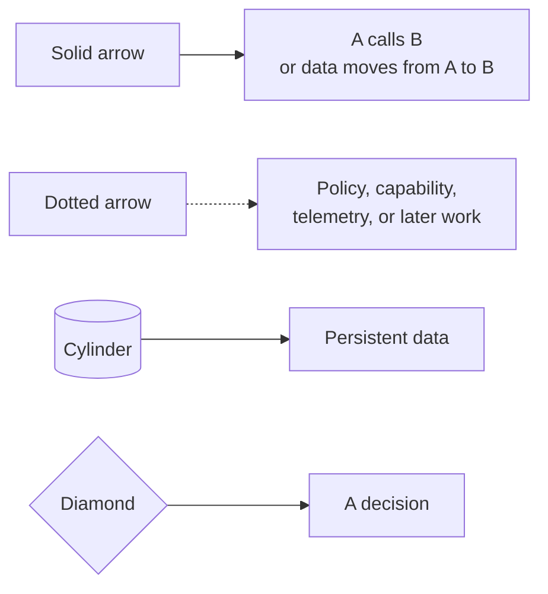

In sequence diagrams, read from top to bottom. Each vertical lane is one participant. An arrow means the participant
on the left sends a call or result to the participant on the right.

## 1. The whole app in 30 seconds

At its center, this is one Nuxt application with a browser side and a server side. The server stores authoritative
application state in SQLite. External services are reached through small, server-only boundaries.

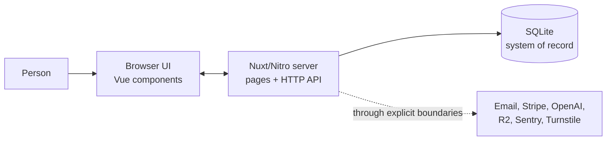

Read that picture as three statements:

1. The browser never talks directly to SQLite.
2. The server decides who the user is, what they own, and what an operation may change.
3. Provider integrations stay behind server boundaries. Email transport is core configuration; several other
   providers are optional. None replaces the application's ownership rules or local system of record.

### The stack in plain language

| Name               | What it does here                                                                                 |
| ------------------ | ------------------------------------------------------------------------------------------------- |
| **pnpm workspace** | Installs and coordinates packages in this repository. There is currently one application package. |
| **Vue**            | Builds interactive browser components from `.vue` files.                                          |
| **Nuxt**           | Organizes pages, layouts, server rendering, configuration, and the application build.             |
| **Nitro + h3**     | Run the server and turn files under `server/api` into HTTP endpoints.                             |
| **Better Auth**    | Owns sign-in, sessions, linked accounts, organizations, memberships, and invitations.             |
| **SQLite**         | Stores the authoritative local data in one database file.                                         |
| **Drizzle**        | Gives TypeScript code a typed way to describe tables and run SQL operations.                      |
| **Zod**            | Validates untrusted input before business logic uses it.                                          |
| **Adapters**       | Small modules that translate app-shaped requests into provider-specific calls.                    |

The exact dependency versions are pinned in
[`apps/web/package.json`](../apps/web/package.json).

## 2. Where code lives

The repository is a monorepo-shaped workspace, but only `apps/web` contains a production application today.

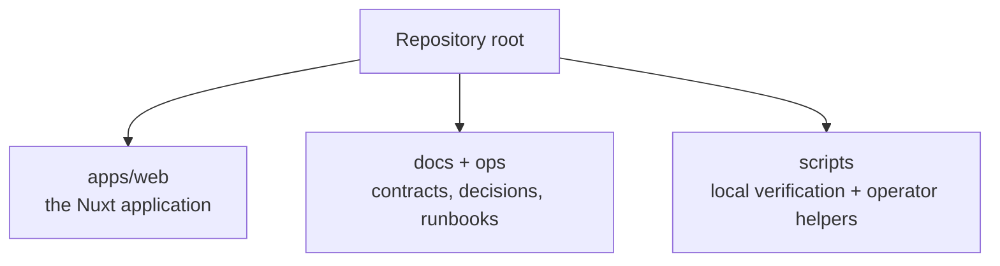

Inside `apps/web`, start with these directories:

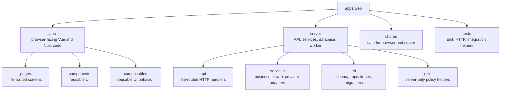

The most important code-placement boundary is:

| Folder   | Where its code may run                                                                |
| -------- | ------------------------------------------------------------------------------------- |
| `app`    | Browser-facing Nuxt/Vue code; some also participates in server rendering              |
| `shared` | Contracts and constants intentionally safe to import on both browser and server sides |
| `server` | Server only: HTTP authority, secrets, SQL, background work, and provider calls        |

Code in `app` must not import database connections or provider secrets. Code in `shared` must be safe to send to a
browser. A running browser reaches `server` behavior only through HTTP.

## 3. What runs

### 3.1 Local development

During local development, the browser reaches the Nuxt/Nitro development process directly.

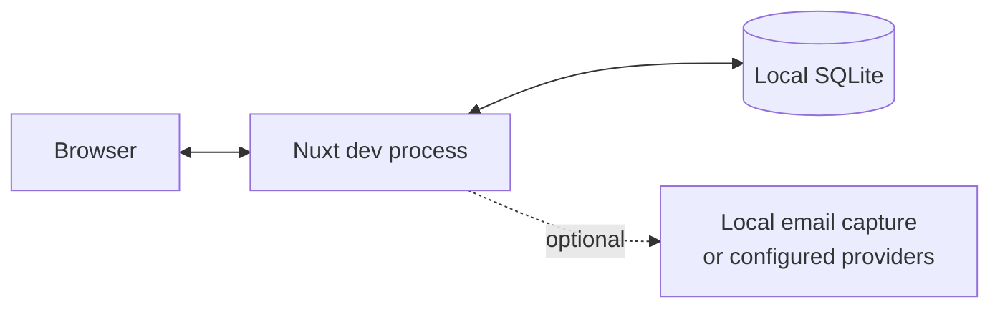

The root `dev` command delegates to the web package. A developer starts the background worker separately when a flow
needs queued jobs.

### 3.2 Production requests

The default production path adds Cloudflare in front of the same application boundary.

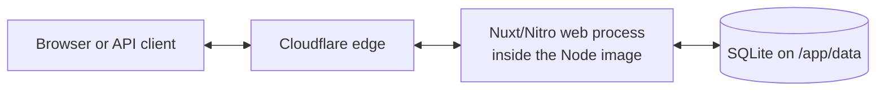

Cloudflare can proxy, filter, and terminate edge traffic, but the application still authenticates the user and
authorizes each private operation. An edge check is not a replacement for server authorization.

### 3.3 One image, four entry points

The production image contains four programs. "Same image" means they ship from the same build; it does not mean they
run in one process or have the same authority.

An **image** is the packaged filesystem and runtime. An **entry point** is a command available in that image. A
**process** is one running instance of an entry point.

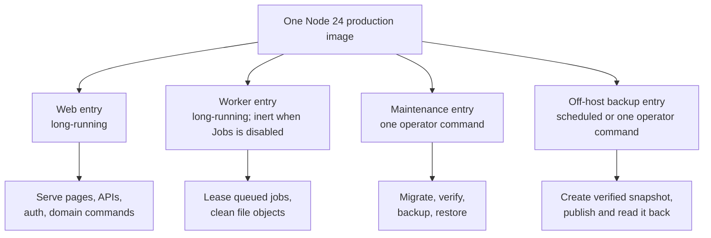

| Entry           | Usually alive for          | May do                                                                 |
| --------------- | -------------------------- | ---------------------------------------------------------------------- |
| Web             | The life of the deployment | Serve SSR pages and APIs; run authenticated commands                   |
| Worker          | The life of the deployment | Claim leased jobs and perform retryable background cleanup             |
| Maintenance     | One operation              | Inspect or deliberately change database state                          |
| Off-host backup | One scheduled run          | Coordinate a verified snapshot and upload it with separate credentials |

The Docker default command starts only the web entry. Deployment or operator commands launch the worker,
maintenance, and off-host backup entries separately.

Main sources:

- [web start command](../apps/web/package.json)
- [`server/worker.ts`](../apps/web/server/worker.ts)
- [`server/maintenance.mjs`](../apps/web/server/maintenance.mjs)
- [`server/off-host-backup.mjs`](../apps/web/server/off-host-backup.mjs)

### 3.4 Persistent data and providers

The container can be replaced; important local state lives on the mounted `/app/data` volume. A **volume** is
host-managed persistent storage attached to the container at a known path.

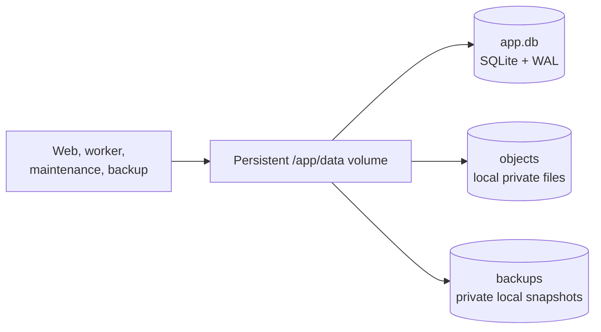

External resources sit outside that volume:

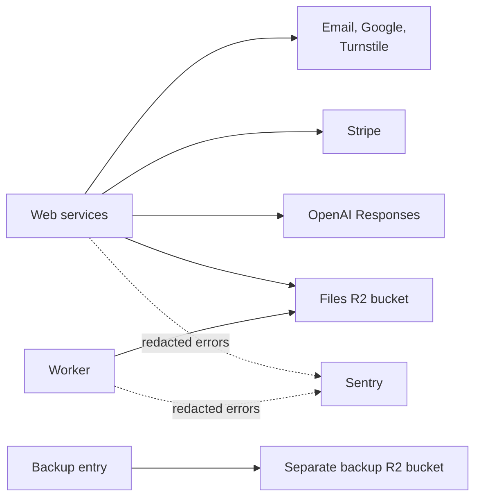

The Files bucket and backup bucket intentionally use different resources and credentials. Coolify injects its shared
runtime environment file into every service, so Compose overrides the five backup keys to empty outside the enabled
runner. Web routes, readiness checks, worker logic, and Files authorization never consume them.

**Object storage** keeps byte objects under keys rather than relational rows; R2 is Cloudflare's object-storage
service. **Sentry** receives redacted error and trace telemetry, not application authorization.

### 3.5 Startup validation happens before listening

The web process validates core configuration and every explicit module flag before it accepts traffic.

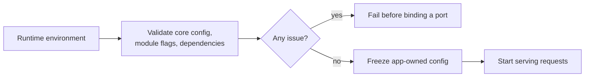

This is why the liveness route can stay tiny after startup. It does not mean an invalid configuration is allowed to
start and then report itself alive.

### 3.6 Three different health questions

| Check                      | Question                                                                                     | What it deliberately does not prove                                        |
| -------------------------- | -------------------------------------------------------------------------------------------- | -------------------------------------------------------------------------- |
| Public `GET /api/live`     | Can the already-started process answer?                                                      | Configuration, SQLite, modules, providers, or schema identity              |
| Protected `GET /api/ready` | Are module configuration and a fresh read-only SQLite `SELECT 1` ready for traffic?          | Migration identity, object storage, worker progress, or external providers |
| Maintenance verification   | Does the database pass integrity, foreign-key, migration-ledger, and packaged-schema checks? | Real provider accounts or full deployment routing                          |

Keeping these questions separate lets an orchestrator distinguish a dead process, an unavailable local dependency,
and an invalid database package.

## 4. How an HTTP request moves through the server

An API request does not jump directly from the browser to a database query. It passes several boundaries, and each
boundary answers a different question.

### 4.1 Read request or command?

The application treats `GET`, `HEAD`, and `OPTIONS` as safe methods. Other methods under `/api` are commands because
they may change state.

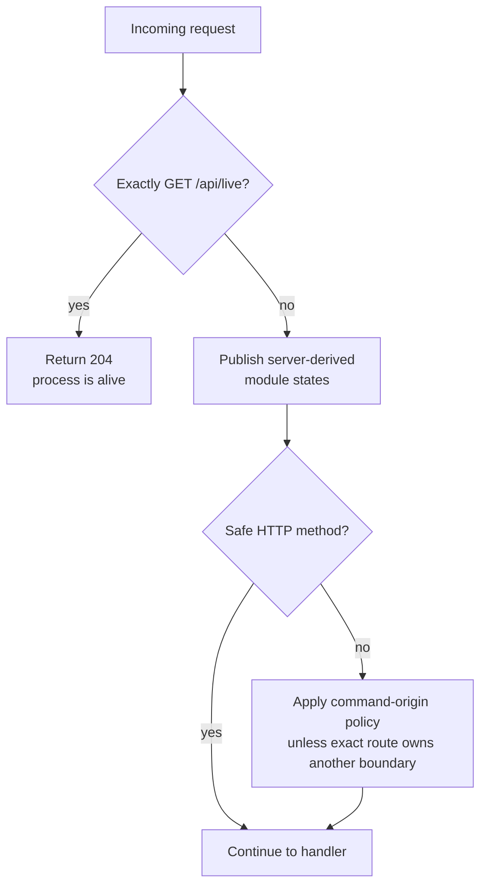

`GET /api/live` is deliberately tiny. It answers only "is the process responding?" It does not inspect configuration,
SQLite, or providers. Protected `GET /api/ready` answers a different question: "is this configured process ready to
receive traffic?"

### 4.2 Gate 1: optional modules

Billing, Files, AI, Turnstile, Observability, and Jobs are explicit modules.

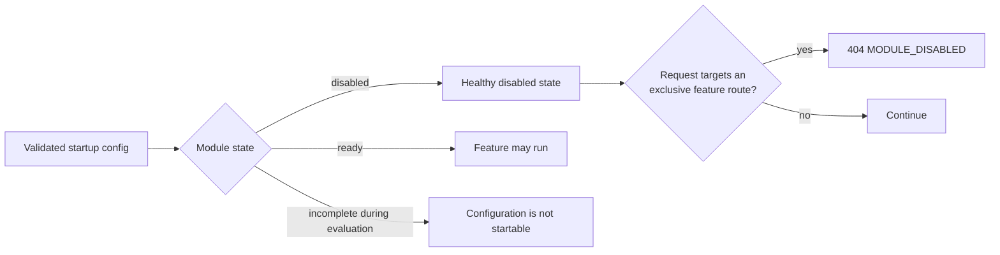

Why return a stable 404 for an exclusive disabled route? A disabled fork should not partially execute the feature,
touch its provider, or expose a half-configured endpoint.

The manifest is in
[`shared/modules.ts`](../apps/web/shared/modules.ts), startup
validation is in
[`server/utils/runtime.ts`](../apps/web/server/utils/runtime.ts),
and the request gate is
[`01-module-boundary.ts`](../apps/web/server/middleware/01-module-boundary.ts).

### 4.3 Gate 2: browser-origin policy

For an ordinary unsafe app API, the server requires trustworthy evidence that the command came from the configured
application origin.

This reduces **cross-site request forgery (CSRF)**: a malicious site trying to make a signed-in browser send an
unintended command to this app.

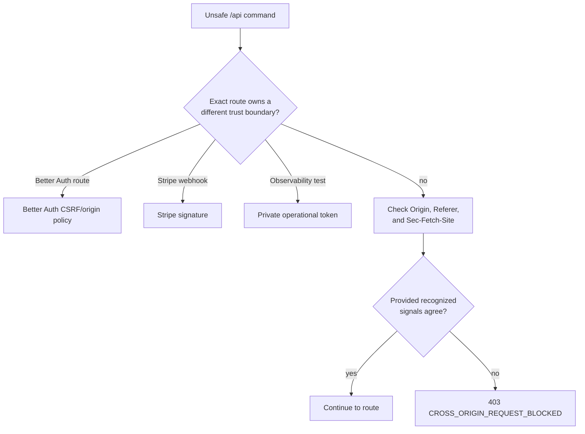

This gate reduces cross-site request forgery risk. It does **not** answer "which user is this?" or "does this user own
record X?" Those checks still happen in the route and repository.

Implementation:
[`02-cross-origin.ts`](../apps/web/server/middleware/02-cross-origin.ts)
and
[`request-origin.ts`](../apps/web/server/utils/request-origin.ts).

### 4.4 Route-specific work

After global middleware, an ordinary private route usually follows this order:

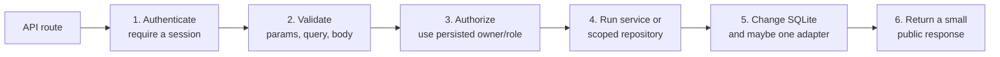

The order matters:

1. Authentication establishes the caller.
2. Validation makes untrusted bytes safe to interpret.
3. Authorization decides whether that caller may touch this particular resource.
4. Services coordinate multi-step business behavior.
5. Repositories keep SQL and owner predicates out of page components.
6. Public responses omit private owner IDs, provider locators, secrets, and raw provider envelopes.

## 5. Data ownership and family-plan authority

This is the most important product rule in the codebase:

> A family plan can grant a capability. It does not grant access to another person's private records.

### 5.1 Private data belongs to a user

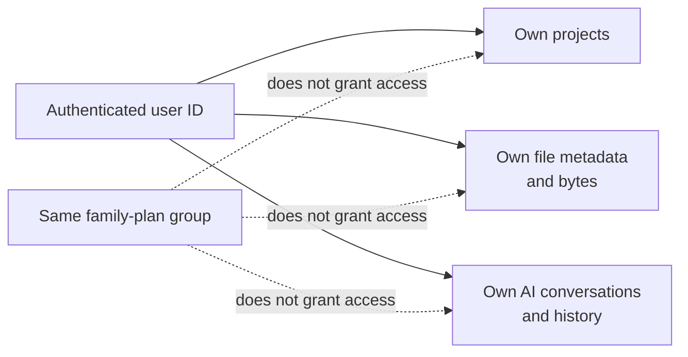

Private queries include the immutable authenticated `user.id` in their predicates. The app does not use the session's
mutable `activeOrganizationId` as application authorization.

### 5.2 Organizations represent family-plan membership

Better Auth Organization is present, but users do not navigate a shared workspace.

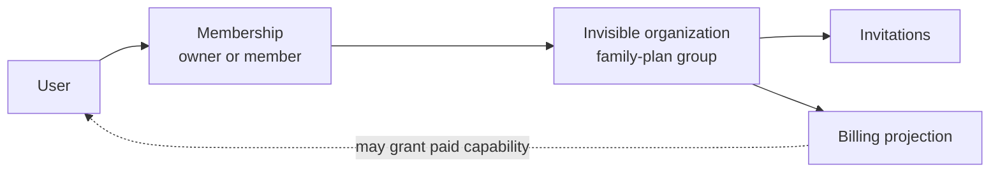

This separation lets a family member receive plan coverage while keeping their projects, Files, and AI history private.

### 5.3 Small relationship diagrams

In these diagrams, `||` means exactly one, `o|` means zero or one, and `o{` means zero or many.

Identity and family membership:

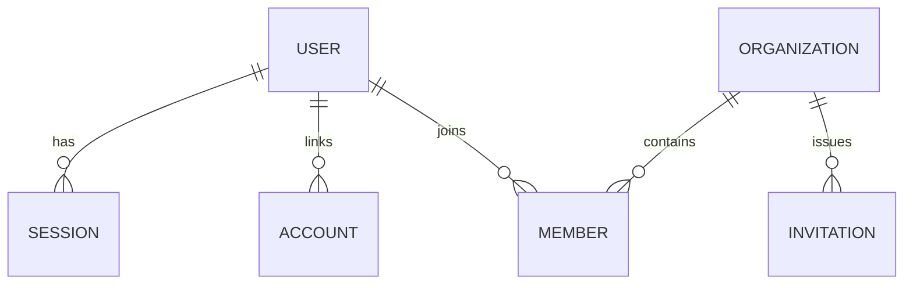

Private product data:

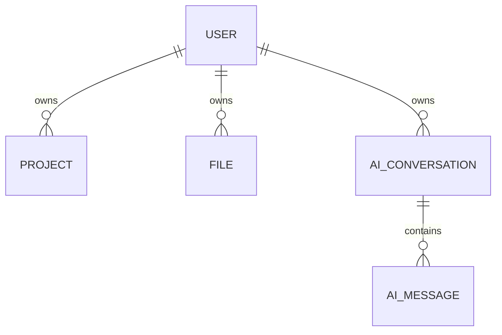

The Drizzle export surface is
[`server/db/schema/index.ts`](../apps/web/server/db/schema/index.ts).
The custom runtime-invariant migration adds family and billing constraints that Drizzle cannot express directly.

## 6. Read features vertically

A junior developer can get lost by reading every component, then every route, then every repository. Instead, pick one
feature and follow it from the browser down to state.

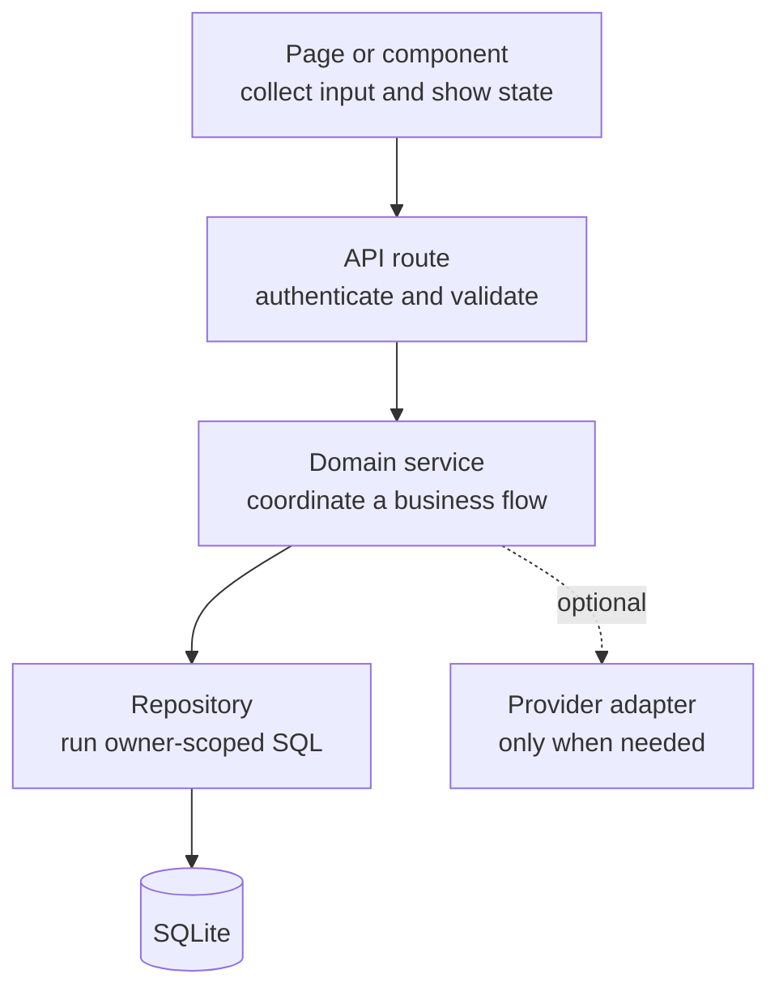

Not every small feature needs a service. The project create route can call its scoped repository directly. Complex
Files, AI, billing, and account-deletion flows use services because they coordinate multiple state changes or a
provider boundary.

| Feature             | Browser/HTTP entry                                                                              | Core code                                           | State/provider                                       |
| ------------------- | ----------------------------------------------------------------------------------------------- | --------------------------------------------------- | ---------------------------------------------------- |
| Identity and family | `/login`, `/signup`, `/account`, `/invite/:invitationId`; `/api/auth/**`, `/api/invitations/**` | Better Auth composition and invitation services     | Auth/family tables, email, optional Google/Turnstile |
| Projects            | `/app/projects`; `/api/projects/**`                                                             | Owner-scoped project repository                     | User-owned project rows                              |
| Billing             | `/account/billing`; billing APIs; Stripe webhook                                                | Billing services and event store                    | Organization billing projection, Stripe              |
| Files               | `/api/files/**` (no product page yet)                                                           | File service, storage adapter, job queue            | Owner-scoped metadata, local objects or Files R2     |
| AI                  | `/api/ai/**` (no product page yet)                                                              | Conversation service, AI repository, OpenAI adapter | Owner-scoped history and coordination state, OpenAI  |
| Operations          | live/ready/baseline endpoints and process commands                                              | Runtime evaluator, worker, maintenance, backup      | SQLite, local snapshots, Sentry, backup R2           |

Primary proof follows the same feature slices:

| Feature                | Start with these tests                                                                   |
| ---------------------- | ---------------------------------------------------------------------------------------- |
| Identity and family    | Passwordless, social-auth, organization, invitation, family, and account-deletion suites |
| Projects               | Project HTTP/repository tests and the private-project browser journey                    |
| Billing                | Billing service, HTTP, webhook, and family-billing browser tests                         |
| Files                  | File service/repository/adapter tests, worker tests, and isolated API smoke              |
| AI                     | AI service/repository/HTTP/adapter tests with deterministic provider doubles             |
| Runtime and operations | Built-runtime, container, integration, maintenance, and backup process suites            |

## 7. First end-to-end trace: create a project

Projects are the best first feature to read because they use the standard private request path without a provider or a
background job.

### 7.1 Browser responsibilities

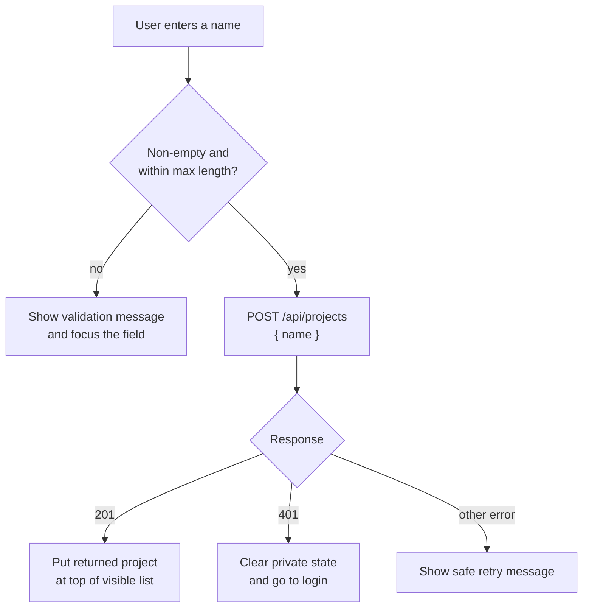

Client validation improves the experience, but it is not a security boundary. A caller can skip the page and send an
HTTP request directly, so the server validates the same input again.

### 7.2 Server responsibilities

```mermaid
sequenceDiagram
  autonumber
  actor Browser
  participant Middleware
  participant Route as Project route
  participant Auth as Better Auth
  participant Repo as Project repository
  participant DB as SQLite

  Browser->>Middleware: POST /api/projects
  Middleware->>Middleware: Module projection, then origin check
  Middleware->>Route: Dispatch allowed request
  Route->>Auth: requireSession(event)
  Auth->>DB: Read persisted session and user
  DB-->>Auth: Authenticated user
  Route->>Route: Zod-validate { name }
  Route->>Repo: createProject(user.id, input)
  Repo->>DB: INSERT with owner_user_id = user.id
  DB-->>Repo: Public project fields
  Repo-->>Route: Project
  Route-->>Browser: 201 { project }
```

The repository generates the project ID on the server and returns only `id`, `name`, `createdAt`, and `updatedAt`.
Later read, update, and delete queries match both the project ID and the authenticated owner ID.

Read these files in order:

1. [`app/pages/app/projects/index.vue`](../apps/web/app/pages/app/projects/index.vue)
2. [`server/api/projects/index.post.ts`](../apps/web/server/api/projects/index.post.ts)
3. [`server/utils/auth/require-session.ts`](../apps/web/server/utils/auth/require-session.ts)
4. [`server/db/repositories/projects.ts`](../apps/web/server/db/repositories/projects.ts)

Checkpoint questions:

- Where does the page prevent two overlapping create requests from racing in the UI?
- Why does the route authenticate before reading and validating the body?
- Which SQL predicate prevents one user from reading or changing another user's project?

## 8. Passwordless authentication

Passwordless sign-in has two separate browser actions:

1. Ask the server to send a magic link.
2. Open that link to prove control of the mailbox and receive a session.

### 8.1 Request a magic link

```mermaid
sequenceDiagram
  autonumber
  actor User
  participant UI as Auth form
  participant Auth as Better Auth handler
  participant DB as SQLite
  participant Email as Capture or SMTP

  User->>UI: Submit email address
  UI->>Auth: Request magic link
  Auth->>Auth: Validate origin and callback
  Auth->>DB: Store hash of 5-minute verification value
  Auth->>Email: Send opaque sign-in URL
  Email-->>Auth: Transport accepted
  Auth-->>UI: Neutral completion result
  UI-->>User: Show the same safe delivery message
```

When Turnstile is enabled, the request also has to prove the expected Turnstile action before Better Auth creates the
verification value:

```mermaid
flowchart LR
  Form["Auth form"] --> Token["Turnstile token"]
  Token --> Server["Server-side verification"]
  Server -->|accepted| Magic["Continue magic-link request"]
  Server -->|rejected| Stop["Reject without sending"]
```

The UI gets a neutral result so it does not reveal whether an email address already has an account. Login and signup
use the same magic-link operation, and a previously unknown mailbox can become a new user after successful redemption.

### 8.2 Open and consume the magic link

```mermaid
sequenceDiagram
  autonumber
  actor User
  participant Auth as Better Auth handler
  participant DB as SQLite
  participant Browser

  User->>Auth: Open opaque verification URL
  Auth->>DB: Atomically claim verification row
  DB-->>Auth: Winning one-time value
  Auth->>DB: Create or find user
  Auth->>DB: Create session
  Auth-->>Browser: Set session cookie
  Auth-->>Browser: Redirect to validated app or invite URL
```

"Atomically claim" means competing redemptions cannot both win the same verification row. It does **not** mean token
consumption, user creation, and session creation are one large transaction. If later work fails after the value is
consumed, the link can be burned and the user must request another.

### 8.3 New-user family bootstrap

When the database receives a new user row, a database trigger creates that person's private family-plan group.

```mermaid
flowchart LR
  NewUser["New user row"] --> Trigger["Database trigger"]
  Trigger --> PersonalOrg["Personal organization"]
  Trigger --> OwnerMember["Owner membership"]
  PersonalOrg --> OwnerMember
```

This bootstrap does not create shared projects or move private records into an organization.

Follow the code:

1. [`AuthEntryForm.vue`](../apps/web/app/components/AuthEntryForm.vue)
2. [`server/api/auth/[...all].ts`](../apps/web/server/api/auth/[...all].ts)
3. [`auth/passwordless.ts`](../apps/web/server/utils/auth/passwordless.ts)
4. [`auth/create.ts`](../apps/web/server/utils/auth/create.ts)
5. [email adapter](../apps/web/server/services/email/index.ts)
6. [passwordless HTTP tests](../apps/web/tests/passwordless-auth-http.test.ts)

## 9. Private Files and background cleanup

Files are easier to understand when metadata and bytes are treated as related but separate state.

- **Metadata** is the SQLite row: owner, display name, media type, size, storage key, expiry, and lifecycle state.
- **Bytes** are the physical object in the local object directory or the Files R2 bucket.

There is currently no Files product page. Files is a server-side API capability under `/api/files/**`.
Enabling Files also requires Jobs; startup validation rejects an enabled Files module without its cleanup worker
boundary.

### 9.1 The file lifecycle

```mermaid
stateDiagram-v2
  [*] --> Pending: start upload
  Pending --> Ready: verify stored object
  Pending --> Deleted: upload expires
  Ready --> Deleted: owner deletes
  Deleted --> Removed: worker deletes bytes and row
  Removed --> [*]
```

The important user-visible guarantee is that `Deleted` metadata becomes inaccessible immediately. The worker may
remove bytes later, but delayed physical cleanup does not restore application access.

One narrow residual remains for R2: a presigned download URL issued before deletion is a bearer capability until its
60-second expiry. Deletion prevents new authorized downloads, but the app cannot revoke a URL that R2 already issued.

### 9.2 Start an upload

The common first half is the same for local storage and R2:

```mermaid
sequenceDiagram
  autonumber
  actor Client
  participant API as Files API
  participant Service as File service
  participant DB as SQLite

  Client->>API: POST /api/files/uploads
  API->>API: Authenticate, then validate metadata
  API->>Service: Create upload target
  Service->>DB: Insert owner-scoped pending row
  Service->>DB: Enqueue expiry cleanup in job_queue
  Service-->>API: Local or R2 upload capability
  API-->>Client: Upload instructions
```

The request includes a declared size, normalized media type, and base64 `Content-MD5`. The server chooses the configured
storage driver; the client cannot choose a bucket or object key.

A **checksum** is a compact integrity value used to detect changed bytes. Here `Content-MD5` is a transfer-integrity
check, not a password-security mechanism.

The job queue is not a separate hosted queue. It is a SQLite table:

```mermaid
flowchart LR
  DB[("SQLite")] --> Metadata["files table<br/>metadata + lifecycle"]
  DB --> Queue["job_queue table<br/>due time + lease + payload"]
  Worker["Worker process"] --> Queue
  Worker --> Metadata
```

### 9.3 Upload bytes with the local driver

```mermaid
sequenceDiagram
  autonumber
  actor Client
  participant API as Files API
  participant DB as SQLite
  participant Store as Local object store

  Client->>API: PUT /api/files/:id/content
  API->>DB: Recheck session owner, token, pending state, expiry
  API->>Store: Stream to contained temporary storage
  Store->>Store: Verify byte count and MD5
  API->>DB: Recheck authoritative pending row
  API->>Store: Publish object atomically
  API-->>Client: Upload accepted
```

The local upload goes through the web process because the server must enforce the session and signed upload
capability while it streams and verifies the bytes.

### 9.4 Upload bytes with the R2 driver

```mermaid
sequenceDiagram
  autonumber
  actor Client
  participant API as Files API
  participant DB as SQLite
  participant R2 as Files R2 bucket

  Client->>API: Request upload target
  API->>DB: Persist pending owner-scoped row
  API-->>Client: Short-lived presigned conditional PUT
  Client->>R2: PUT bytes with signed Content-MD5
  R2-->>Client: Provider result
```

A presigned URL is a time-limited bearer capability: possession of the URL grants exactly the operation encoded in
it until it expires. R2 receives the bytes directly, so the application does not proxy the upload body.

The signed conditional PUT enforces `Content-MD5` and allows creation only when the key is absent. Later completion
uses trusted R2 metadata to check size and media type; it does not download the object and recompute the MD5.

### 9.5 Complete an upload

Uploading bytes and declaring the file ready are separate steps.

```mermaid
flowchart TD
  Complete["POST /api/files/:id/complete"] --> Row["Load owner-scoped row"]
  Row --> State{"Current state?"}
  State -->|already ready| Same["Return the ready DTO"]
  State -->|pending| Inspect["HEAD or stat object"]
  Inspect --> Match{"Expected object<br/>attributes match?"}
  Match -->|yes| Ready["Mark ready and return DTO"]
  Match -->|no| Error["Return safe failure;<br/>keep pending"]
```

Completion is replay-safe: retrying after a successful completion returns the existing ready file instead of creating
another object.

### 9.6 Delete access now, clean bytes later

The delete request makes the user-facing access change in one SQLite transaction:

```mermaid
sequenceDiagram
  autonumber
  actor Client
  participant API as Files API
  participant DB as SQLite transaction

  Client->>API: DELETE /api/files/:id
  API->>DB: Match file ID + authenticated owner ID
  DB->>DB: Mark metadata deleted
  DB->>DB: Enqueue files.cleanup-orphans
  DB-->>API: Commit both changes
  API-->>Client: 204 response, new app access is gone
```

The worker later converges physical state:

```mermaid
flowchart TD
  Worker["Worker poll loop"] --> Claim["Claim due job<br/>with a lease"]
  Claim --> Phase{"Cleanup phase"}
  Phase -->|expired pending| Expire["Mark expired uploads deleted"]
  Phase -->|deleted metadata| Delete["Delete bytes, then row"]
  Phase -->|reconciliation| Compare["Compare tracked keys<br/>with one storage page"]
  Expire --> Finish["Schedule successor if needed;<br/>finalize or retry job"]
  Delete --> Finish
  Compare --> Finish
```

A **lease** is a time-bounded claim on a job. If a worker dies, another worker can reclaim the job later. That means
cleanup is at-least-once and must be safe when repeated. Worker outage can delay byte deletion, so recurring
reconciliation also searches for untracked objects.

### 9.7 One more fail-closed rule: storage binding

The database remembers the storage driver and provider identity selected for an initialized deployment. Changing from
local to R2, or changing the R2 bucket, account, or jurisdiction, is a stopped-writer data migration rather than an
environment-variable toggle.

Follow the code:

1. [`file-service.ts`](../apps/web/server/services/storage/file-service.ts)
2. [`file-storage-binding.ts`](../apps/web/server/services/storage/file-storage-binding.ts)
3. [`local-object-storage.ts`](../apps/web/server/services/storage/local-object-storage.ts)
4. [`r2-object-storage.ts`](../apps/web/server/services/storage/r2-object-storage.ts)
5. [`job-queue.ts`](../apps/web/server/services/jobs/job-queue.ts)
6. [`orphan-cleanup.ts`](../apps/web/server/services/storage/orphan-cleanup.ts)
7. [`server/worker.ts`](../apps/web/server/worker.ts)

Checkpoint questions:

- At which state does the application allow a download?
- Which facts are verified by the local uploader, and which facts are verified for R2?
- Why must both "mark deleted" and "enqueue cleanup" commit together?
- What makes a repeated cleanup job safe?

## 10. One AI conversation turn

AI is another server-side API capability with no product page yet. It is more complicated than Projects because one
request can spend provider money and can outlive the browser connection.

The central idea is:

> Reserve local authority before calling OpenAI; finalize that reservation after the call ends.

### 10.1 The parts and their jobs

```mermaid
flowchart LR
  Route["Message route<br/>HTTP boundary"] --> Service["Conversation service<br/>orchestrates one turn"]
  Service --> Repo["AI repository<br/>atomic state changes"]
  Repo --> DB[("SQLite")]
  Service --> Adapter["OpenAI adapter<br/>bounded provider request"]
  Adapter --> OpenAI["Responses API"]
```

The route does not build raw OpenAI requests, and the adapter does not decide who owns a conversation. The service
coordinates those two boundaries.

#### Persisted AI coordination relationships

```mermaid
erDiagram
  USER ||--o{ AI_USAGE_BUCKET : accumulates
  USER ||--o| AI_GENERATION_LEASE : holds
  AI_CONVERSATION ||--o{ AI_GENERATION_ATTEMPT : reserves
  AI_MESSAGE ||--o{ AI_FILE_CITATION : cites
  AI_MESSAGE ||--o{ AI_WEB_CITATION : cites
```

### 10.2 Attempt states

Every logical generation has a caller-supplied `clientRequestId` and a persisted attempt.

```mermaid
stateDiagram-v2
  [*] --> Pending: reservation commits
  Pending --> Succeeded: valid assistant response
  Pending --> Refused: provider refusal
  Pending --> Failed: definite local/provider failure
  Pending --> Cancelled: request cancelled
  Pending --> Indeterminate: timeout or ambiguous outcome
  Succeeded --> [*]
  Refused --> [*]
  Failed --> [*]
  Cancelled --> [*]
  Indeterminate --> [*]
```

`Pending` is the only nonterminal state. An attempt also records enough minimized information to return the same
public outcome on a safe retry without silently making another provider call.

### 10.3 Preflight: recognize a retry

Before making a reservation, the service runs a short immediate transaction.

```mermaid
flowchart TD
  Request["Message + clientRequestId"] --> Preflight["Reap stale attempts<br/>and expired leases"]
  Preflight --> Lookup["Look up owner + conversation<br/>+ clientRequestId"]
  Lookup --> Found{"Attempt exists?"}
  Found -->|terminal, same request| Replay["Replay stored outcome"]
  Found -->|pending| Conflict["Report generation in progress"]
  Found -->|key reused differently| Reject["Reject idempotency conflict"]
  Found -->|no| Continue["Continue toward reservation"]
```

An **idempotency key** lets the server recognize a retry of the same logical command. It is not a cache key for
arbitrary different prompts.

To **reap stale attempts** means marking expired pending attempts terminal and clearing leases whose time-bounded
authority has expired before evaluating the new request.

### 10.4 Reservation transaction

Before OpenAI is contacted, SQLite atomically reserves everything that competing requests might otherwise race over.

```mermaid
flowchart TD
  Start["BEGIN IMMEDIATE"] --> Check["Recheck conversation owner<br/>and optional billing entitlement"]
  Check --> Limits{"Quota and one-per-user<br/>generation lease available?"}
  Limits -->|no| Reject["Reject without provider call"]
  Limits -->|yes| Message["Insert user message"]
  Message --> Attempt["Insert pending attempt<br/>and claim history position"]
  Attempt --> Usage["Increment UTC-day quota<br/>and hold owner lease"]
  Usage --> Commit["Commit reservation"]
```

`BEGIN IMMEDIATE` is a SQLite write transaction that acquires write authority early. The reservation commits:

- the user message and its conversation sequence;
- the pending attempt and idempotency key;
- one of the user's daily reserved attempts;
- a short-lived generation lease for that user.

The current policy permits one active generation per user and 50 reserved provider attempts per UTC day. A failed
provider call is still a reserved attempt; its local reservation is finalized, not rolled back as if nothing happened.

AI checks paid entitlement only when the Billing module is enabled. With Billing disabled, a ready AI module is not
paywalled by the local billing projection.

### 10.5 Provider call outside the transaction

The application does not hold a SQLite write transaction open while waiting for the network.

```mermaid
sequenceDiagram
  autonumber
  participant Service
  participant Repo as AI repository
  participant Adapter as OpenAI adapter
  participant OpenAI

  Service->>Repo: Read bounded visible history
  Repo-->>Service: App-owned message context
  Service->>Adapter: Instructions, history, policy, signal
  Adapter->>OpenAI: responses.create
  OpenAI-->>Adapter: Text/refusal, citations, usage, request ID
  Adapter-->>Service: Strict normalized result
```

The adapter applies app-owned limits: a 60-second provider timeout, zero SDK retries, bounded output, `store: false`,
no streaming, and optional deployment-owned File Search or domain-restricted Web Search.

`store: false` disables normal Responses application-state storage; it is not a claim of Zero Data Retention. Optional
File Search also has provider-retained corpus state, and Web Search has its own provider and third-party privacy
considerations.

### 10.6 Finalize success or failure

A second short transaction turns the pending attempt into a terminal result.

```mermaid
flowchart TD
  Result["Normalized provider outcome"] --> Kind{"Outcome"}
  Kind -->|success| Success["Insert assistant message<br/>and allowed citations"]
  Kind -->|refusal| Refusal["Insert refusal message"]
  Kind -->|failure/cancel/timeout| Failure["Record terminal error<br/>without assistant message"]
  Success --> Final["Release owner lease<br/>finalize attempt + usage"]
  Refusal --> Final
  Failure --> Final
  Final --> Public["Return public response<br/>or stable application error"]
```

If the attempt lease has expired, a late result cannot simply take over current history. Finalization checks the
conversation, owner, history revision, attempt, and lease before committing.

Follow the code:

1. [message route](../apps/web/server/api/ai/conversations/[conversationId]/messages/index.post.ts)
2. [`ai-conversation-service.ts`](../apps/web/server/services/ai/ai-conversation-service.ts)
3. [`repositories/ai-conversations.ts`](../apps/web/server/db/repositories/ai-conversations.ts)
4. [`ai-policy.ts`](../apps/web/server/services/ai/ai-policy.ts)
5. [`openai.ts` adapter](../apps/web/server/services/ai/openai.ts)

Checkpoint questions:

- Which facts commit before the provider call begins?
- Why is the provider call outside both database transactions?
- What does retrying the same `clientRequestId` do?
- Why is the generation lease per user rather than only per conversation?

## 11. Stripe webhooks and the local billing projection

Stripe sends a webhook from outside the browser. It cannot satisfy the app's ordinary same-origin browser policy, so
this one exact route uses a different trust boundary.

- A **webhook** is a provider-to-application HTTP request.
- A **projection** is the application's minimized local view of provider state.
- An **event receipt** is the small local record that says a specific provider event was already processed.

#### Persisted billing relationships

Billing data belongs to the family-plan organization, not to a private project:

```mermaid
erDiagram
  ORGANIZATION ||--o| BILLING_CUSTOMER : bills
  ORGANIZATION ||--o{ BILLING_CHECKOUT_ATTEMPT : starts
  ORGANIZATION ||--o| BILLING_SUBSCRIPTION : projects
  BILLING_CUSTOMER o|--o{ BILLING_CHECKOUT_ATTEMPT : supports
  BILLING_CUSTOMER ||--o| BILLING_SUBSCRIPTION : identifies
```

### 11.1 Why the webhook may enter

```mermaid
flowchart LR
  Sender["Stripe webhook sender"] --> Raw["Raw event bytes<br/>+ Stripe-Signature"]
  Raw --> Route["POST /api/webhooks/stripe"]
  Route --> SDK["Official Stripe SDK<br/>signature verification"]
  SDK -->|valid| Service["Billing webhook service"]
  SDK -->|invalid| Reject["Reject; no billing write"]
```

The exemption applies only to the origin gate. The route still requires a valid provider signature, enabled Billing
module, accepted event shape, and service-level policy. Signature verification must receive the unmodified raw body.

### 11.2 Deduplicate before expensive work

Providers can retry webhooks, and two deliveries can race.

```mermaid
flowchart TD
  Event["Verified Stripe event"] --> Supported{"Supported event type?"}
  Supported -->|no| Acknowledge["Acknowledge without<br/>provider read or receipt"]
  Supported -->|yes| Receipt["Look up minimized event receipt"]
  Receipt --> Exists{"Event ID exists?"}
  Exists -->|yes| Duplicate["Return duplicate: true"]
  Exists -->|no| Fetch["Fetch route-specific current state<br/>from Stripe API"]
  Fetch --> Apply["Continue to atomic apply"]
```

The inbound webhook sender and the outbound Stripe API are two roles. Every supported event is only a trigger for its
route-specific authoritative current-state read; the application does not trust the event payload as current billing
state. A signed unsupported event is acknowledged without a provider read or durable receipt.

### 11.3 Apply a minimized local observation

```mermaid
flowchart TD
  Begin["BEGIN IMMEDIATE"] --> Again{"Recheck event receipt"}
  Again -->|now exists| Duplicate["Return duplicate: true"]
  Again -->|still new| Classify["Choose live, detached,<br/>or ignored target"]
  Classify --> Order["Apply ordering and<br/>family-authority policy"]
  Order --> Receipt["Insert minimized receipt last"]
  Receipt --> Commit["Commit and return duplicate: false"]
```

| Classification          | Plain meaning                                                                                                                    |
| ----------------------- | -------------------------------------------------------------------------------------------------------------------------------- |
| `live`                  | The observation belongs to a current organization customer or Checkout attempt.                                                  |
| `detached`              | The account was deleted, but a minimized identity-free billing subject remains for provider reconciliation.                      |
| `ignored`               | No applicable live or detached target changed; the event receipt is still recorded.                                              |
| reconciliation required | This is a flag within affected state, not a fourth target. Ambiguous or conflicting observations deny authority until corrected. |

The receipt is inserted last so a recorded event means its local projection work completed in the same transaction.
The application stores a minimized billing projection and receipt, not the raw webhook body.

The local projection, not a Checkout success query string, decides current family-plan capability. Billing entitlement
may cover accepted family members, but it still grants no access to their private Projects, Files, or AI history.

Follow the code:

1. [`stripe.post.ts`](../apps/web/server/api/webhooks/stripe.post.ts)
2. [`stripe-client.ts`](../apps/web/server/services/payments/stripe-client.ts)
3. [`billing-webhook.ts`](../apps/web/server/services/payments/billing-webhook.ts)
4. [`billing-event-store.ts`](../apps/web/server/services/payments/billing-event-store.ts)

Checkpoint questions:

- Why is a Stripe signature authentication for this route while an `Origin` header is not?
- Why does the service check for a receipt both before and inside the transaction?
- Why is the receipt written after projection changes?

## 12. Backup and restore

Backup and restore both move database state, but their safety conditions are different.

| Operation             | May web and worker keep writing? | Main idea                                                |
| --------------------- | -------------------------------- | -------------------------------------------------------- |
| Routine SQLite backup | Yes                              | SQLite's Online Backup API creates a consistent snapshot |
| Migration             | No                               | Change the live schema with every writer stopped         |
| Restore               | No                               | Prepare a verified candidate, then replace live state    |

### 12.1 Create a verified local snapshot

The off-host command asks the maintenance entry to create the snapshot. That keeps database identity and verification
policy in one operator boundary.

```mermaid
sequenceDiagram
  autonumber
  participant Scheduler
  participant Backup as Off-host backup entry
  participant Maintenance
  participant DB as Live SQLite
  participant Local as Private backups directory

  Scheduler->>Backup: Run backup
  Backup->>Local: Acquire private operator lock
  Backup->>Maintenance: Create generated snapshot
  Maintenance->>DB: Check integrity, foreign keys, migration identity
  Maintenance->>DB: Run SQLite Online Backup API
  DB-->>Local: Consistent staged snapshot
  Maintenance->>Local: Make standalone, reverify, restrict permissions
  Maintenance-->>Backup: Verified local snapshot
```

The Online Backup API is what makes this operation safe while ordinary writers are active. Copying `app.db` with a
generic filesystem copy would not provide the same contract.

### 12.2 Verify coverage, publish immutably, and read back

```mermaid
sequenceDiagram
  autonumber
  participant Backup as Off-host backup entry
  participant Local as Local snapshot
  participant Maintenance
  participant R2 as Separate backup R2

  Backup->>Local: Hash bytes and stable file identity
  Backup->>Maintenance: Verify schema and Files coverage
  Maintenance-->>Backup: Snapshot accepted
  Backup->>R2: HEAD SHA-derived immutable key
  opt Key does not exist
    Backup->>R2: Conditional PUT with transfer checksum
  end
  Backup->>R2: Full GET read-back
  R2-->>Backup: Stored bytes and metadata
  Backup->>Backup: Verify byte count and SHA-256
  Backup->>Local: Remove snapshot only after verification
```

The off-host object key is derived from the snapshot hash, so different bytes cannot silently replace an existing
backup. A successful upload is not enough; the command downloads the object and verifies what R2 actually returns.

Important scope boundary: this command backs up SQLite. It does **not** copy local file-object bytes, OpenAI corpora,
or other provider resources. It refuses off-host publication when active Files rows use the local driver because the
snapshot would not cover those bytes. Files stored in R2 remain in the separately credentialed Files bucket.

### 12.3 Restore prerequisite: stop every writer

> Follow the
> [restore runbook](../ops/restore-runbook.md). Do not
> reconstruct a production command from these teaching diagrams.

A **same-volume candidate** is staged on the same mounted filesystem so final rename can be atomic. SQLite
**sidecars** are the WAL, SHM, and journal files that may belong to the live database. **Quarantine** is a private
holding directory for prior state kept during replacement or investigation.

```mermaid
flowchart TD
  Start["Planned restore"] --> Stop["Stop web, worker,<br/>any enabled backup runner, every writer"]
  Stop --> Confirm["Operator supplies<br/>--confirm-app-stopped"]
  Confirm --> Verify{"Live DB and input<br/>can be inspected safely?"}
  Verify -->|yes| Prepare["Prepare candidate"]
  Verify -->|busy or inaccessible| Abort["Abort; do not guess"]
```

The confirmation flag is an operator assertion, not automatic process detection.

### 12.4 Prepare the candidate without touching live state

```mermaid
flowchart LR
  Backup["Selected backup"] --> Verify["Verify path, integrity,<br/>foreign keys, identity"]
  Verify --> Candidate["Online-copy to<br/>same-volume candidate"]
  Candidate --> Migrate["Apply packaged<br/>forward migrations"]
  Migrate --> Invalidate["Delete restored sessions<br/>and one-time verifications"]
  Invalidate --> Final["Checkpoint and verify<br/>exact current schema"]
```

At the end of this phase, the current live database has not yet been replaced.

### 12.5 Preserve prior state, install, and roll back if needed

```mermaid
flowchart TD
  Candidate["Verified candidate"] --> Live{"Prior live state?"}
  Live -->|healthy| Safety["Create verified<br/>pre-restore backup"]
  Live -->|corrupt but inspectable| Retain["Retain prior state<br/>for quarantine"]
  Live -->|none| NoPrior["No prior state<br/>to preserve"]
  Safety --> Move["Move DB and sidecars<br/>together to quarantine"]
  Retain --> Move
  Move --> Install["Rename candidate<br/>into live path"]
  NoPrior --> Install
  Install --> Check{"Final verification passes?"}
```

```mermaid
flowchart TD
  Check{"Final verification passes?"} -->|yes| Done["Restore succeeds"]
  Check -->|no| Remove["Remove failed replacement"]
  Remove --> Prior{"Prior state was moved?"}
  Prior -->|yes| Rollback["Move prior state back"]
  Prior -->|no| Fail["Return failure;<br/>no prior live DB existed"]
```

SQLite's database file, WAL, SHM, and rollback journal are one state family and must move together. Busy or
inaccessible live state aborts rather than being casually classified as corrupt.

Restoring a database intentionally moves local state backward in time. Sessions and one-time verification rows are
invalidated, but an older snapshot can resurrect other records that were later deleted. Stripe state, R2 Files,
provider corpora, and post-snapshot operations therefore require deliberate reconciliation.

Main sources:

- [`maintenance.mjs`](../apps/web/server/maintenance.mjs)
- [`off-host-backup.mjs`](../apps/web/server/off-host-backup.mjs)
- [backup runbook](../ops/backup-runbook.md)
- [restore runbook](../ops/restore-runbook.md)

## 13. How the repository verifies behavior

Tests are part of the architecture because each layer can prove only certain claims.

### 13.1 Evidence layers

| Layer                       | Good at proving                                                                           | Does not prove by itself                             |
| --------------------------- | ----------------------------------------------------------------------------------------- | ---------------------------------------------------- |
| Focused Vitest              | Pure policy, repositories, service behavior, provider request shape                       | Browser rendering or real provider accounts          |
| HTTP/component tests        | Middleware/route composition, auth ordering, stable responses                             | Production bundle and container behavior             |
| Browser tests               | Rendered loading/error/success states, keyboard, accessibility, responsive behavior       | Real hosted provider behavior                        |
| Built-runtime probes        | Packaged Nitro startup, config rejection, liveness/readiness, route composition           | Container filesystem and orchestration               |
| Container/integration tests | Image contents, health, persistence, local provider boundaries, end-to-end local mutation | A real deployed Cloudflare/Stripe/OpenAI environment |
| Staging evidence            | Actual provider accounts, DNS, proxy, credentials, callbacks, delivery                    | Every local code branch                              |

The most common mistake is treating a provider double as provider certification:

```mermaid
flowchart LR
  Double["Deterministic provider double"] --> Local["Proves local policy,<br/>request shape, error handling"]
  Local -. "does not prove" .-> Real["Real credentials, account policy,<br/>network, callbacks, delivery"]
  Staging["Staging certification"] --> Real
```

### 13.2 Local check

```mermaid
flowchart LR
  Change["Local change"] --> Check["pnpm run check"]
  Check --> Checks["Formatting, doctor, policy,<br/>lint, migrations, types, Vitest"]
  Checks --> Result{"All checks pass?"}
  Result -->|yes| Pass["Local check passes"]
  Result -->|no| Fail["Change is blocked"]
```

### 13.3 Full local verification

`pnpm run verify` exercises the expensive production boundaries.

```mermaid
flowchart TD
  Full["pnpm run verify"] --> Supply["Network supply-chain scan"]
  Full --> Runtime["Build + built-runtime probes"]
  Full --> Browser["Chromium + accessibility"]
  Full --> Container["Disposable image + health"]
  Full --> Integration["Isolated mutating API"]
  Supply --> Confidence["Strong local confidence"]
  Runtime --> Confidence
  Browser --> Confidence
  Container --> Confidence
  Integration --> Confidence
  Confidence -. "does not replace" .-> Staging["Real deployment and<br/>provider certification"]
```

References:

- [local verification guide](ci.md)
- [implementation checklist](implementation-checklist.md)

## 14. Why the code looks this way

This repository is one evolving baseline, not a set of tagged tutorial snapshots. The word "step" in the repository
name should not be read as "check out step 3 to get the step-3 app."

### 14.1 The broad evolution

```mermaid
flowchart LR
  Prototype["Initial full-stack<br/>prototype"] --> Audit["July 9 audit<br/>reset the contract"]
  Audit --> Foundation["Repair waves 1-2<br/>toolchain, CI, runtime, security"]
  Foundation --> Product["Repair waves 3-5<br/>identity, UI, billing, Files, AI"]
  Product --> Baseline["Current four-entry<br/>database package"]
```

After the current application behavior was assembled, operations work hardened private backups:

```mermaid
flowchart LR
  Baseline["Current application baseline"] --> Backups["Verified private<br/>off-host backups"]
  Backups --> External["Real deployment and<br/>provider certification pending"]
  External --> Reaudit["Independent<br/>re-audit pending"]
```

A repair wave is a dependency-ordered group of changes, not a supported release line.

The current four-entry package preserves the original two-entry starting prefix (`0000` and `0001`) and appends the
#169 Stripe persistence/invariant pair (`0002` and `0003`).

### 14.2 Current, superseded, removed, and pending

| Status                | Examples                                                                                                                                                                                     |
| --------------------- | -------------------------------------------------------------------------------------------------------------------------------------------------------------------------------------------- |
| Current               | User-owned private Projects/Files/AI; invisible organization-backed family entitlement; direct Stripe/OpenAI adapters; local or R2 Files; four-entry package with preserved two-entry prefix |
| Superseded history    | App-owned URL-scoped workspace authority                                                                                                                                                     |
| Removed from baseline | Local Search/FTS and PWA/offline-shell direction                                                                                                                                             |
| Still pending         | Real hosted email, Google, Stripe, R2, OpenAI, proxy/deployment certification and an independent re-audit                                                                                    |

Architecture Decision Records preserve why a choice changed even after the old design stops being current. Dated audit
documents are historical evidence; they are not compatibility inputs for the running application.

Read:

- [approved repair backlog](audits/2026-07-09/repair-backlog.md)
- [architecture decisions](adr)
- [canonical baseline](baseline/README.md)

## 15. A practical first day

### Choose a path by goal

| Goal                        | Reading route                                                                                                                                   | Small exercise                                                                 |
| --------------------------- | ----------------------------------------------------------------------------------------------------------------------------------------------- | ------------------------------------------------------------------------------ |
| First application request   | [1](#1-the-whole-app-in-30-seconds) -> [4](#4-how-an-http-request-moves-through-the-server) -> [7](#7-first-end-to-end-trace-create-a-project)  | Trace project name and owner ID from page to SQLite and back                   |
| Identity and authorization  | [5](#5-data-ownership-and-family-plan-authority) -> [8](#8-passwordless-authentication)                                                         | Explain why a family member gets capability but not another user's records     |
| Provider-backed feature     | [6](#6-read-features-vertically) -> either [9](#9-private-files-and-background-cleanup) or [10](#10-one-ai-conversation-turn) -> its linked ADR | Mark which state is local, which call crosses an adapter, and what retry means |
| Production operations       | [3](#3-what-runs) -> [12](#12-backup-and-restore) -> deployment and backup/restore runbooks                                                     | Explain why backup may run with writers but restore may not                    |
| Why the code looks this way | [14](#14-why-the-code-looks-this-way) -> relevant ADR -> dated audit evidence                                                                   | Separate current behavior, superseded design, and pending certification        |

### Project first-day exercise

This route starts with one concrete feature before asking a junior developer to read the largest policy files.

| Time   | Read or do                                                          | Expected conclusion                                                          |
| ------ | ------------------------------------------------------------------- | ---------------------------------------------------------------------------- |
| 20 min | README introduction, Stack, Repository Shape                        | This is one Nuxt app under repair, not a finished starter                    |
| 20 min | Root `package.json`, `pnpm-workspace.yaml`, `apps/web/package.json` | Root scripts delegate to one application package                             |
| 20 min | `app/app.vue` and `app/layouts/default.vue`                         | Nuxt inserts routed pages into the application shell                         |
| 60 min | Project schema, POST route, session helper, repository              | The client supplies a name; the server supplies the owner                    |
| 35 min | The two numbered server middleware files                            | Module policy and origin policy run before the route                         |
| 50 min | Projects page, focusing only on load/create/session-loss paths      | UI state is careful, but security still belongs to the server                |
| 45 min | Project HTTP tests and one browser success journey                  | Tests reveal the intended guarantees and boundary ownership                  |
| 20 min | Draw and explain a seven-node project-create flow                   | The learner can locate auth, validation, ownership, SQL, response, and proof |

### Filename routing quick reference

Nuxt and Nitro use filenames to create routes:

| Source file                                | Resulting route                  |
| ------------------------------------------ | -------------------------------- |
| `app/pages/app/projects/index.vue`         | Page at `/app/projects`          |
| `server/api/projects/index.get.ts`         | `GET /api/projects`              |
| `server/api/projects/index.post.ts`        | `POST /api/projects`             |
| `server/api/projects/[projectId].patch.ts` | `PATCH /api/projects/:projectId` |
| `server/api/auth/[...all].ts`              | Catch-all under `/api/auth/**`   |

### Suggested project code trail

1. [public project shapes](../apps/web/shared/projects.ts)
2. [project validation schema](../apps/web/server/db/schema/projects.validation.ts)
3. [project POST route](../apps/web/server/api/projects/index.post.ts)
4. [session requirement](../apps/web/server/utils/auth/require-session.ts)
5. [project repository](../apps/web/server/db/repositories/projects.ts)
6. [project table](../apps/web/server/db/schema/projects.ts)
7. [project page](../apps/web/app/pages/app/projects/index.vue)
8. [project HTTP tests](../apps/web/tests/workspace-project-http.test.ts)
9. [private-project browser journey](../apps/web/tests/browser/private-project-journey.mjs)

Questions the learner should be able to answer:

- Why may the request body contain only `name`?
- Where does `ownerUserId` come from?
- Why is the owner ID absent from the public response?
- Which predicate conceals another user's project?
- Why are same-origin checks, authentication, validation, and authorization separate?

Defer `runtime.ts`, the full AI repository, maintenance/restore internals, the entire canonical baseline, and the large
browser fixtures until the learner can explain the Projects slice.

## 16. Glossary

| Term                       | Junior-friendly definition                                                                                   |
| -------------------------- | ------------------------------------------------------------------------------------------------------------ |
| pnpm workspace             | A package-management grouping in the repository. It is unrelated to family-plan membership.                  |
| Vue single-file component  | A `.vue` file containing component logic, an HTML-like template, and sometimes scoped CSS.                   |
| Nuxt                       | The framework supplying Vue pages, layouts, server rendering, routing, configuration, and the server shell.  |
| Nitro / h3                 | Nuxt's server runtime and HTTP tools. Files under `server/api` become handlers.                              |
| SSR                        | Server-side rendering: the server creates the initial HTML for a page request.                               |
| Hydration                  | Browser JavaScript attaches interactive Vue behavior to server-rendered HTML.                                |
| Middleware                 | Code that runs before a page or API handler and may reject the request early.                                |
| Handler / route            | The HTTP boundary that receives a request, performs boundary checks, calls app code, and returns a response. |
| Service                    | Server code coordinating a business operation, often across database and provider steps.                     |
| Repository                 | Server-only database functions that require ownership or other scope as explicit arguments.                  |
| Adapter                    | A narrow wrapper around Stripe, OpenAI, R2, SMTP, or another external API.                                   |
| DTO / projection           | A minimized data shape allowed to cross a boundary; private internal fields are omitted.                     |
| Schema                     | The tables, columns, relationships, constraints, or validation shape the app expects.                        |
| Migration                  | A reviewed, versioned change to database structure or invariants.                                            |
| System of record           | The authoritative place for a category of state. SQLite is the local app system of record.                   |
| WAL                        | SQLite's write-ahead log, a sidecar that can contain part of current database state.                         |
| User                       | The application's person/identity row.                                                                       |
| Account                    | A Better Auth login/provider credential link, not a synonym for user or billing account.                     |
| Session                    | Server-verifiable state identifying the currently signed-in user.                                            |
| Organization               | The invisible family-plan membership and entitlement group, not a shared project container.                  |
| Member                     | The user-to-organization relationship with product role `owner` or `member`.                                 |
| `activeOrganizationId`     | Optional Better Auth session state that this app deliberately does not use for private-data authorization.   |
| Authentication             | Establishing who the caller is.                                                                              |
| Authorization              | Deciding whether that caller may perform this operation on this resource.                                    |
| Entitlement                | Permission to use a paid capability; it does not grant another person's private records.                     |
| Owner predicate            | A database condition such as `project.id = ? AND owner_user_id = session.user.id`.                           |
| Concealed 404              | Missing, deleted, and someone-else's private record intentionally look the same.                             |
| Module state               | `disabled`, `incomplete`, or `ready` during evaluation; a running process publishes disabled or ready.       |
| Fail closed                | Reject ambiguous or incomplete state instead of guessing or silently falling back.                           |
| Transaction                | Database operations that commit together or roll back together.                                              |
| `BEGIN IMMEDIATE`          | A SQLite write transaction used when competing writers must not reserve the same authority.                  |
| Job lease                  | A time-bounded claim allowing a worker to process one queued job.                                            |
| At-least-once              | A job may run more than once, so repeating its effects must be safe.                                         |
| Idempotency key            | A caller-provided identifier used to recognize a retried logical operation.                                  |
| Capability / presigned URL | A time-limited bearer credential granting one narrow storage operation.                                      |
| Webhook                    | A provider-to-app request authenticated here with provider-specific signature verification.                  |
| Liveness                   | "The process can answer." It deliberately proves almost nothing else.                                        |
| Readiness                  | "Configured local dependencies are available." It does not prove migration identity or real providers.       |
| Provider double            | A deterministic test substitute that proves local policy, not the real service.                              |
| Staging certification      | Evidence gathered against actual deployed infrastructure and provider accounts.                              |

## 17. Map from the original visual tour

Every section in the compact visual tour has a junior-oriented home here.

| Original section                         | Junior guide      |
| ---------------------------------------- | ----------------- |
| Runtime topology                         | Sections 2 and 3  |
| Request pipeline                         | Section 4         |
| Data authority and ownership             | Section 5         |
| Feature slices                           | Section 6         |
| Representative request: create a project | Section 7         |
| Passwordless authentication              | Section 8         |
| Private file lifecycle                   | Section 9         |
| One AI conversation turn                 | Section 10        |
| Stripe webhook projection                | Section 11        |
| Verified off-host backup                 | Section 12.1-12.2 |
| Stopped-writer restore                   | Section 12.3-12.5 |
| Verification plane                       | Section 13        |
| Evolution map                            | Section 14        |
| Suggested reading paths                  | Section 15        |

## What to remember

If a new developer remembers only five things after the first pass, make them these:

1. The browser never supplies trusted ownership; the server derives it from the authenticated session.
2. Family-plan entitlement can grant capability, but it never shares private Projects, Files, or AI history.
3. Routes are thin boundaries; services coordinate flows, repositories own scoped SQL, and adapters isolate providers.
4. SQLite is authoritative local state, including the job queue and AI attempt coordination.
5. Local tests can prove local behavior; real provider and deployment claims still require staging evidence.
