# Visual Tour

This is a diagram-first guide to how the repository runs. It is a navigation aid, not a second architecture
contract. When a summary here and the [canonical baseline](baseline/README.md) differ, the baseline and executable
code are authoritative.

New to this codebase? Start with the [junior developer visual tour](visual-tour-junior.md), which breaks these
diagrams into smaller steps and defines the architecture vocabulary as it goes.

The shortest useful mental model is:

- one pnpm workspace containing one Nuxt 4 application;
- one production image containing four executable entries;
- SQLite as the local system of record;
- user-owned private data separated from family-plan membership and entitlement;
- optional provider integrations behind explicit module, service, and adapter boundaries.

Solid arrows below represent calls or data flow. Dotted arrows represent capabilities, policy, telemetry, or
asynchronous influence rather than ordinary in-process calls.

## Runtime topology

The default production route passes through Cloudflare before reaching the Node container. Local development reaches
the Nitro process directly, but the application process and service boundaries are the same.

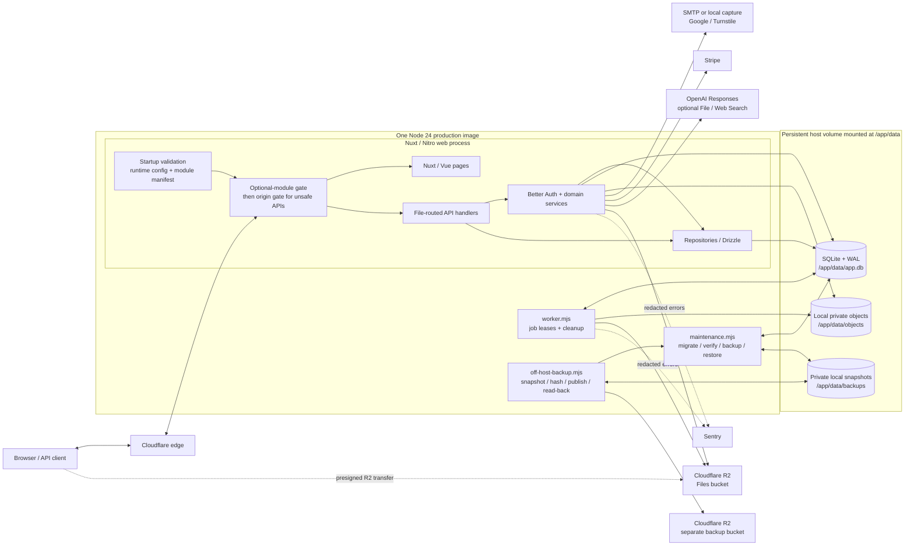

The web, worker, maintenance, and backup code ship together, but they do not have the same authority:

| Entry           | Lifetime                               | Responsibility                                                                       | Main source                                                                              |
| --------------- | -------------------------------------- | ------------------------------------------------------------------------------------ | ---------------------------------------------------------------------------------------- |
| Web             | Long-running                           | SSR, public pages, API routes, authentication, domain commands                       | [Package start command → generated `.output/server/index.mjs`](../apps/web/package.json) |
| Worker          | Long-running; inert when Jobs is off   | Idle when disabled; otherwise lease jobs, reconcile, and delete file objects         | [`server/worker.ts`](../apps/web/server/worker.ts)                                       |
| Maintenance     | One-shot operator command              | Migrate, verify, create local backups, and perform stopped-writer restore            | [`server/maintenance.mjs`](../apps/web/server/maintenance.mjs)                           |
| Off-host backup | Scheduled or one-shot operator command | Ask maintenance for a verified snapshot, publish it, then read it back and verify it | [`server/off-host-backup.mjs`](../apps/web/server/off-host-backup.mjs)                   |

The Files R2 bucket and database-backup R2 bucket are intentionally separate resources with separate credentials.
Backup values remain outside Nuxt runtime config, web routes, readiness, worker logic, and Files authorization.
Coolify injects its shared runtime environment file into every service, so Compose explicitly overrides the five backup
keys to empty outside the enabled runner.

## Request pipeline

Every request except public liveness first receives the server-derived module projection. Unsafe application API
commands then pass the origin boundary unless an exact route owns its own Better Auth CSRF/origin, provider-signature,
or operational-token boundary.

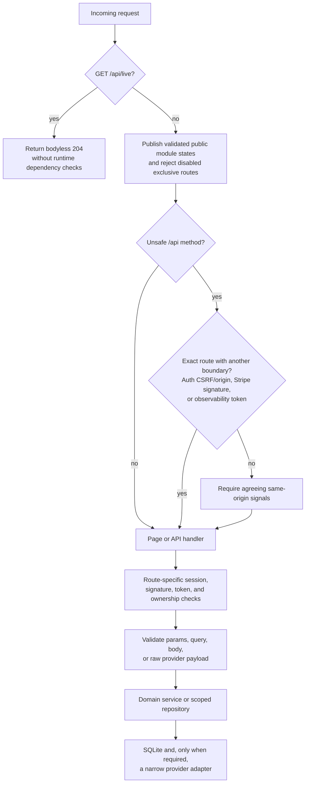

The implementation is split across the [module boundary](../apps/web/server/middleware/01-module-boundary.ts),
[origin boundary](../apps/web/server/middleware/02-cross-origin.ts),
[origin policy](../apps/web/server/utils/request-origin.ts), and route-specific authorization.

## Data authority and ownership

Better Auth Organization is an invisible family-plan membership group. It is not a shared-data container and its
session-selected `activeOrganizationId` is not application authorization.

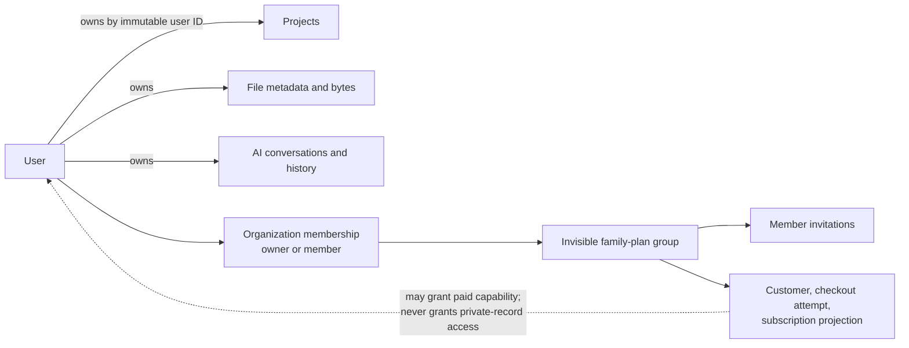

The principal table relationships are:

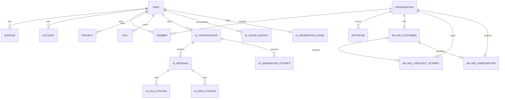

The complete Drizzle export surface is in [`server/db/schema/index.ts`](../apps/web/server/db/schema/index.ts). The
generated baseline creates those relationships, while
[`0001_runtime_invariants.sql`](../apps/web/server/db/migrations/0001_runtime_invariants.sql) adds the family authority
constraints that Drizzle cannot express.

## Feature slices

Reading one row from left to right is usually faster than reading the repository directory by directory.

| Slice                  | UI and HTTP entry                                                                                                                                                                                                   | Core implementation                                                                                                                                                | State and external boundary                                        |
| ---------------------- | ------------------------------------------------------------------------------------------------------------------------------------------------------------------------------------------------------------------- | ------------------------------------------------------------------------------------------------------------------------------------------------------------------ | ------------------------------------------------------------------ |
| Identity and family    | [`/login`, `/signup`, `/account`, `/invite/:invitationId`](../apps/web/app/pages); [`/api/auth/**`](../apps/web/server/api/auth); [`/api/invitations/**`](../apps/web/server/api/invitations)                       | [Better Auth composition](../apps/web/server/utils/auth/create.ts), [invitations](../apps/web/server/services/workspace-invitations.ts), organization repositories | Auth and organization tables; email, optional Google and Turnstile |
| Projects               | [`/app/projects`](../apps/web/app/pages/app/projects); [`/api/projects/**`](../apps/web/server/api/projects)                                                                                                        | [Owner-scoped project repository](../apps/web/server/db/repositories/projects.ts)                                                                                  | User-owned project rows; no provider                               |
| Billing                | [`/account/billing`](../apps/web/app/pages/account/billing.vue); [`/api/account/billing/**`](../apps/web/server/api/account/billing); [`POST /api/webhooks/stripe`](../apps/web/server/api/webhooks/stripe.post.ts) | [Billing services](../apps/web/server/services/payments), organization and billing repositories                                                                    | Organization billing projection; Stripe                            |
| Files                  | No product page; [`/api/files/**`](../apps/web/server/api/files)                                                                                                                                                    | [File service](../apps/web/server/services/storage/file-service.ts), Files repository, storage binding, job queue                                                  | Owner-scoped metadata; local object store or Files R2              |
| AI                     | No product page; [`/api/ai/**`](../apps/web/server/api/ai)                                                                                                                                                          | [Conversation service](../apps/web/server/services/ai/ai-conversation-service.ts), AI repository                                                                   | Owner-scoped history, attempt, and quota state; OpenAI Responses   |
| Runtime and operations | Public shell; [`/api/live`, `/api/ready`, `/api/baseline`](../apps/web/server/api)                                                                                                                                  | Runtime evaluator, worker, maintenance, backup operator                                                                                                            | SQLite, Sentry, private local snapshots, and a separate backup R2  |

Primary verification owners follow the same slices:

| Slice                  | Evidence                                                                                                |
| ---------------------- | ------------------------------------------------------------------------------------------------------- |
| Identity and family    | Passwordless, social-auth, organization, invitation, family, and account-deletion Vitest/browser suites |
| Projects               | Project HTTP/repository tests and private-project browser journey                                       |
| Billing                | Billing service/HTTP/webhook tests and family-billing browser journey                                   |
| Files                  | File service/repository/adapter tests, worker tests, isolated API smoke                                 |
| AI                     | AI service/repository/HTTP/adapter tests with deterministic provider doubles                            |
| Runtime and operations | Built-runtime, container, integration, maintenance, and backup process suites                           |

Files and AI are deliberately server-side capabilities today: their entries in
[`shared/modules.ts`](../apps/web/shared/modules.ts) declare API prefixes but no UI routes.

The main provider-backed decisions are [direct Stripe family-plan authority](adr/0009-direct-stripe-family-plan-authority.md),
[private local/R2 Files](adr/0011-private-files-local-and-r2-lifecycle.md),
[direct OpenAI conversations](adr/0012-direct-openai-responses-and-local-history.md),
[deployment-owned File Search](adr/0013-deployment-owned-openai-file-search.md), and
[server-owned Web Search](adr/0014-server-owned-openai-web-search.md).

## Representative request: create a project

This is the smallest end-to-end example of the ordinary authenticated application path.

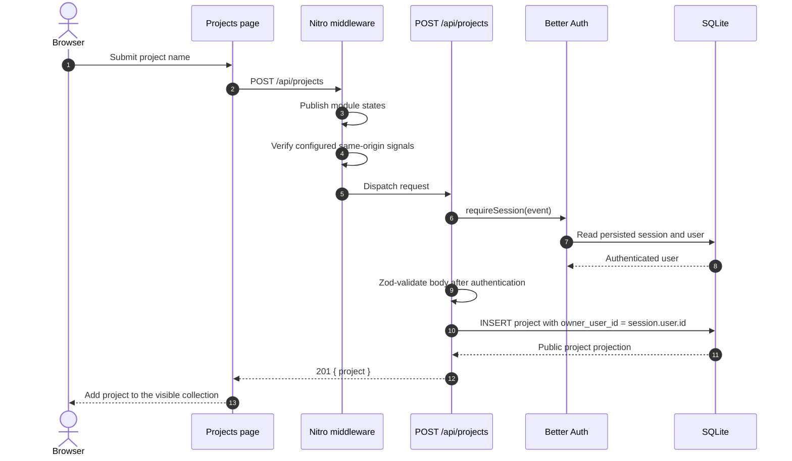

Read this flow in
[`app/pages/app/projects/index.vue`](../apps/web/app/pages/app/projects/index.vue),
[`api/projects/index.post.ts`](../apps/web/server/api/projects/index.post.ts),
[`require-session.ts`](../apps/web/server/utils/auth/require-session.ts), and
[`repositories/projects.ts`](../apps/web/server/db/repositories/projects.ts).

## Passwordless authentication

Better Auth owns the verification and session state machine. The application wraps it with callback/origin policy,
optional Turnstile verification, database configuration, and a narrow email-delivery contract.

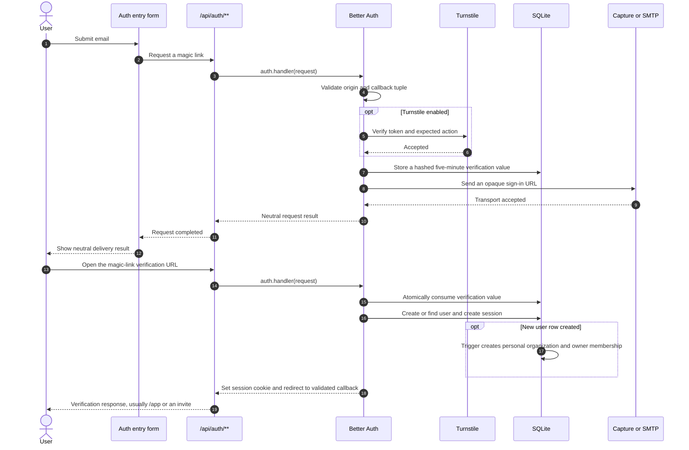

The application-owned pieces are
[`AuthEntryForm.vue`](../apps/web/app/components/AuthEntryForm.vue),
[`api/auth/[...all].ts`](../apps/web/server/api/auth/[...all].ts),
[`auth/passwordless.ts`](../apps/web/server/utils/auth/passwordless.ts), and the
[email adapter](../apps/web/server/services/email/index.ts).

## Private file lifecycle

File metadata becomes inaccessible immediately on deletion. Physical byte deletion is asynchronous and converges
through the SQLite job queue.

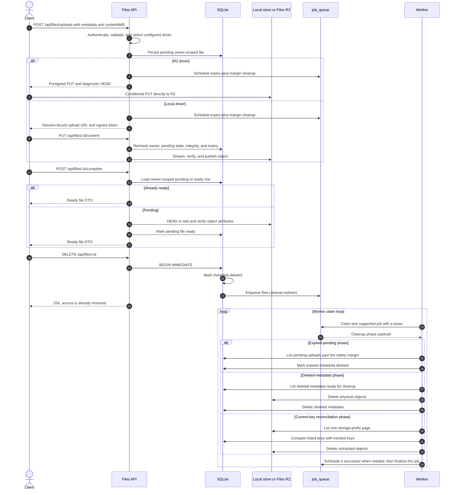

The main sources are [`file-service.ts`](../apps/web/server/services/storage/file-service.ts),
[`object-storage.ts`](../apps/web/server/services/storage/object-storage.ts),
[`job-queue.ts`](../apps/web/server/services/jobs/job-queue.ts), and
[`orphan-cleanup.ts`](../apps/web/server/services/storage/orphan-cleanup.ts).

## One AI conversation turn

A new provider call is bracketed by reservation and finalization SQLite transactions. Before those, a separate
immediate preflight transaction reaps stale attempts and leases and checks the idempotency key. Reservation atomically
rechecks ownership and optional entitlement, then claims the history position, quota, and per-user lease; finalization
releases the lease and persists the terminal attempt and visible assistant state.

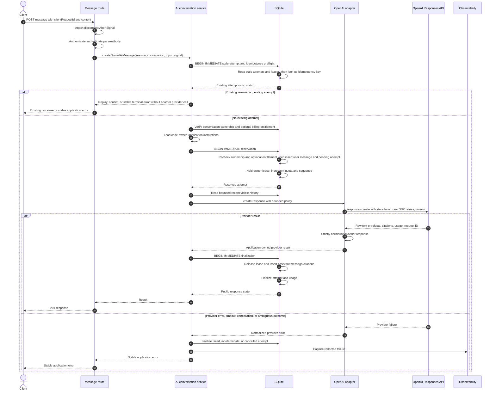

Follow the orchestration in
[`ai-conversation-service.ts`](../apps/web/server/services/ai/ai-conversation-service.ts), the atomic state changes in
[`repositories/ai-conversations.ts`](../apps/web/server/db/repositories/ai-conversations.ts), and the provider boundary
in [`openai.ts`](../apps/web/server/services/ai/openai.ts).

## Stripe webhook projection

The Stripe webhook is an exact origin-policy exemption because its authority is the unmodified raw body plus official
SDK signature verification. The exemption is not a generic bearer or cookie bypass.

```mermaid
sequenceDiagram
  autonumber
  participant Stripe
  participant Route as POST /api/webhooks/stripe
  participant SDK as Stripe SDK boundary
  participant Service as Billing webhook service
  participant DB as SQLite

  Stripe->>Route: Raw event bytes and Stripe-Signature
  Route->>SDK: Verify signature against unmodified body
  SDK-->>Route: Verified Stripe event
  Route->>Service: Process event observation
  Service->>Service: Check exact supported-event allowlist
  alt Unsupported signed event
    Service-->>Route: ignored; no provider read or receipt
  else Supported event
    Service->>DB: Check minimized event receipt
    alt Duplicate
      DB-->>Service: Existing event receipt
      Service-->>Route: duplicate true
    else New event ID
      Service->>Stripe: Fetch route-specific current provider state
      Stripe-->>Service: Authoritative current state
      Service->>DB: BEGIN IMMEDIATE and recheck event receipt
      alt Event ID now exists
        DB-->>Service: Existing event receipt
        Service-->>Route: duplicate true
      else Still new
        DB->>DB: Classify live, detached, or ignored, then apply ordering and reconciliation policy
        DB->>DB: Insert minimized event receipt last
        Service-->>Route: duplicate false
      end
    end
  end
  Route-->>Stripe: { received: true, duplicate }
```

See [`stripe.post.ts`](../apps/web/server/api/webhooks/stripe.post.ts),
[`billing-webhook.ts`](../apps/web/server/services/payments/billing-webhook.ts), and
[`billing-event-store.ts`](../apps/web/server/services/payments/billing-event-store.ts).

## Verified off-host backup

Routine off-host backup may run while the web and worker write because maintenance uses SQLite's Online Backup API.
Migration and restore are different: they require every writer to be stopped.

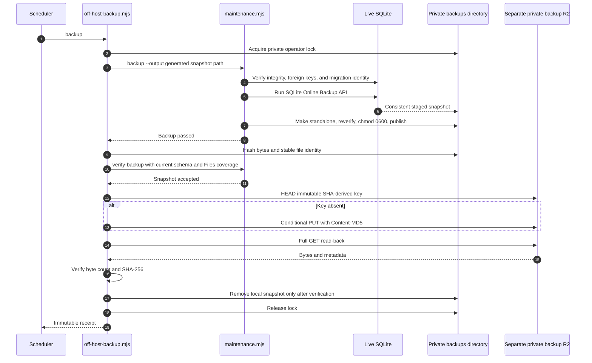

The orchestration is in [`off-host-backup.mjs`](../apps/web/server/off-host-backup.mjs), while snapshot creation and
schema verification remain in [`maintenance.mjs`](../apps/web/server/maintenance.mjs). Operational policy is in the
[backup runbook](../ops/backup-runbook.md).

## Stopped-writer restore

Restore prepares and verifies a candidate before replacing live state. Restored sessions and one-time verification
rows are invalidated. If installation or final verification fails, the prior database and sidecars are moved back.

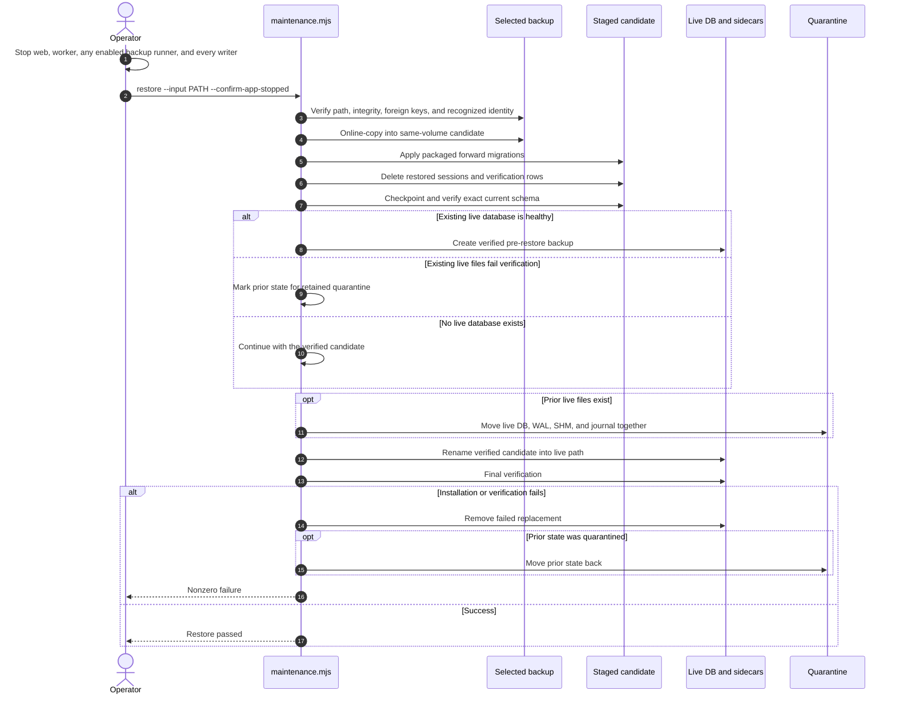

Use the [restore runbook](../ops/restore-runbook.md) rather than reconstructing an operator command from this diagram.

## Verification plane

Tests are part of the architecture because different layers own different claims. A provider double can prove local
policy and request shape, while only staging evidence can certify a real external account or service.

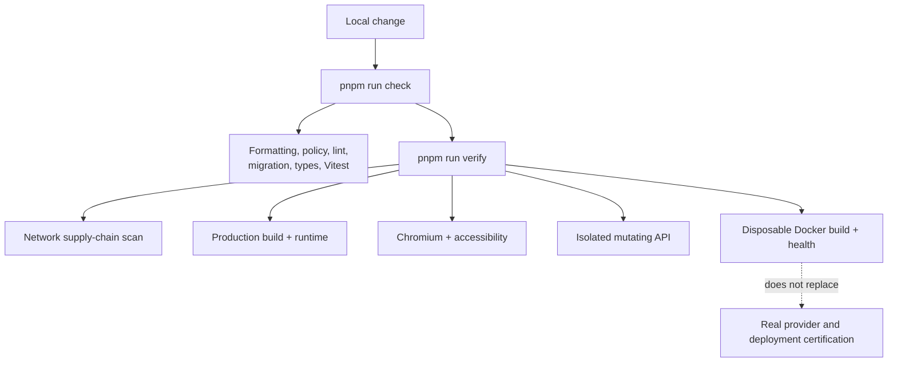

The [local verification guide](ci.md) describes the commands. The
[implementation checklist](implementation-checklist.md) distinguishes locally
complete behavior from remaining external certification.

## Evolution map

The repository is one evolving baseline rather than a sequence of tagged tutorial snapshots. Its practical “steps”
are dependency-ordered, issue-scoped repair waves, usually delivered as one behavioral outcome per pull request.

```mermaid
flowchart LR
  Prototype["Initial full-stack prototype"] --> Audit["July 9 audit<br/>canonical contract reset"]
  Audit --> Wave1["Wave 1<br/>governance, toolchain, CI, pins"]
  Wave1 --> Wave2["Wave 2<br/>runtime config, modules, security,<br/>health, container trust"]
  Wave2 --> Wave3["Wave 3<br/>passwordless identity,<br/>organization and family authority"]
  Wave3 --> Wave4["Wave 4<br/>personal shell, account UI,<br/>projects, CSS, accessibility"]
  Wave4 --> Wave5["Wave 5<br/>billing, Files, AI, jobs,<br/>Turnstile, Sentry"]
  Wave5 --> Rebaseline["Current four-entry DB package<br/>with preserved two-entry prefix"]
  Rebaseline --> Backups["Verified private<br/>off-host backups"]
  Backups --> External["Real deployment and<br/>provider certification pending"]
  External --> Reaudit["Independent re-audit pending"]

  Wave3 -. "superseded app-owned<br/>URL-scoped workspace" .-> FamilyModel["Organization = family entitlement<br/>private data = user-owned"]
  Wave5 -. "removed from baseline" .-> Removed["Local Search / FTS<br/>and PWA"]
```

The source roadmap is the [approved repair backlog](audits/2026-07-09/repair-backlog.md). Architectural reversals and
supersessions are preserved in [`docs/adr`](adr), while dated audit records remain historical evidence rather than
current compatibility inputs.

## Suggested reading paths

- **First application request:** runtime topology → request pipeline → project creation.
- **Identity and authorization:** data authority → passwordless authentication → Identity and family feature row.
- **Provider-backed feature:** feature row → Files or AI sequence → corresponding ADR and tests.
- **Production operations:** runtime topology → backup → restore → [deployment guide](deployment.md) →
  [deployment checklist](../ops/deployment-checklist.md) → [backup runbook](../ops/backup-runbook.md).
- **Why the code looks this way:** evolution map → ADRs → dated audit evidence.
